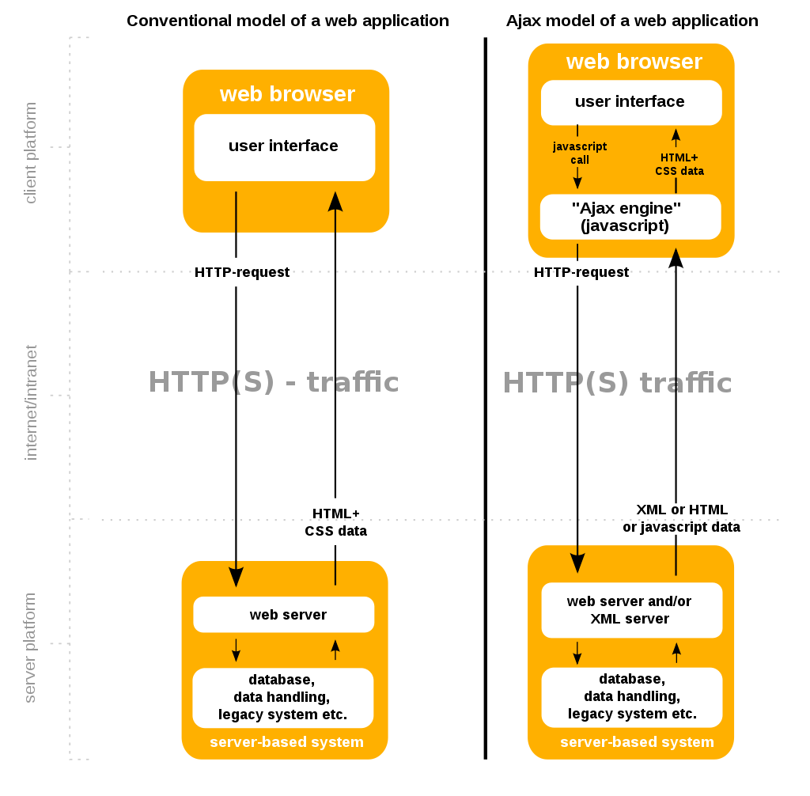

---
layout:
  title:
    visible: true
  description:
    visible: false
  tableOfContents:
    visible: true
  outline:
    visible: true
  pagination:
    visible: true
---

# AJAX

**Asynchronous JavaScript and XML (AJAX)** is a suite of web development techniques that utilize client-side technologies to create asynchronous web applications.

With AJAX web applications can send and retrieve data from a back-end server asynchronously (in the background) without interfering with the display and behavior of the existing page. AJAX is effectively a **decoupling of the data interchange and presentation layers** of the application. Because of this decoupling AJAX allows web pages and applications to change content dynamically without refreshing the entire page.

Modern implementations often use JSON in place of XML but the concept (and name) remains the same.

<figure><figcaption><p>Conventional web application model vs. an AJAX implementation</p></figcaption></figure>

## Technologies

AJAX is a concept that has come to represent a range of web technologies:

* **HTML** and **CSS** are used as the framework of the page
* **Document Object Model (DOM)** is used for dynamic display of, and interaction with data
* **JSON** or **XML** is used for the interchange of data
  * If XML is used, **XSLT** is required for XML manipulation. In practice XML is rarely used in modern applications
* The **`XMLHttpRequest`** object is used for asynchronous communication
* **JavaScript** knits all of the above together
  * A variety of popular JavaScript libraries, including JQuery, include abstractions to assist in executing Ajax requests.

## Example

### JavaScript Example

The following is a simple example of an AJAX implementation in JavaScript (leveraging the `XMLHttpRequest` object and using the HTTP `GET` method):

#### Client-Side


```javascript
// Initialize the HTTP request.
let xhr = new XMLHttpRequest();
// define the request
xhr.open('GET', 'send-ajax-data.php');

// Track the state changes of the request.
xhr.onreadystatechange = function () {
	const DONE = 4; // readyState 4 means the request is done.
	const OK = 200; // status 200 is a successful return.
	if (xhr.readyState === DONE) {
		if (xhr.status === OK) {
			console.log(xhr.responseText); // 'This is the output.'
		} else {
			console.log('Error: ' + xhr.status); // An error occurred during the request.
		}
	}
};

// Send the request to send-ajax-data.php
xhr.send(null);
```


#### Server-Side


```php
<?php
// This is the server-side script.

// Set the content type.
header('Content-Type: text/plain');

// Send the data back.
echo "This is the output.";
?>
```


The above is just a simple illustration of an implementation. A full list of AJAX frameworks can be found [here](https://en.wikipedia.org/wiki/List\_of\_Ajax\_frameworks).
