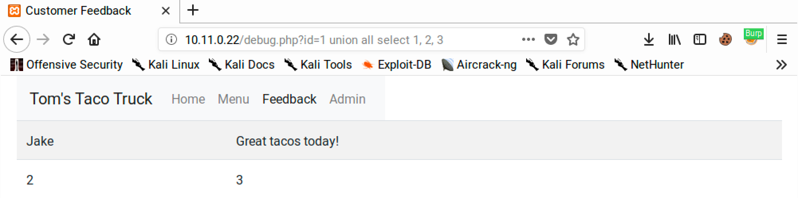

# Database Enumeration

## Column Number Enumeration

This is a method for brute-forcing the number of columns. In instances where an `order by <column_number>` can be injected, an attacker can increment the column number until an error is returned. This will indicate how many columns are present in the database.

This technique can be automated via a script or the BurpSuite Repeater.

#### Example

The `/debug.php`file on the Windows lab machine has a SQLi vulnerability:

```
http://10.11.0.22/debug.php?id=1
```

The `id` parameter can have arbitrary SQL tacked on the end:

```
http://10.11.0.22/debug.php?id=1 order by 1
```

One can increment the order by until an error occurs. In this case, it errors at `order by 4` and thus the attacker knows there are **3 columns in the database**.

### Understanding the Output

Once the number of columns are known, it is important to understand how they map into the webpage. In many instances this will be obvious as the database column count will match the display on the screen. In instances where the database seems to have more columns than are obvious to look at, one must understand which columns get mapped onto the screens.

#### Example

To continue the example from above, there are 3 columns in the database but on the screen only 2 columns are visible. To understand what maps where one could:

```
http://10.11.0.22/debug.php?id=1 union all select 1, 2, 3
```

In this instance, the `UNION` is appending a single row that contains 1, 2, and 3 in each of the columns respectively. Examining the screenshot below one can see the first column is not visible on the page but columns 2 and 3 are:

<figure><figcaption><p>Output of query</p></figcaption></figure>

In this instance it makes most sense to attempt to leak data into column 3 as it is the largest and will be easiest to review.
