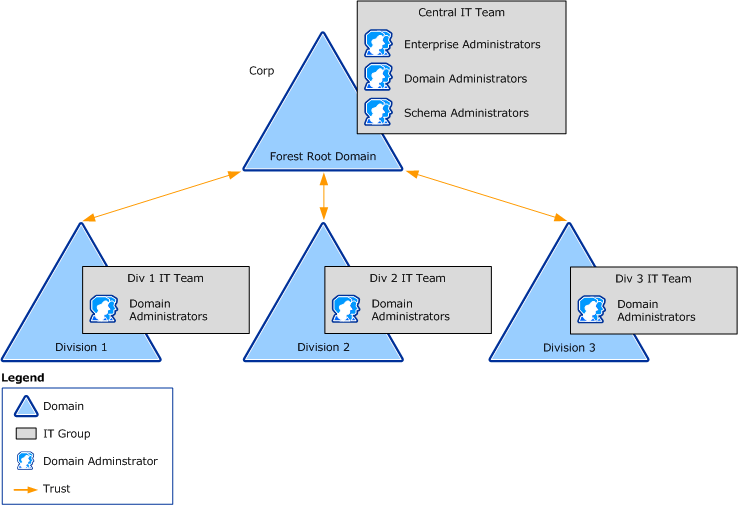
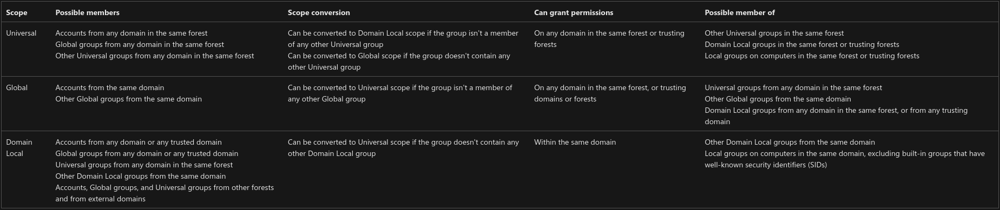
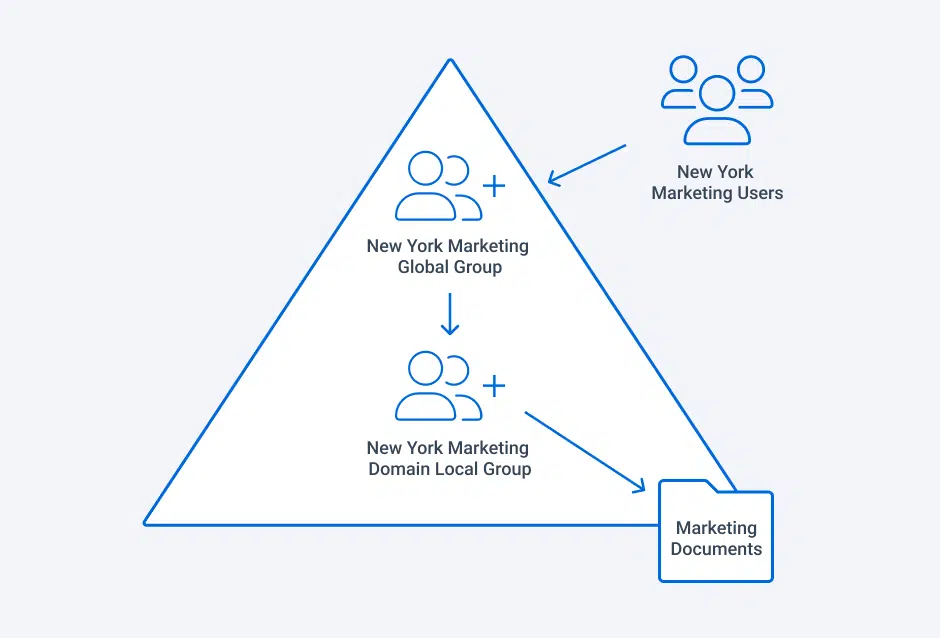
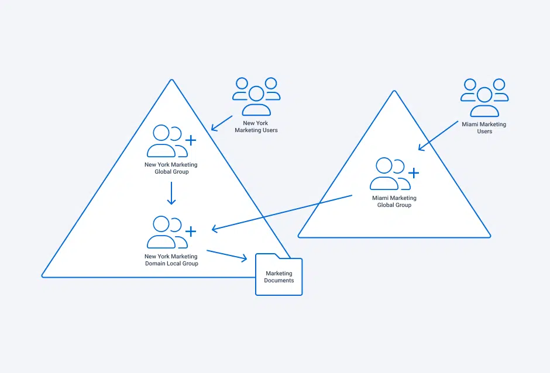
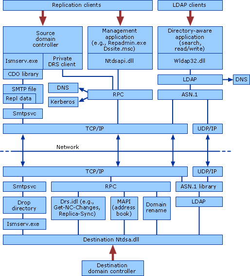

---
layout:
  title:
    visible: true
  description:
    visible: false
  tableOfContents:
    visible: true
  outline:
    visible: true
  pagination:
    visible: true
---

# Active Directory

[Active Directory Domain Services](https://learn.microsoft.com/en-us/windows-server/identity/ad-ds/get-started/virtual-dc/active-directory-domain-services-overview) (AD DS), usually shortened to just Active Directory (AD), is a service that allows system administrators to update and manage operating systems, applications, users, and data access on a large scale. Active Directory is installed with a standard configuration, however, system administrators often customize it to fit the needs of the organization.

While Active Directory itself is a service, it also acts as a management layer. AD contains critical information about the environment, storing information about users, groups, and computers, each referred to as **objects**. Permissions set on each object dictate the privileges that object has within the domain.

The first step in configuring an instance of AD is to create a domain name such as `corp.com` in which `corp` is often the name of the organization itself. Within this domain, administrators can add various types of objects that are associated with the organization such as computers, users, and group objects.

## Forest Model

It is important to understand the Active Directory [logical model](https://learn.microsoft.com/en-us/windows-server/identity/ad-ds/plan/understanding-the-active-directory-logical-model). AD is a distributed database that stores and manages information about network resources as well as application-specific data from directory-enabled applications. allows administrators to organize elements of a network (such as users, computers, and devices) into a hierarchical containment structure. The top-level container is the **forest**. Within forests are **domains**, and within domains are **organizational units** (**OUs**).

### Forest

A forest is a collection of one or more Active Directory domains that share a common logical structure, directory schema (class and attribute definitions), directory configuration (site and replication information), and global catalog (forest-wide search capabilities). Domains in the same forest are automatically linked with two-way, transitive trust relationships.

### Domain

A domain is a partition in an Active Directory forest. There are several core functions of a domain:

* **User Identity:** domains allow user identities to be created once and referenced on any computer joined to the forest in which the domain is located. Domain controllers that make up a domain are used to store user accounts and user credentials (such as passwords or certificates) securely
* **Authentication:** Domain controllers provide authentication services for users and supply additional authorization data such as user group memberships, which can be used to control access to resources on the network
* **Trust Relationships:** Domains can extend authentication services to users in domains outside their own forest by means of trusts
* **Replication:** The domain defines a partition of the directory that contains sufficient data to provide domain services and then replicates it between the domain controllers. In this way, all domain controllers are peers in a domain and are managed as a unit.
  * Additionally, the partitioning of data into domains enables organizations to replicate data only to where it is needed. In this way, the directory can scale globally over a network that has limited available bandwidth.

### Organizational Units

OUs can be used to form a hierarchy of containers within a domain. OUs are used to group objects for administrative purposes such as the application of Group Policy or delegation of authority.&#x20;

Control (over an OU and the objects within it) is determined by the access control lists (ACLs) on the OU and on the objects in the OU. To facilitate the management of large numbers of objects, AD DS supports the concept of _delegation of authority_. By means of delegation, owners can transfer full or limited administrative control over objects to other users or groups. This is seen in the diagram below:

<figure><figcaption>
Forest Model
</figcaption></figure>

The Central IT team manages the forest but can delegate management of each domain (Division 1, 2, and 3) to the IT team for that division (e.g. Div 1 IT Team).

## Data Store

Active Directory uses a structured data store as the basis for a logical, hierarchical organization of directory information.

This [**data store**](https://learn.microsoft.com/en-us/previous-versions/windows/it-pro/windows-server-2003/cc736627\(v=ws.10\)), also known as the **directory**, contains information about Active Directory objects. These objects typically include shared resources such as servers, volumes, printers, and the network user and computer accounts.

The directory is stored on domain controllers and can be accessed by network applications or services. A domain can have one or more domain controllers. Each domain controller has a copy of the directory for the entire domain in which it is located. Directory data is stored in the `Ntds.dit` file on the domain controller. Changes made to the directory on one domain controller are replicated to other domain controllers in the domain, domain tree, or forest. Active Directory uses four distinct directory partition types to store and copy different types of data:

1. **Domain:** holds information about objects within a domain. This is information such as e-mail contacts, user and computer account attributes, and published resources that are of interest to administrators and users.
2. **Configuration:** The configuration data describes the topology of the directory. This configuration data includes a list of all domains, trees, and forests and the locations of the domain controllers and global catalogs.
3. **Schema:** The schema is the formal definition of all object and attribute data that can be stored in the directory.
   * Domain controllers running Windows Server 2003 include a default schema that defines many object types, such as user and computer accounts, groups, domains, organizational units, and security policies
   * Administrators and programmers can extend the schema by defining new object types and attributes or by adding new attributes for existing objects.
4. **Application:** Data stored in the application directory partition is intended to satisfy cases where information needs to be replicated but not necessarily on a global scale. Application directory partitions are not part of the directory data store by default; they must be created, configured, and managed by the administrator.

## Security

AD provides a secure directory environment for an organization using built-in logon authentication and user authorization, which are core features of the Local Security Authority (LSA). Logon authentication and user authorization are available by default and provide immediate protection for network access and network resources.

Active Directory requires confirmation of the identity of a user before allowing access to the network, a process known as authentication. Users only need to provide a single sign-on to the domain (or to trusted domains) to gain access to the network. Once Active Directory confirms the identity of the user, the LSA on the authenticating domain controller generates an access token that determines what level of access that user has on network resources. This allows AD to provide [access control](https://learn.microsoft.com/en-us/previous-versions/windows/it-pro/windows-server-2003/cc785913\(v=ws.10\)).

### Security Descriptor

Access control permissions are assigned to shared objects and Active Directory objects to control how different users can use each object. A security descriptor contains two access control lists (ACLs) used to assign and track security information for each object: the discretionary access control list (DACL) and the system access control list (SACL).

1. **Discretionary Access Control List (DACL):** identifies the users and groups that are assigned or denied access permissions on an object.
   * If a DACL does not explicitly identify a user, or any groups that a user is a member of, the user will be denied access to that object.
   * By default, a DACL is controlled by the owner of an object or the person who created the object, and it contains access control entries (ACEs) that determine user access to the object.
2. **System Access Control List (SACL):** identifies the users and groups that the administrator wants to audit when they successfully access or fail to access an object.
   * Auditing is used to monitor events related to system or network security, to identify security breaches, and to determine the extent and location of any damage.
   * By default, a SACL is controlled by the owner of an object or the person who created the object. A SACL contains access control entries (ACEs) that determine whether to record a successful or failed attempt by a user to access a object using a given permission, for example, Full Control and Read.

### Object Inheritance

By default, Active Directory objects inherit ACEs from the security descriptor located in their parent container object. Inheritance enables the access control information defined at a container object in Active Directory to apply to the security descriptors of any subordinate objects, including other containers and their objects.

### User Authentication

Active Directory also authenticates and authorizes users, groups, and computers to access objects on the network. The Local Security Authority (LSA) is the security subsystem responsible for all interactive user authentication and authorization services on a local computer. The LSA is also used to process authentication requests made through the Kerberos V5 protocol or NTLM protocol in Active Directory.

Once the identity of a user has been confirmed in Active Directory, the LSA on the authenticating domain controller generates a user access token and associates a security ID (SID) with the user.

#### Access Token

When a user is authenticated, LSA creates a security access token for that user. An access token contains the user's name, the groups to which that user belongs, a SID for the user, and all of the SIDs for the groups to which the user belongs.

If a user is added to a group after the user access token has been issued, the user must log off and log on again before the access token will be updated.

#### Security ID

Active Directory automatically assigns SIDs to security principal objects at the time they are created. Security principals are accounts in Active Directory that can be assigned permissions such as computer, group, or user accounts. Once a SID is issued to the authenticated user, it is attached to the access token of the user.

#### Operation

When a user attempts to access some object, the information in the access token is used to determine a user's level of access. The SIDs in the access token are compared with the list of SIDs that make up the DACL for the object to ensure that the user has sufficient permission to access the object. This is because the _access control process identifies user accounts by SID rather than by name_.

## Security Groups

Administrators can use groups to collect user accounts, computer accounts, and other groups into manageable units. Working with groups instead of with individual users helps simplify network maintenance and administration.

Active Directory has two types of groups:

1. **Security groups**: Used to assign permissions to shared resources
2. **Distribution groups**: Used to create email distribution lists
   * Distribution groups aren't security enabled, so they cannot be included in DACLs

### Purpose

Security groups allow administrators to:

1. Assign user rights to security groups in Active Directory
2. Assign permissions to security groups for resources

#### User Rights

User rights determine what members of a security group can do within the scope of a domain or forest.

User rights are automatically assigned to some security groups when Active Directory is installed to help administrators define a person’s administrative role in the domain. For example, a user who is added to the [Backup Operators](https://learn.microsoft.com/en-us/windows-server/identity/ad-ds/manage/understand-security-groups#backup-operators) group in Active Directory can back up and restore files and directories that are located on each domain controller in the domain. The user can complete these actions because, by default, the user rights _Backup files and directories_ and _Restore files and directories_ are automatically assigned to the Backup Operators group. Therefore, members of this group inherit the user rights that are assigned to that group.

#### Permissions

Permissions are different from user rights. Permissions are assigned to a security group for a shared resource. Permissions determine who can access the resource and the level of access, such as Full control or Read. Some permissions that are set on domain objects are automatically assigned to allow various levels of access to default security groups like the Account Operators group or the Domain Admins group.

Security groups are listed in Discretionary Access Control Lists (DACLs) that define permissions on resources and objects. When administrators assign permissions for resources like file shares or printers, they should assign those permissions to a security group instead of to individual users. The permissions are assigned once to the group instead of multiple times to each individual user. Each account that's added to a group receives the rights that are assigned to that group in Active Directory. The user receives permissions that are defined for that group.

### Group Scope

Each group has a [scope](https://learn.microsoft.com/en-us/windows-server/identity/ad-ds/manage/understand-security-groups#group-scope) that identifies the extent to which the group is applied in the domain tree or forest. There are 3 scopes:

* Universal
* Global
* Domain Local

The table below describes the scopes and how they work as security groups

<figure><figcaption>
AD Group Scopes
</figcaption></figure>

This table alone does not make a ton of sense. It becomes more clear in the context of a logical AD model. Microsoft provides two best-practices models for AD architecture:

* **AGDLP** (account, global and domain local permission)
* **AGUDLP** (account, global, universal and domain local permission)

These models define the techniques for the nesting of groups without compromising security .

#### AGDLP

The [AGDLP](https://blog.netwrix.com/2022/10/19/group-scope-in-active-directory/) model states that user and computer accounts should be members of global groups, which are in turn members of domain local groups that describe resource permissions.

Think of global groups as “account groups” — they are used to contain user and computer accounts (as well as other global groups), all from the same domain. A group cannot contain users or computers from other domains. The users typically are in the same department, have the same manager or exhibit some other similarity. Consider a company where everyone in the Marketing department of the New York headquarters would be put into the same _global group_ called `New York Marketing`.

Domain local groups are “resource groups” because the greater flexibility in their membership makes local domain groups ideal for granting permissions on resources. In particular, domain local groups can include members not just from the parent domain but from other domains and trusted forests. This enables administrators to grant access to a resource to anyone in the environment who needs it. To continue the example from above, IT might define a _domain local group_ that grants access to a file share called `Marketing Documents`.

By _nesting_ the `New York Marketing` group _inside_ the `Marketing Documents` domain local group, all members of the `New York Marketing` group are granted access to `Marketing Documents`:

<figure><figcaption>
Domain local group encapsulating a global group to provide access to a resource
</figcaption></figure>

The use of domain local groups becomes especially important when you are dealing have trusted forests. In those cases, chances are good that accounts in one forest will need access to resources in the other forest. If a global group was used to grant access to a resource, there would be no way for accounts in the other forest to be given access to that resource, since accounts and groups cannot be nested into global groups from a different domain or forest.

To continue the example, imagine if the company acquired another firm who had a marketing team in Miami and the IT groups decide to establish trusts between the two companies’ forests. Under the AGDLP model, the Miami-based company’s forest includes a global group for their Marketing department, called `Miami Marketing`. In order to give those team members access to the `Marketing Documents` share, all the admin has to do is nest the `Miami Marketing` global group in the `Marketing Documents` domain local group, as illustrated below:

<figure><figcaption>
Granting a second global group access to a resource via a domain local group
</figcaption></figure>

#### AGUDLP

The [AGUDLP](https://itfreetraining.com/lesson/agudlp/) model is very similar to AGDLP but introduces the universal groups into the equation (hence the “U” in its name). This is particularly helpful for multi-domain environments as universal groups span the domains where global ones do not.

For example, the global `New York Marketing` and `Miami Marketing` global groups from above could be members of a universal `Marketing` group that could then be granted access to the `Marketing Documents` share.

One major advantage of this model is that it allows distributed administration of the domains. For example the main IT team could be responsible for granting the `Marketing` universal group access to the `Marketing Documents` share. However, on-site admins in both New York and Miami could be granted control over the respective `New York Marketing` and `Miami Marketing` global groups. This would allow the on-site admins to add users to the group as people are on-boarded but they would not need to worry about managing the universal `Marketing` group.&#x20;

### Default Groups

There are quite a few [security groups](https://learn.microsoft.com/en-us/windows-server/identity/ad-ds/manage/understand-security-groups#default-active-directory-security-groups) provided by default with AD. Some key ones are enumerated below.

#### Guests

Members of the [Guests](https://learn.microsoft.com/en-us/windows-server/identity/ad-ds/manage/understand-security-groups#guests) group have the same access as members of the Users group by default, except that the Guest account has further restrictions. By default, the only member is the Guest account. The Guests group allows occasional or one-time users to sign in with limited privileges to a computer’s built-in Guest account.

When a member of the Guests group signs out, the entire profile is deleted. This fact implies that a guest must use a temporary profile to sign in to the system.

#### Domain Guests

The [Domain Guests](https://learn.microsoft.com/en-us/windows-server/identity/ad-ds/manage/understand-security-groups#domain-guests) group includes the domain’s built-in Guest account. When members of this group sign in as local guests on a domain-joined computer, a domain profile is created on the local computer.

#### Domain Users

The [Domain Users](https://learn.microsoft.com/en-us/windows-server/identity/ad-ds/manage/understand-security-groups#domain-users) group includes all user accounts in a domain. When a user account is created in a domain, it's automatically added to this group. This group can be used to represent all users in the domain.

For example, if one wants all domain users to have access to a printer, they can assign permissions for the printer to this group or add the Domain Users group to a Local group on the print server that has permissions for the printer.

#### Domain Computers

[This](https://learn.microsoft.com/en-us/windows-server/identity/ad-ds/manage/understand-security-groups#domain-computers) group can include all computers and servers that have joined the domain, excluding domain controllers. By default, any computer account that's created automatically becomes a member of this group.

#### Domain Controllers

The [Domain Controllers](https://learn.microsoft.com/en-us/windows-server/identity/ad-ds/manage/understand-security-groups#domain-controllers) group can include all domain controllers in the domain. New domain controllers are automatically added to this group.

#### Administrators

[Administrators](https://learn.microsoft.com/en-us/windows-server/identity/ad-ds/manage/understand-security-groups#administrators) have complete and unrestricted access to the computer. If the computer is promoted to a domain controller, members of the Administrators group have unrestricted access to the domain.

#### Domain Admins

[Domain Admins](https://learn.microsoft.com/en-us/windows-server/identity/ad-ds/manage/understand-security-groups#domain-admins) are authorized to administer the domain. By default, the Domain Admins group is a member of the Administrators group on all computers that have joined a domain, including the domain controllers. The Domain Admins group is the default owner of any object that's created in Active Directory for the domain by any member of the group.

The Domain Admins group controls access to all domain controllers in a domain, and it can modify the membership of all administrative accounts in the domain. Members of the service administrator groups in its domain (Administrators and Domain Admins) and members of the Enterprise Admins group can modify Domain Admins membership. This group is considered a service administrator account because its members have full access to the domain controllers in a domain.

#### Enterprise Admins

The [Enterprise Admins](https://learn.microsoft.com/en-us/windows-server/identity/ad-ds/manage/understand-security-groups#enterprise-admins) group exists only in the root domain of an Active Directory forest of domains. The group is a Universal group if the domain is in native mode. The group is a Global group if the domain is in mixed mode. Members of this group are authorized to make forest-wide changes in Active Directory, like adding child domains.

By default, the only member of the group is the Administrator account for the forest root domain. This group is automatically added to the Administrators group in every domain in the forest, and it provides complete access to configuring all domain controllers. Members in this group can modify the membership of all administrative groups. Members of the default service administrator groups in the root domain can modify Enterprise Admins membership. This group is considered a service administrator account.

#### Enterprise Key Admins

[Enterprise Key Admins](https://learn.microsoft.com/en-us/windows-server/identity/ad-ds/manage/understand-security-groups#enterprise-key-admins) can perform administrative actions on key objects within the forest.

## Flexible Single-Master Operation

Active Directory is the central repository in which all objects in an enterprise and their respective attributes are stored. It's a hierarchical, multi-master enabled database that can store millions of objects. Changes to the database can be processed at any given domain controller (DC) in the enterprise, regardless of whether the DC is connected or disconnected from the network. The concept of [Flexible Single-Master Operation](https://learn.microsoft.com/en-gb/troubleshoot/windows-server/active-directory/fsmo-roles) (FSMO) explains how Windows handles updates to the database where there is no single "master" copy.

### Multi-Master Model

A [multi-master](https://learn.microsoft.com/en-GB/troubleshoot/windows-server/active-directory/fsmo-roles#multi-master-model) enabled database, such as the Active Directory, provides the flexibility of allowing changes to occur at any DC in the enterprise. But it also introduces the possibility of conflicts that can potentially lead to problems once the data is replicated to the rest of the enterprise. One way Windows deals with conflicting updates is by having a conflict resolution algorithm handle discrepancies in values. It's done by resolving to the DC to which changes were written last, which is the **last writer wins**. The changes in all other DCs are discarded. Although this method may be acceptable in some cases, there are times when conflicts are too difficult to resolve using the last writer wins approach.

### Single-Master Model

For situations that are too complex for the last writer wins approach, Windows incorporates methods to prevent conflicting Active Directory updates from occurring.

To prevent conflicting updates in Windows, the Active Directory performs updates to certain objects in a single-master fashion. In a single-master model, only one DC in the entire directory is allowed to process updates.

This is conceptually similar to the role of the Primary Domain Controller (PDC) in earlier versions of Windows, e.g. Microsoft Windows NT 3.51 and 4.0. In these earlier versions, the PDC is responsible for processing all updates in a domain.

Active Directory extends the single-master model found in earlier versions of Windows to include multiple roles, and the ability to transfer roles to any DC in the enterprise. Because an Active Directory role isn't bound to a single DC, it's referred to as an **FSMO role**. Currently in Windows there are five FSMO roles:

* Schema master
* Domain naming master
* RID master
* PDC emulator
* Infrastructure master

#### Schema Master Role

The schema master FSMO role holder is the DC responsible for performing updates to the directory schema, that is, the schema naming context or `LDAP://cn=schema,cn=configuration,dc=`.

This DC is the only one that can process updates to the directory schema. Once the Schema update is complete, it's replicated from the schema master to all other DCs in the directory. There's only one schema master per forest.

#### Domain Naming Master Role

The domain naming master FSMO role holder is the DC responsible for making changes to the forest-wide domain name space of the directory, that is, the Partitions\Configuration naming context or `LDAP://CN=Partitions, CN=Configuration, DC=`.

This DC is the only one that can add or remove a domain from the directory. It can also add or remove cross references to domains in external directories.

#### RID Master Role

The RID master FSMO role holder is the single DC responsible for processing RID Pool requests from all DCs within a given domain. It's also responsible for removing an object from its domain and putting it in another domain during an object move.

When a DC creates a security principal object, such as a user or group, it attaches a unique Security ID (SID) to the object. This SID consists of:

* A domain SID that's the same for all SIDs created in a domain.
* A relative ID (RID) that's unique for each security principal SID created in a domain.

Each Windows DC in a domain is allocated a pool of RIDs that it's allowed to assign to the security principals it creates. When a DC's allocated RID pool falls below a threshold, that DC issues a request for additional RIDs to the domain's RID master. The domain RID master responds to the request by retrieving RIDs from the domain's unallocated RID pool, and assigns them to the pool of the requesting DC. There's one RID master per domain in a directory.

#### PDC Emulator Role

The [PDC Emulator](https://learn.microsoft.com/en-gb/troubleshoot/windows-server/active-directory/fsmo-roles#pdc-emulator-fsmo-role) is necessary to synchronize time in an enterprise. Windows includes the W32Time (Windows Time) time service that is required by the Kerberos authentication protocol. All Windows-based computers within an enterprise use a common time. The PDC emulator of a domain is authoritative for the domain. The PDC emulator at the root of the forest becomes authoritative for the enterprise, and should be configured to gather the time from an external source.

In addition to being the authoritative source on time the PDC emulator FSMO role holder retains the following functions:

* Password changes done by other DCs in the domain are replicated preferentially to the PDC emulator.
* When authentication failures occur at a given DC because of an incorrect password, the failures are forwarded to the PDC emulator before a bad password failure message is reported to the user.
* Account lockout is processed on the PDC emulator.
* The PDC emulator performs all of the functionality that a Windows NT 4.0 Server-based PDC or earlier PDC performs for Windows NT 4.0-based or earlier clients.

#### Infrastructure Master Role

When an object in one domain is referenced by another object in another domain, it represents the reference by:

* The GUID
* The SID (for references to security principals)
* The DN of the object being referenced

The infrastructure FSMO role holder is the DC responsible for updating an object's SID and distinguished name in a cross-domain object reference.

## AD Replication Model

In production environments, domains typically rely on more than one domain controller to provide redundancy. [Active Directory replication](https://learn.microsoft.com/en-us/previous-versions/windows/it-pro/windows-server-2003/cc737314\(v=ws.10\)) is the means by which changes to directory data are transferred between domain controllers in an Active Directory forest. The Active Directory replication model defines the mechanisms that allow directory updates to be transferred automatically between domain controllers to provide a seamless replication solution for the Active Directory distributed directory service.

### AD Replication Model Architecture 

Active Directory replication operates within the directory service component of the security subsystem. The directory service component, `Ntdsa.dll`, is accessed through the LDAP network protocol and LDAP C API for directory service updates, as implemented in `Wldap32.dll`. The updates are transported over IP as packaged by the replication RPC protocol. SMTP can also be used to prepare non-domain updates for TCP transport over IP.

The **Directory Replication System** (**DRS**) client and server components interact to transfer and apply Active Directory updates between domain controllers.

The following diagram shows the client-server architecture for replication clients and LDAP clients:

<figure><figcaption>
Client-server architecture for replication and LDAP clients
</figcaption></figure>

### DRS Remote Protocol

The Directory Replication Service (DRS) Remote Protocol is an RPC protocol for replication and management of data in Active Directory.

The protocol consists of two RPC interfaces named `drsuapi` and `dsaop`. The name of each `drsuapi` method begins with "`IDL_DRS`", while the name of each `dsaop` method begins with "`IDL_DSA`".

A domain controller may request an update for a specific object, like an account, using the [`IDL_DRSGetNCChanges`](https://learn.microsoft.com/en-us/openspecs/windows\_protocols/ms-drsr/b63730ac-614c-431c-9501-28d6aca91894) API.

To launch such a replication, a user needs to have the [following rights](https://www.secureideas.com/blog/the-other-replicating-directory-changes):

* `Replicating Directory Changes`
* `Replicating Directory Changes All`
* `Replicating Directory Changes in Filtered Set`

By default, members of the `Domain Admins`, `Enterprise Admins`, and `Administrators` groups have these rights assigned.

## Access Control Lists

An object in AD may have a set of permissions applied to it with multiple [access control entries](https://learn.microsoft.com/en-us/windows/win32/secauthz/access-control-entries) (ACE). These ACEs make up the [access control list](https://learn.microsoft.com/en-us/windows/win32/secauthz/access-control-lists) (ACL). Each ACE defines whether access to the specific object is allowed or denied.

### Access Control Entries

There are six types of ACEs, three of which are supported by all securable objects. The other three types are [Object-specific ACEs](https://learn.microsoft.com/en-us/windows/win32/secauthz/object-specific-aces) supported by directory service objects.

All types of ACEs contain the following access control information:

* A **Security Identifier** (SID) that identifies the **trustee** to which the ACE applies
  * A trustee can be a user account, group account, or logon session
* An access mask that specifies the [access rights](https://learn.microsoft.com/en-us/windows/win32/secauthz/access-rights-and-access-masks) granted by the ACE
* A flag indicating the type of ACE
* A set of bit flags that determine whether child containers or objects can inherit the ACE from the primary object to which the ACL is attached

### Security Descriptors

A [security descriptor](https://learn.microsoft.com/en-us/windows/win32/secauthz/security-descriptors) contains the security information associated with a [securable object](https://learn.microsoft.com/en-us/windows/win32/secauthz/securable-objects). A security descriptor consists of a [`SECURITY_DESCRIPTOR`](https://learn.microsoft.com/en-us/windows/desktop/api/Winnt/ns-winnt-security\_descriptor) structure and its associated security information. A security descriptor can include the following security information:

* SIDs for the owner and primary group of the object
* DACL
* SACL

#### DACL

A _discretionary access control list_ (DACL) is an access control list that is controlled by the owner of an object and that specifies the access particular users or groups can have to the object.

#### SACL

A _system access control list_ (SACL) allows administrators to log attempts to access a secured object. Each ACE specifies the types of access attempts by a specified trustee that cause the system to generate a record in the security event log. An ACE in an SACL can generate audit records when an access attempt fails, when it succeeds, or both.

### ACL Validation

When a domain object attempts to interact with another object, e.g. a domain user attempts to access a domain share (which is also an object). The targeted object, in this case the share, will then go through a validation check based on the ACL to determine if the user has permissions to the share. This ACL validation involves two main steps. In an attempt to access the share, the user will send an **access token**, which consists of the user identity and permissions. The target object will then validate the token against the list of permissions (the ACL). If the ACL allows the user to access the share, access is granted. Otherwise the request is denied.

### Permission Types

Microsoft provides a [broad variety](https://learn.microsoft.com/en-us/dotnet/api/system.directoryservices.activedirectoryrights?view=netframework-4.7.2) of potential permissions that can be used to configure an ACE. While any could be misconfigured an attacker is largely interested in a few specific ones:

* `GenericAll`: Full permissions on object
* `GenericWrite`: Edit certain attributes on the object
* `WriteOwner`: Change ownership of the object
* `WriteDACL`: Edit ACE's applied to object
* `AllExtendedRights`: Change password, reset password, etc.
* `ForceChangePassword`: Password change for object
* `Self`: The right to perform an operation that is controlled by a validated write access right
  * Could allow an attacker to add themselves to a group for example

Of these, the `GenericAll` is the most permissive. A more complete list of rights can also be found [here](https://adsecurity.org/?p=3658).

## Group Policy

[Group Policy](https://learn.microsoft.com/en-us/previous-versions/windows/it-pro/windows-server-2012-r2-and-2012/hh831791\(v=ws.11\)) is an infrastructure that allows administrators to specify managed configurations for users and computers through Group Policy settings and Group Policy Preferences.

Group Policy objects can be applied locally to a Windows computer through its own operating system, or Group Policy objects can be applied through Active Directory. Local group policies allow security settings to be applied to either standalone computers or computers managed by a domain controller, but these policy settings cannot be centrally managed. Conversely, Active Directory based Group Policy objects can be centrally managed, but they are only implemented if a user is logging in from a computer joined to the domain.

Many organizations use a combination of local and Active Directory Group Policy objects. The local policy settings provide security when the user is not logged into a domain, while Active Directory Group Policy objects apply once the user has logged in.

Group Policy objects are applied in a hierarchical manner, and often multiple Group Policy objects are combined together to form the effective policy. Local Group Policy objects are applied first, followed by site level, domain level, and organizational unit level Group Policy objects.

### Group Policy Object

A Group Policy object (GPO) is a logical object composed of two components, a Group Policy container and a Group Policy template. Windows stores both of these objects on domain controllers in the domain. The Group Policy container object is stored in the domain partition of Active Directory. The Group Policy template is a collection of files and folders stored on the system volume (SYSVOL) of each domain controller in the domain. Windows copies the container and template to all domain controllers in a domain. Active Directory replication copies the Group Policy container while the File Replication Service (FRS) or the Distributed File System Replication (DFSR) service copies the data on SYSVOL.

### Group Policy Preferences

[Group Policy Preferences](https://learn.microsoft.com/en-us/previous-versions/windows/it-pro/windows-server-2012-r2-and-2012/dn581922\(v=ws.11\)) (GPP) is a collection of Group Policy client-side extensions that _deliver preference settings to domain-joined computers_ running Microsoft Windows desktop and server operating systems.

Preference settings are administrative configuration choices deployed to desktops and servers. Preference settings differ from policy settings because users have a choice to alter the administrative configuration. Policy settings administratively enforce setting, which restricts user choice.
