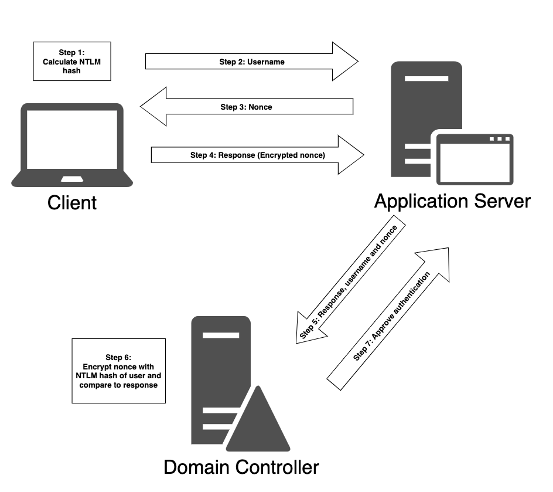
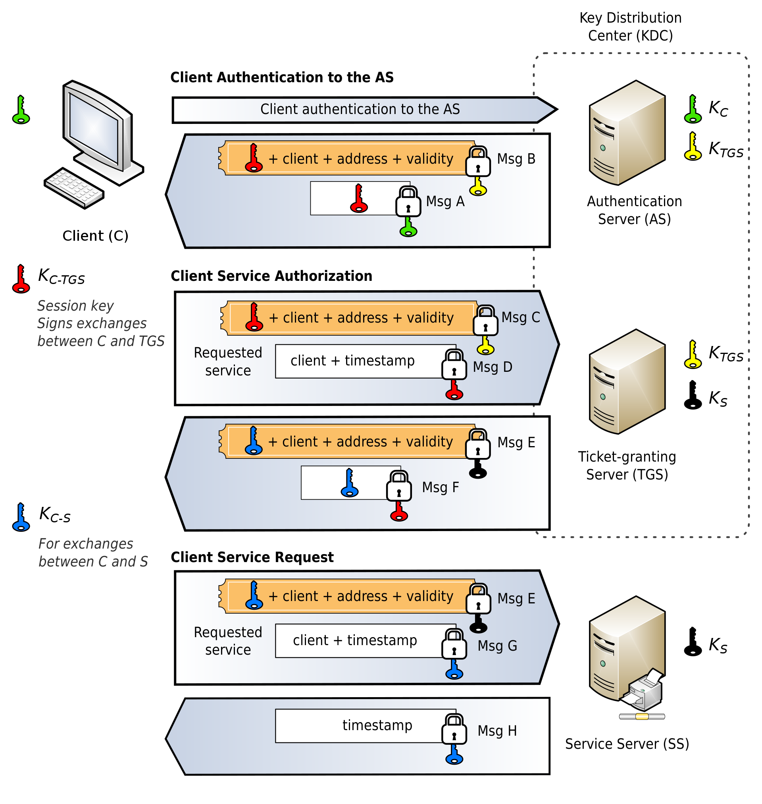
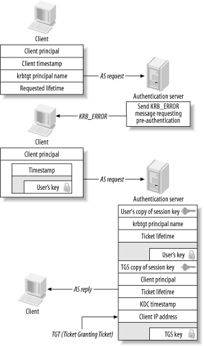
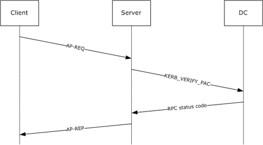
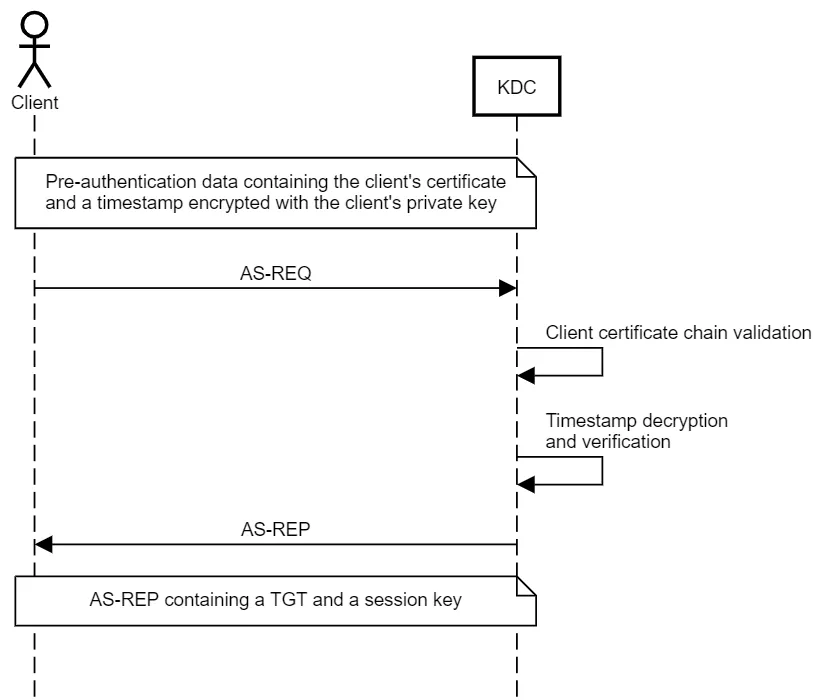
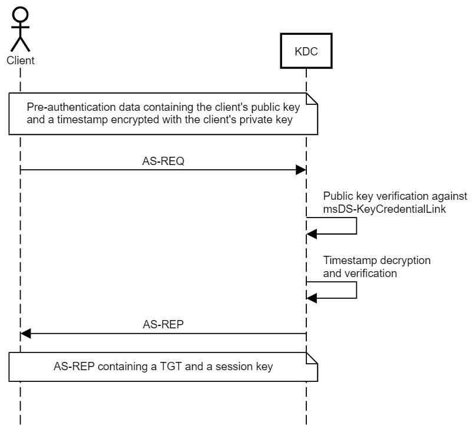
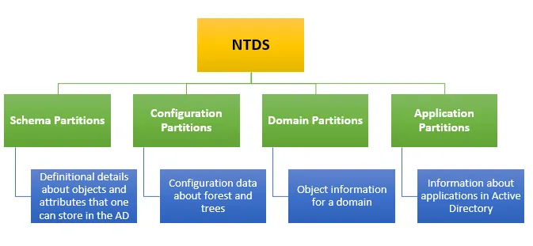

---
layout:
  title:
    visible: true
  description:
    visible: false
  tableOfContents:
    visible: true
  outline:
    visible: true
  pagination:
    visible: true
---

# Authentication

Active Directory supports multiple authentication protocols and techniques that implement authentication to Windows computers as well as those running Linux and macOS. While older protocols (such as [WDigest](https://learn.microsoft.com/en-us/previous-versions/windows/it-pro/windows-server-2003/cc778868\(v=ws.10\)?redirectedfrom=MSDN)) may be helpful for Windows 7-era machines, this section will primarily focus on the more modern methods: **NTLM** and **Kerberos** authentication.

## NTLM

NT (New Technology) LAN Manager (NTLM) is a suite of Microsoft security protocols intended to provide authentication, integrity, and confidentiality to users.

### Protocol Operation

The following steps present an outline of NTLM non-interactive authentication. The first step provides the user's NTLM credentials and occurs only as part of the interactive authentication (logon) process.

1. (Interactive authentication only) A user accesses a client computer and provides a domain name, user name, and password. The client computes a cryptographic hash of the password and discards the actual password. This is known as the **NTLM hash**
2. The client sends the user name to the server (in plaintext).
3. The server generates a 16-byte random number, called a challenge or nonce, and sends it to the client.
4. The client encrypts this challenge with the hash of the user's password and returns the result to the server. This is called the response.
5. The server sends the following three items to the domain controller:
   * Username
   * Challenge sent to the client
   * Response received from the client
6. The domain controller uses the user name to retrieve the hash of the user's password from the Security Account Manager database. It uses this password hash to encrypt the challenge.
7. The domain controller compares the encrypted challenge it computed (in step 6) to the response computed by the client (in step 4). If they are identical, authentication is successful.

<figure><figcaption><p>NTLMv2 Authentication in AD environment</p></figcaption></figure>

### Versions

#### NTLMv1

The server authenticates the client by sending an 8-byte random number, the challenge. The client performs an operation involving the challenge and a secret shared between client and server, specifically one of the two password hashes described above. The client returns the 24-byte result of the computation. In fact, in NTLMv1 the computations are usually made using both hashes and both 24-byte results are sent. The server verifies that the client has computed the correct result, and from this infers possession of the secret, and hence the authenticity of the client.

Both the hashes produce 16-byte quantities. Five bytes of zeros are appended to obtain 21 bytes. The 21 bytes are separated in three 7-byte (56-bit) quantities. Each of these 56-bit quantities is used as a key to [DES](https://en.wikipedia.org/wiki/Data\_Encryption\_Standard) encrypt the 64-bit challenge. The three encryptions of the challenge are reunited to form the 24-byte response.

The exchange looks like this:

```
C = 8-byte server challenge, random
K1 | K2 | K3 = NTLM-Hash | 5-bytes-0
response = DES(K1,C) | DES(K2,C) | DES(K3,C)
```

#### NTLMv2

NTLMv2 is a challenge-response authentication protocol. It is intended as a cryptographically strengthened replacement for NTLMv1, enhancing NTLM security by hardening the protocol against many spoofing attacks and adding the ability for a server to authenticate to the client.

NTLMv2 sends two responses to an 8-byte _server challenge_. Each response contains a 16-byte [HMAC](https://en.wikipedia.org/wiki/HMAC)-[MD5](https://en.wikipedia.org/wiki/MD5) hash of the server challenge, a fully/partially randomly generated _client challenge_, and an HMAC-MD5 hash of the user's password and other identifying information. The two responses differ in the format of the client challenge. The shorter response uses an 8-byte random value for this challenge. In order to verify the response, the server must receive as part of the response the client challenge. For this shorter response, the 8-byte client challenge appended to the 16-byte response makes a 24-byte package which is consistent with the 24-byte response format of the previous NTLMv1 protocol.

The second response sent by NTLMv2 uses a variable-length client challenge which includes (1) the current time in [NT Time](https://en.wikipedia.org/wiki/NT\_Time) format, (2) an 8-byte random value (CC2 in the box below), (3) the domain name and (4) some standard format stuff. The response must include a copy of this client challenge, and is therefore variable length.

The challenge response exchange follows this format:

```
SC = 8-byte server challenge, random
CC = 8-byte client challenge, random
CC* = (X, time, CC2, domain name)
v2-Hash = HMAC-MD5(NT-Hash, user name, domain name)
LMv2 = HMAC-MD5(v2-Hash, SC, CC)
NTv2 = HMAC-MD5(v2-Hash, SC, CC*)
response = LMv2 | CC | NTv2 | CC*
```

#### NTLMv2 Session

The NTLM2 Session protocol is similar to [MS-CHAPv2](https://en.wikipedia.org/wiki/MS-CHAP). It consists of authentication from NTLMv1 combined with session security from NTLMv2.

Briefly, the NTLMv1 algorithm is applied, except that an 8-byte client challenge is appended to the 8-byte server challenge and MD5-hashed. The least 8-byte half of the hash result is the challenge utilized in the NTLMv1 protocol. The client challenge is returned in one 24-byte slot of the response message, the 24-byte calculated response is returned in the other slot.

This is a strengthened form of NTLMv1 which maintains the ability to use existing Domain Controller infrastructure yet avoids a dictionary attack by a rogue server.

The format followed for this version is:

```
NTLMv1
  Client<-Server:  SC
  Client->Server:  H(P,SC)
  Server->DomCntl: H(P,SC), SC
  Server<-DomCntl: yes or no

NTLM2 Session
  Client<-Server:  SC
  Client->Server:  H(P,H'(SC,CC)), CC
  Server->DomCntl: H(P,H'(SC,CC)), H'(SC,CC)
  Server<-DomCntl: yes or no
```

### Prevalence

Since 2010, Microsoft no longer recommends NTLM in applications. Despite these recommendations, NTLM is still widely deployed on systems. A major reason is to maintain compatibility with older systems.

Also, **NTLM authentication is used when a client authenticates to a server by IP address** (instead of by hostname), or if the user attempts to authenticate to a hostname that is not registered on the Active Directory-integrated DNS server. Likewise, third-party applications may choose to use NTLM authentication instead of Kerberos.

Even with its relative weaknesses, completely disabling and blocking NTLM authentication requires extensive planning and preparation as it's an important fallback mechanism and used by many third-party applications. Therefore, it's fairly common to encounter enabled NTLM authentication in a target environment.

### Drawbacks

As with any other cryptographic hash, NTLM cannot be reversed. However, it is considered a _fast-hashing_ algorithm since short passwords can be cracked quickly using modest equipment.

By using cracking software like Hashcat with top-of-the-line graphic processors, it is possible to test over 600 billion NTLM hashes every second. This means that eight-character passwords may be cracked within 2.5 hours and nine-character passwords may be cracked within 11 days.

## Kerberos

Computer-network authentication protocol that works on the basis of **tickets** to allow nodes communicating over a non-secure network to prove their identity to one another in a secure manner.Its designers aimed it primarily at a **client–server model**, and it provides **mutual authentication**, where both the user and the server verify each other's identity. Kerberos protocol messages are **protected against eavesdropping and replay attacks**.Kerberos builds on symmetric-key cryptography and requires a trusted third party, and optionally may use public-key cryptography during certain phases of authentication. Kerberos uses **UDP port 88** by default. Protocol was originally developed by MIT.Windows 2000 and later versions use Kerberos as the default authentication method. Microsoft added some features to Kerberos (documented in RFC 3244)

### Protocol Overview <a href="#protocol-overview" id="protocol-overview"></a>

The client authenticates itself to the **Authentication Server** (**AS**) which forwards the username to a [**key distribution center**](https://en.wikipedia.org/wiki/Key\_distribution\_center) (**KDC**).&#x20;

The KDC issues a **ticket-granting ticket** (**TGT**), which is time stamped and encrypts it using the **ticket-granting service's** (**TGS**) secret key and returns the encrypted result to the user's workstation. This is _done infrequently_, typically at user logon; the TGT expires at some point although it may be transparently renewed by the user's session manager while they are logged in.

When the client needs to communicate with a service on another node (a "principal", in Kerberos parlance), the client sends the TGT to the TGS, which usually shares the same host as the KDC. The service must have already been registered with the TGS with a Service Principal Name (SPN). The client uses the SPN to request access to this service. After verifying that the TGT is valid and that the user is permitted to access the requested service, the TGS issues ticket and session keys to the client. The client then sends the ticket to the service server (SS) along with its service request.

### Operation Details

The protocol is detailed below. There is also a [diagram](./#diagram) illustrating the concepts below. Keep in mind in an AD environment the KDC (made up of the AS and TGS) is the domain controller. The information below is also described (and illustrated) [here](https://en.hackndo.com/kerberos/#how-it-works).

#### Client Authentication to AS

When a client attempts to authenticate to the AS, the following steps are used:

1. Client sends a clear-text message of the user ID to the **Authentication Server** (**AS**) requesting services on behalf of the user. This message is known as the _AS Request_ (`AS-REQ`)
2. If client is in AS's database, the AS generates the secret key by hashing the password of the user found at the database (e.g. Active Directory in Windows Server) and sends two messages back to the client known as the _AS Reply_ (`AS-REP`):
   * **Message A:** Client/Ticket-Granting-Service (TGS) Session Key. This is a symmetric key that can be used for the rest of the session
     * **Direction:** KDC (AS) to client
     * **Encrypted With:** Client's secret key
       * The "secret" key is actually based on the user's password. On the client end the password is entered by the user. On the server's end, it has access to the AD database and can obtain the user's (hashed) password and thus the key
       * The user's password is looked up in the [`Ntds.dit`](https://attack.mitre.org/techniques/T1003/003/) file
   * **Message B:** Ticket Granting Ticket (TGT)
     * **Direction:** KDC (AS) to client
     * **Encrypted With:** TGS's secret key
       * The TGT is not decrypted by the client, it is just stored and presented whenever it is needed in later interactions
       * The key is the (NTLM hash of the [`KRBTGT`](./#krbtgt) account)
     * **Consists Of:** Client ID, client [network address](https://en.wikipedia.org/wiki/Network\_address), ticket validity period, and the Client/TGS Session Key. This is all then encrypted with the TGS's secret key
3. Once the client receives messages A and B, it attempts to decrypt message A with the secret key generated from the password entered by the user
   * If the user entered password does not match the password in the AS database, the client's secret key will be different and thus unable to decrypt message A
   * With a valid password and secret key the client decrypts message A to obtain the **Client/TGS Session Key**
     * This session key is used for further communications with the TGS

#### Client Service Authorization

When a client wants to use a service on the network it must request authorization via the steps:

1. Client sends the following messages to the TGS known as the _TGS Request_ (`TGS-REQ`):
   * **Message C:** Service request
     * **Direction:** Client to KDC (TGS)
     * **Composed Of:** TGT and ID of requested service
       * ID of requested service is a Service Principal Name (SPN) of the form `spn/host`
         * E.g. `MSSqlSvc/SQL.domain.com`. requests the MSSQL service via its SPN (`MSsqlSvc`) on the host machine `SQL.domain.com`.
     * **Encrypted With:** Message C as a whole is not encrypted, but recall the TGT is encrypted with the TGS's secret key and is basically just an encrypted blob to the client
   * **Message D:** Authenticator
     * **Direction:** Client to KDC (TGS)
     * **Composed Of:** Client ID and timestamp
     * **Encrypted With:** Client/TGS Session Key (established in Message A)
2. The TGS conducts the following steps for validation:
   1. Extracts the "Message B" portion from Message C and decrypts it using its (the TGS's) secret key
      * This gives the TGS access to the Client/TGS session key and the client ID (both of which are contained in the unencrypted TGT)
   2. Message D is then decrypted using the Client/TGS session key
      * This yields another copy of the client ID and a timestamp
      * The TGS ensures the timestamp is not a duplicate of one it has seen before as that could be an indication of a replay attack
   3. The client IDs retrieved from messages C and D are compared and if they match the TGS sends the following 2 messages to the client known as the _TGS Reply_ (`TGS-REP`):
      * **Message E:** Client-To-Service Key
        * **Direction:** KDC (TGS) to client
        * **Consists Of:** client ID, client network address, validity period, and _Client/Service Session Key_
        * **Encrypted With:** Service's secret key
          * TGS has access to service's key in the same way it has access to the user's
          * Because this is encrypted with the service's key it will just be an encrypted blob to the client. Which is fine because the purpose of this message is mainly to safely transport the Client/Service Session Key to the service's server
      * **Message F:** Client/Service Session Key
        * **Direction:** KDC (TGS) to client
        * **Encrypted With:** Client/TGS Session Key (established in Message A)
          * This message makes the Client/Service Session Key accessible to the client machine because the contents can be decrypted as the client has access to the client/TGS session key

#### Client Service Request

At this point the client has enough information to authenticate with the service server (SS), also known as the application server (AS). To do so:

1. Client sends the SS two messages. This is known as the _Application Request_ (`AP-REQ`)
   * **Message E:** Exact copy of message from previous step. The message is effectively just forwarded from the TGS to the SS via the client
   * **Message G:** Service Authenticator
     * **Direction:** Client to SS
     * **Composed Of:** Client ID and timestamp
     * **Encrypted With:** Client/Service Session Key (passed to client in Message F)
2. The SS performs the following steps for authentication
   1. Decrypts Message E using its (the SS's) own secret key
      * This gives the SS a copy of the Client/Service session key as well as the client's ID
   2. Decrypts Message G using the Client/Service session key (extracted from Message E)
      * This gives the SS another copy of the client ID
   3. Compares the client IDs from Messages E and G, if they match the server sends the following message to confirm its identity. This message is known as the _Application Response_ (`AP-REP`):
      * **Message H:** Timestamp found in Message G&#x20;
        * **Encrypted With:** Client/Service Session Key (from decrypted Message E)
   4. Client decrypts Message H and validates the timestamp matches what was in its service authenticator message (Message G). If the timestamps match the client is authenticated and can trust the server
   5. If enabled, [PAC validation](./#pac-validation) is performed here
   6. Authentication is complete and client can begin using service

#### Diagram

The steps described above are visualized in the diagram below:

<figure><figcaption><p>Client authenticating to a KDC then an SS</p></figcaption></figure>

### Pre-Authentication

Starting with Kerberos 5, [**pre-authentication**](https://learn.microsoft.com/en-us/archive/technet-wiki/23559.kerberos-pre-authentication-why-it-should-not-be-disabled) was introduced to prevent [AS-REP Roasting](attacking-ad-authentication/as-rep-roasting.md). Pre-Authentication requires a client to prove their identity prior to receiving an AS-REP message. The steps [above](./#client-authentication-to-as) describe operation without Pre-Authentication:

1. Client sends `AS-REQ` which is just a clear-text user ID
2. Server responds with `AS-REP` which is made up of 2 messages one of which is the TGT

Pre-Authentication inserts an extra step:

1. Client encrypts a timestamp with the user's password hash
2. KDC then attempts to decrypt and verify this timestamp (recall the KDC also has access to the user's password hash)
3. Assuming the timestamp can be decrypted it validates the client has access to the user's password (at least in theory)

The way this actually works in practice is that instead of replying to the `AS-REQ` with an `AS-REP` immediately, the KDC instead replies with a `KRB_ERROR` message. This tells the client pre-authentication is required and the client can respond with the required encrypted timestamp as seen in the diagram below ([source](https://www.oreilly.com/library/view/kerberos-the-definitive/0596004036/ch03s03s06.html)):

<figure><figcaption><p>Kerberos with pre-authentication enabled</p></figcaption></figure>

The above is known as the symmetric key approach to Pre-Authentication as it relies on the symmetric key of the user's password hash. There is also an asymmetric cryptography approach known as PKINIT.

### Concepts

#### KRBTGT

The [`KRBTGT`](https://adsecurity.org/?p=483) account is a local default account that acts as a service account for the Key Distribution Center (KDC) service. This account cannot be deleted, and the account name cannot be changed. The KRBTGT account cannot be enabled in Active Directory.

`krbtgt` is also the security principal name used by the KDC for a Windows Server domain, as specified by [RFC 4120](http://www.ietf.org/rfc/rfc4120.txt). The `krbtgt` account is the entity for the `krbtgt` security principal, and it is created automatically when a new domain is created.

Windows Server Kerberos authentication is achieved by the use of a special Kerberos ticket-granting ticket (TGT) enciphered with a symmetric key. This key is derived from the password of the server or service to which access is requested. The TGT password of the `krbtgt` account is known only by the Kerberos service. In order to request a session ticket, the TGT must be presented to the KDC. The TGT is issued to the Kerberos client from the KDC.

### Drawbacks

* Kerberos has strict time requirements, which means that the clocks of the involved hosts must be synchronized within configured limits.
  * The tickets have a time availability period, and if the host clock is not synchronized with the Kerberos server clock, the authentication will fail
  * The default configuration per MIT requires that clock times be no more than five minutes apart
* The administration protocol is not standardized and differs between server implementations
  * Password changes are described in RFC 3244
* In case of symmetric cryptography adoption (Kerberos can work using symmetric or asymmetric (public-key) cryptography), since all authentications are controlled by a centralized key distribution center (KDC), compromise of this authentication infrastructure will allow an attacker to impersonate any user.
* Each network service that requires a different host name will need its own set of Kerberos keys. This complicates virtual hosting and clusters.
* Kerberos requires user accounts and services to have a trusted relationship to the Kerberos token server.
* The required client trust makes creating staged environments (e.g., separate domains for test environment, pre-production environment and production environment) difficult: Either domain trust relationships need to be created that prevent a strict separation of environment domains, or additional user clients need to be provided for each environment.

### Privilege Attribute Certificate

The base _Kerberos protocol does not provide authorization_. "Kerberized" applications are expected to manage their own authorization, typically through names. Specifically, the Kerberos protocol does not define any explicit group membership or logon policy information to be carried in the Kerberos tickets. It leaves that for Kerberos extensions to provide a mechanism to convey authorization information by encapsulating this information within an `AuthorizationData` structure.

The [**Privilege Attribute Certificate**](https://learn.microsoft.com/en-us/openspecs/windows\_protocols/ms-pac/54d570b1-fc54-4c54-8218-f770440ec334) (**PAC**)  was created to provide this authorization data for Kerberos Protocol Extensions [`[MS-KILE]`](https://learn.microsoft.com/en-us/openspecs/windows\_protocols/ms-kile/2a32282e-dd48-4ad9-a542-609804b02cc9). Into the PAC structure `[MS-KILE]` encodes authorization information, which consists of group memberships, additional credential information, profile and policy information, and supporting security metadata.

Examples of information that can be provided by a DC include:

* Authorization data such as [security identifiers (SIDs)](https://learn.microsoft.com/en-us/openspecs/windows\_protocols/ms-pac/f2ef15b6-1e9b-48b5-bf0b-019f061d41c8#gt\_83f2020d-0804-4840-a5ac-e06439d50f8d) and [relative identifiers (RIDs)](https://learn.microsoft.com/en-us/openspecs/windows\_protocols/ms-pac/f2ef15b6-1e9b-48b5-bf0b-019f061d41c8#gt\_df3d0b61-56cd-4dac-9402-982f1fedc41c).
* User profile information such as a home directory or logon script.
* Password credentials, used during smart card authentication, for password based authentication protocols to use at a later time.
* [Service for User (S4U)](https://learn.microsoft.com/en-us/openspecs/windows\_protocols/ms-pac/f2ef15b6-1e9b-48b5-bf0b-019f061d41c8#gt\_083a5403-f654-4db6-b17e-9c10dc5cd420) protocol [\[MS-SFU\]](https://learn.microsoft.com/en-us/openspecs/windows\_protocols/ms-sfu/3bff5864-8135-400e-bdd9-33b552051d94) data.

A PAC is shown below, it has been simplified and some comments added for readability ([source](https://en.hackndo.com/kerberos-silver-golden-tickets/)):


```
AuthorizationData item
    ad-type: AD-Win2k-PAC (128)
        Type: Logon Info (1)
            PAC_LOGON_INFO: 01100800cccccccce001000000000000000002006a5c0818...
                Logon Time: Aug 17, 2018 16:25:05.992202600 Romance Daylight Time
                Logoff Time: Infinity (absolute time)
                PWD Last Set: Aug 16, 2018 14:13:10.300710200 Romance Daylight Time
                PWD Can Change: Aug 17, 2018 14:13:10.300710200 Romance Daylight Time
                PWD Must Change: Infinity (absolute time)
                Acct Name: pixis
                Full Name: pixis
                Logon Count: 7
                Bad PW Count: 2
                User RID: 1102
                Group RID: 513
                GROUP_MEMBERSHIP_ARRAY
                    Referent ID: 0x0002001c
                    Max Count: 2
                    GROUP_MEMBERSHIP:
                        Group RID: 1108
                        Attributes: 0x00000007
                            .... .... .... .... .... .... .... .1.. = Enabled: The enabled bit is SET
                            .... .... .... .... .... .... .... ..1. = Enabled By Default: The ENABLED_BY_DEFAULT bit is SET
                            .... .... .... .... .... .... .... ...1 = Mandatory: The MANDATORY bit is SET
                    GROUP_MEMBERSHIP:
                        Group RID: 513
                        Attributes: 0x00000007
                            .... .... .... .... .... .... .... .1.. = Enabled: The enabled bit is SET
                            .... .... .... .... .... .... .... ..1. = Enabled By Default: The ENABLED_BY_DEFAULT bit is SET
                            .... .... .... .... .... .... .... ...1 = Mandatory: The MANDATORY bit is SET
                User Flags: 0x00000020
                User Session Key: 00000000000000000000000000000000
                Server: DC2016
                Domain: HACKNDO
                SID pointer:
                    Domain SID: S-1-5-21-3643611871-2386784019-710848469  (Domain SID)
                User Account Control: 0x00000210
                    .... .... .... ...0 .... .... .... .... = Don't Require PreAuth: This account REQUIRES preauthentication
                    .... .... .... .... 0... .... .... .... = Use DES Key Only: This account does NOT have to use_des_key_only
                    .... .... .... .... .0.. .... .... .... = Not Delegated: This might have been delegated
                    .... .... .... .... ..0. .... .... .... = Trusted For Delegation: This account is NOT trusted_for_delegation
                    .... .... .... .... ...0 .... .... .... = SmartCard Required: This account does NOT require_smartcard to authenticate
                    .... .... .... .... .... 0... .... .... = Encrypted Text Password Allowed: This account does NOT allow encrypted_text_password
                    .... .... .... .... .... .0.. .... .... = Account Auto Locked: This account is NOT auto_locked
                    .... .... .... .... .... ..1. .... .... = Don't Expire Password: This account DOESN'T_EXPIRE_PASSWORDs
                    .... .... .... .... .... ...0 .... .... = Server Trust Account: This account is NOT a server_trust_account
                    .... .... .... .... .... .... 0... .... = Workstation Trust Account: This account is NOT a workstation_trust_account
                    .... .... .... .... .... .... .0.. .... = Interdomain trust Account: This account is NOT an interdomain_trust_account
                    .... .... .... .... .... .... ..0. .... = MNS Logon Account: This account is NOT a mns_logon_account
                    .... .... .... .... .... .... ...1 .... = Normal Account: This account is a NORMAL_ACCOUNT
                    .... .... .... .... .... .... .... 0... = Temp Duplicate Account: This account is NOT a temp_duplicate_account
                    .... .... .... .... .... .... .... .0.. = Password Not Required: This account REQUIRES a password
                    .... .... .... .... .... .... .... ..0. = Home Directory Required: This account does NOT require_home_directory
                    .... .... .... .... .... .... .... ...0 = Account Disabled: This account is NOT disabled
```


This PAC is found in every tickets (`TGT` or `TGS`) and is encrypted either with the KDC key or with the requested service account’s key. Therefore the user has no control over this information, so he cannot modify his own rights, groups, etc.

In fact the PAC is usually double signed to ensure it is not modified. When a PAC is attached to a `TGS-REP` by the KDC, the PAC is signed first by the key of the service account (service that is being requested in the `TGS-REQ/REP`). The PAC is then signed a second time using the domain controller's secret (NT Hash of the `krbtgt` account).

#### PAC Validation

The application on the server executing in the context of the service account checks the user's permissions from the group memberships included in the service ticket . However, the user and group permissions in the service ticket (`AP-REQ`) are not verified by the application in a majority of environments. In this case, the application blindly trusts the integrity of the service ticket since it is encrypted with a password hash that is, in theory, only known to the service account and the domain controller.

[PAC Validation](https://learn.microsoft.com/en-us/openspecs/windows\_protocols/ms-apds/1d1f2b0c-8e8a-4d2a-8665-508d04976f84) is an optional verification process between the SPN application and the domain controller. If this is enabled, the user authenticating to the service and its privileges are validated by the domain controller.

Recall from above that a PAC is double-signed. First using the service's account hash and then using `krbtgt`'s account secret. The first signature is always checked as part of processing the AP-REQ. It is the second signature, `krbtgt`'s, that is validated when PAC validation is enabled. This ensures that the PAC is legitimate and from the KDC not forged.

With PAC enabled a [client service request](./#client-service-request) looks like this:

<figure><figcaption><p>PAC checks enabled</p></figcaption></figure>

1. The client tries to access a resource requiring Kerberos authentication be sending an `AP-REQ` message
2. The server passes the PAC to the operating system to receive an access token. The server operating system forwards the PAC signature in the `AP-REQ` to the domain controller for verification in a `KERB_VERIFY_PAC` message.
3. The domain controller verifies the signature on the response and returns the result to the server.&#x20;
   * An error is returned as the appropriate RPC status code.
4. The server verifies the `AP-REQ`, and sends an `AP-REP` if the verification is successful.

## PKI in AD

[**Public key infrastructure**](https://en.wikipedia.org/wiki/Public\_key\_infrastructure) (**PKI**) is a set of roles, policies, hardware, software and procedures needed to create, manage, distribute, use, store and revoke digital certificates and manage public-key encryption. The purpose of a PKI is to facilitate the secure electronic transfer of information for a range of network activities such as e-commerce, internet banking and confidential email.

### AD CS

Microsoft provides the AD role [`Active Directory Certificate Services`](https://learn.microsoft.com/en-us/training/modules/implement-manage-active-directory-certificate-services/)  (`AD CS`) to implement a PKI, which exchanges digital certificates between authenticated users and trusted resources. AD CS provides all PKI-related components as role services. Each role service is responsible for a specific portion of the certificate infrastructure while working together to form a complete solution.

The AD CS role includes the following role services:

* **Certification Authority:** The main purposes of CAs are to issue certificates, to revoke certificates, and to publish authority information access (AIA) and revocation information.
* **Certification Authority Web Enrollment:** This component provides a method to issue and renew certificates in scenarios where users use devices that are not joined to the domain or are running operating systems other than Windows.
* **Online Responder:** This component can be used to configure and manage Online Certificate Status Protocol (OCSP) validation and revocation checking.
* **Network Device Enrollment Service (NDES):** With this component, routers, switches, and other network devices can obtain certificates from AD CS.
* **Certificate Enrollment Web Service** **(CES):** This component works as a proxy client between a computer running Windows and the CA. CES enables users, computers, or applications to connect to a CA by using web services
* **Certificate Enrollment Policy Web Service:** This component enables users to obtain certificate enrollment policy information. Combined with CES, it enables policy-based certificate enrollment in scenarios where user devices are not joined to the domain or can't connect to a domain controller

#### Deployment Types

When using AD CS, one can deploy two types of CAs: **standalone** and **enterprise**. These types of CAs are not about hierarchy, but instead, about functionality and integration with AD DS. A standalone CA doesn't depend on AD DS. An enterprise CA requires AD DS, to provide additional functionality, such as autoenrollment. Autoenrollment allows domain users and domain-joined devices to enroll automatically for certificates after you enable automatic certificate enrollment through Group Policy.

### PKINIT

[PKINIT](https://web.mit.edu/kerberos/krb5-1.12/doc/admin/pkinit.html) is an asymmetric cryptography approach to pre-authentication. [Recall from above](./#pre-authentication) that symmetric pre-authentication leverages the current user's password hash as a symmetric key for encrypting the `AS-REQ` thus fulfilling the pre-authentication requirement before receiving an `AS-REP`.

The client has a public-private key pair, and encrypts the pre-authentication data with their private key, and the KDC decrypts it with the client’s public key. The KDC also has a public-private key pair, allowing for the exchange of a session key using one of two methods:

1. [**Diffie-Hellman Key Delivery**](https://en.wikipedia.org/wiki/Diffie%E2%80%93Hellman\_key\_exchange)
2. **Public Key Encryption Key Delivery:** uses the KDC’s private key and the client’s public key to envelop a session key generated by the KDC

PKINIT is not possible out of the box in every Active Directory environment. The key is that both the KDC and the client need a public-private key pair. However, if the environment has [AD CS](./#a-d-cs) and a CA available, the Domain Controller will automatically obtain a certificate by default.

#### Certificate Model

Traditionally, PKI allows the KDC and the client to exchange their public keys using Digital Certificates signed by an entity that both parties have previously established trust with — the CA. This is known as the **Certificate Model** and functions as shown in the diagram below:

<figure><figcaption><p>Pre-Authentication with certificates</p></figcaption></figure>

#### Key Trust

Microsoft also introduced the concept of **Key Trust**, to support passwordless authentication in environments that don’t support Certificate Trust. Under the Key Trust model, PKINIT authentication is established based on the raw key data rather than a certificate.

The client’s public key is stored in a multi-value attribute called [`msDS-KeyCredentialLink`](https://learn.microsoft.com/en-us/openspecs/windows\_protocols/ms-adts/f70afbcc-780e-4d91-850c-cfadce5bb15c), introduced in Windows Server 2016. The values of this attribute are Key Credentials, which are serialized objects containing information such as the creation date, the distinguished name of the owner, a GUID that represents a Device ID, and, of course, the public key. It is a multi-value attribute because an account have several linked devices.

When this model is used, the PKINIT process works as follows:

<figure><figcaption><p>PKINIT with Key Trust</p></figcaption></figure>


## `NTDS.dit`

`NTDS.DIT` stands for New Technology Directory Services Directory Information Tree. It serves as the primary database file within Microsoft’s Active Directory Domain Services (AD DS). Essentially, `NTDS.DIT` stores and organizes all the information related to objects in the domain, including users, groups, computers, and more. It acts as the backbone of Active Directory, housing critical data such as user account details, passwords, group memberships, and other object attributes.

By default, the `Ntds.dit` file is stored in `C:\Windows\NTDS\Ntds.dit` on a domain controller. However, during the Active Directory installation process, the location can be modified based on specific requirements or preferences.

The active directory database is stored in a single `Ntds.dit` file which is logically separated into the following partitions:

<figure><figcaption><p>NTDS.DIT structure</p></figcaption></figure>

While Active Directory is running, it maintains a file system lock on the `Ntds.dit` file. Any attempts to access or copy it will fail. Fortunately there are ways around this ([source](https://www.netwrix.com/ntds\_dit\_security\_active\_directory.html)):

* Simply stop Active Directory (though this is likely to result in being detected).
* Use the Volume Shadow Copy Service (VSS) to snapshot the volume and extract `ntds.dit` from the snapshot as seen in [this example](../persistence/shadow-copies.md)
* Use a PowerShell tool like PowerSploit’s `Invoke-NinjaCopy` to copy the files even though they are in use
* Use a built-in tool like `DSDBUtil.exe` or `NTDSUtil.exe` to create active directory installation media files
