---
layout:
  title:
    visible: true
  description:
    visible: false
  tableOfContents:
    visible: true
  outline:
    visible: true
  pagination:
    visible: true
---

# Automated

## SharpHound

[BloodHound](https://bloodhound.readthedocs.io/en/latest/index.html) is an automatic enumeration tool that uses graph theory to reveal the hidden and often unintended relationships within an Active Directory environment.

[SharpHound](https://bloodhound.readthedocs.io/en/latest/data-collection/sharphound.html) is the official data collector for BloodHound. It is written in C# and uses native Windows API functions and LDAP namespace functions to collect data from domain controllers and domain-joined Windows systems.

SharpHound is available as a [PowerShell script](https://github.com/BloodHoundAD/BloodHound/blob/master/Collectors/SharpHound.ps1), a [pre-compiled executable](https://github.com/BloodHoundAD/BloodHound/blob/master/Collectors/SharpHound.exe), or as [source code](https://github.com/BloodHoundAD/SharpHound). The PowerShell script is meant to be imported as a module:

```powershell
Import-Module .\SharpHound.ps1
```

BloodHound is then started via the command:

```powershell
Invoke-Bloodhound
```

The PowerShell script just runs the core engine via reflection. Therefore this example will focus on using the executable.

### Usage

#### Basic

If running in default mode, SharpHound will automatically determine what domain your current user belongs to, find a domain controller for that domain, and start the “default” collection method. This is done simply by calling the executable:

```sh
SharpHound.exe
```

The default collection method will collect the following pieces of information from the domain controller:

* Security group memberships
* Domain trusts
* Abusable rights on Active Directory objects
* Group Policy links
* OU tree structure
* Several properties from computer, group and user objects
* SQL admin links

Additionally, SharpHound will attempt to collect the following information from each domain-joined Windows computer:

* The members of the local administrators, remote desktop, distributed COM, and remote management groups
* Active sessions, which SharpHound will attempt to correlate to systems where users are interactively logged on

#### Session Loop

Most information gathered during enumeration will not change very much. Groups, Users, etc. are all relatively stable. A notable exception to this rule is user sessions. User sessions are different for two reasons:

1. Users, especially privileged users, log on and off different systems all day, every day
2. The [way SharpHound’s data collection works](https://www.youtube.com/watch?v=q86VgM2Tafc) necessitates scanning the network several times to get more complete session information.
   * Scanning the network one time for user sessions may give the attacker between 5 and 15% of the actual sessions on the network.

SharpHound’s Session Loop collection method makes this very easy:

```bash
SharpHound.exe --CollectionMethods Session --Loop
```

#### Example

Continuing the example from the [manual enumeration](manual.md) section, assume the attacker has compromised the user `stephanie` and is able to use that account to access a machine (`CLIENT75`) joined to the `corp.com` domain. After transferring the executable to the machine the attacker can collect all information via the command:


```sh
SharpHound.exe --CollectionMethods All --OutputDirectory C:\Users\stephanie\Desktop\ --OutputPrefix "corp_audit"
```


When run, this starts SharpHound with a flurry of activity:

```shell-session
C:\Users\stephanie> .\SharpHound.exe --CollectionMethods All --OutputDirectory C:\Users\stephanie\Desktop\ --OutputPrefix "corp audit"
C:\Users\stephanie>.\SharpHound.exe --CollectionMethods All --OutputDirectory C:\Users\stephanie\Desktop\ --OutputPrefix "corp_audit"
2024-03-19T20:27:27.1305421-07:00|INFORMATION|This version of SharpHound is compatible with the 4.3.1 Release of BloodHound
2024-03-19T20:27:27.2735200-07:00|INFORMATION|Resolved Collection Methods: Group, LocalAdmin, GPOLocalGroup, Session, LoggedOn, Trusts, ACL, Container, RDP, ObjectProps, DCOM, SPNTargets, PSRemote
2024-03-19T20:27:27.2891802-07:00|INFORMATION|Initializing SharpHound at 8:27 PM on 3/19/2024
2024-03-19T20:27:27.4004192-07:00|INFORMATION|[CommonLib LDAPUtils]Found usable Domain Controller for corp.com : DC1.corp.com
...
2024-03-19T20:28:19.2837992-07:00|INFORMATION|SharpHound Enumeration Completed at 8:28 PM on 3/19/2024! Happy Graphing!
```

The output can be viewed in the `\Desktop` directory:

```shell-session
C:\Users\stephanie\Desktop> dir

 Directory of C:\Users\stephanie\Desktop

03/19/2024  08:28 PM    <DIR>          .
03/19/2024  08:25 PM    <DIR>          ..
03/19/2024  08:28 PM            12,717 corp_audit_20240319202818_BloodHound.zip
03/19/2024  08:28 PM             9,780 MTk2MmZkNjItY2IyNC00MWMzLTk5YzMtM2E1ZDcwYThkMzRl.bin
               2 File(s)         22,497 bytes
               2 Dir(s)     736,096,256 bytes free
```

The `MTk...Rl.bin` file is created by SharpHound but is not important and can be deleted. Once transferred back to the attacker's machine the `.zip` output can be examined. Once unzipped it contains:

```shell-session
kali@kali:~$ ls
corp_audit_20240319202818_computers.json   corp_audit_20240319202818_groups.json
corp_audit_20240319202818_containers.json  corp_audit_20240319202818_ous.json
corp_audit_20240319202818_domains.json     corp_audit_20240319202818_users.json
corp_audit_20240319202818_gpos.json
```

This is just a snapshot but the data can still prove useful. It is possible to manually go through the data, or BloodHound can be used for analysis as shown below.

## Analysis with BloodHound

BloodHound provides a user interface for analyzing the output gathered by SharpHound. An example of Analysis being conducted with BloodHound can be seen [here](../../../assembling-the-pieces/pivoting-to-the-internal-network.md#domain-enumeration).

### Prerequisites

#### Neo4j

BloodHound depends on [Neo4j](https://neo4j.com/) which must be started with the command:

```bash
sudo neo4j start
```

When run the output appears as follows:

```shell-session
kali@kali:~$ sudo neo4j start
Directories in use:
home:         /usr/share/neo4j
config:       /usr/share/neo4j/conf
logs:         /etc/neo4j/logs
plugins:      /usr/share/neo4j/plugins
import:       /usr/share/neo4j/import
data:         /etc/neo4j/data
certificates: /usr/share/neo4j/certificates
licenses:     /usr/share/neo4j/licenses
run:          /var/lib/neo4j/run
Starting Neo4j.
Started neo4j (pid:33755). It is available at http://localhost:7474
There may be a short delay until the server is ready.
```

Once started, the user can navigate to the interface in a browser. The landing page will look like this:

<figure>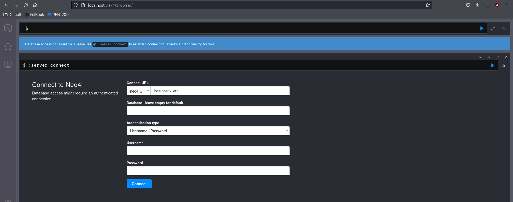<figcaption><p>Neo4J landing page</p></figcaption></figure>

For the first login the default credentials (`neo4j:neo4j`) are used. The user will immediately be prompted for a new password.

### Starting BloodHound

Once Neo4j is running, BloodHound can be started with the command:

```bash
bloodhound
```

The command launches a window asking the user to authenticate with Neo4j:

<figure>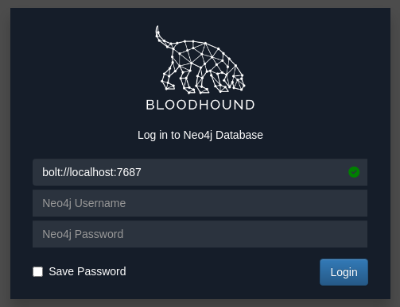<figcaption><p>Neo4j authentication in BloodHound</p></figcaption></figure>

Using the same credentials set up [earlier](automated.md#neo4j) the user authenticates to the database. Given that there is no data the page will appear blank, but the upload button (highlighted in green) can be used to load the `.zip` collected via SharpHound:

<figure>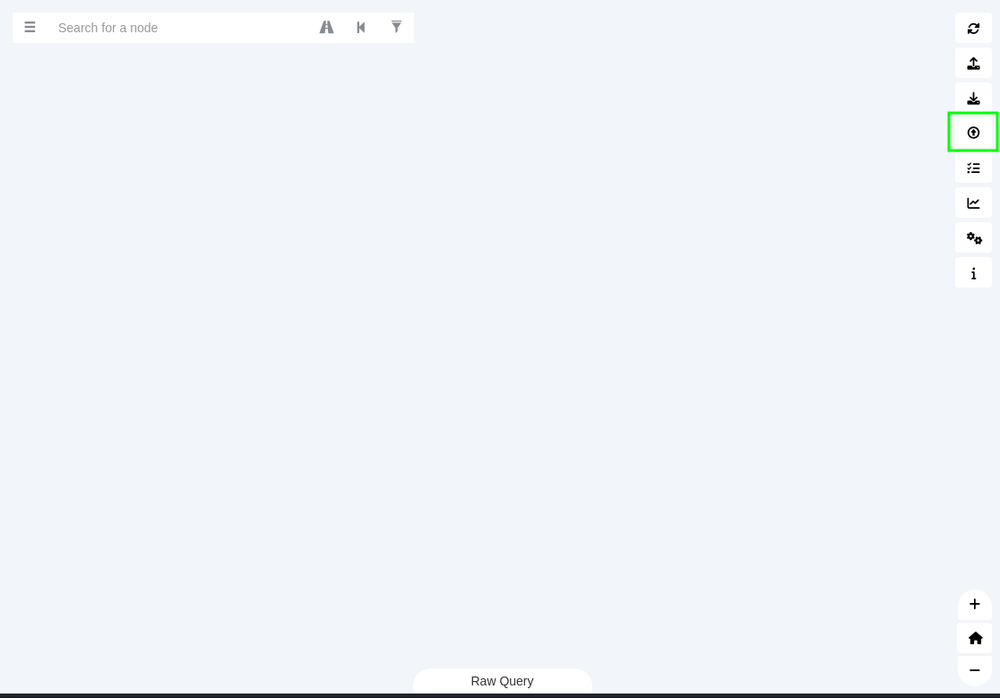<figcaption><p>Blank BloodHound screen</p></figcaption></figure>

### Analyze

#### Database Info

Once started and the data uploaded, the user can determine a rough size of the dataset collected via the `Database Info` tab accessible via the hamburger button highlighted in green:

<figure>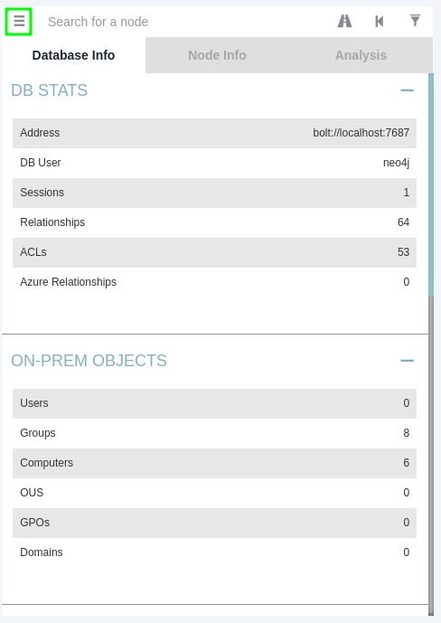<figcaption><p>Database Info in BloodHound</p></figcaption></figure>

#### Analysis

The `Analysis` tab offers a variety of options for looking at the data:

<figure>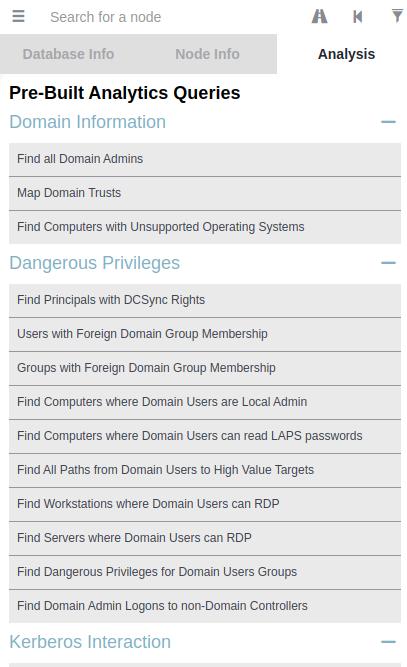<figcaption><p>BloodHound's Analysis options</p></figcaption></figure>

The various Analysis tools can be used to discover and highlight interesting or insecure relationships in the AD environment. The tools usually display output visually. For example, using the `Find All Domain Admins` tool the output looks something like this:

<figure>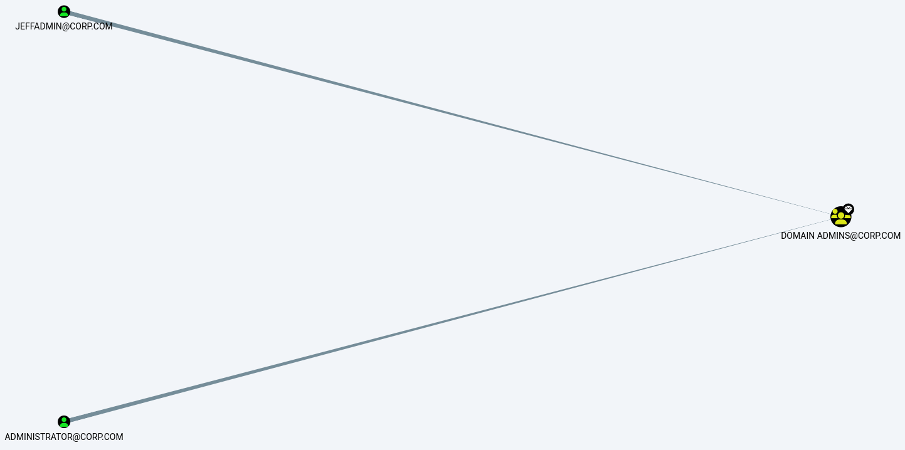<figcaption><p>Find All Domain Admins output</p></figcaption></figure>

### Node Info

Any particular item can be searched via the Search Node interface. The search attempts to auto-complete so the user can just start typing:

<figure>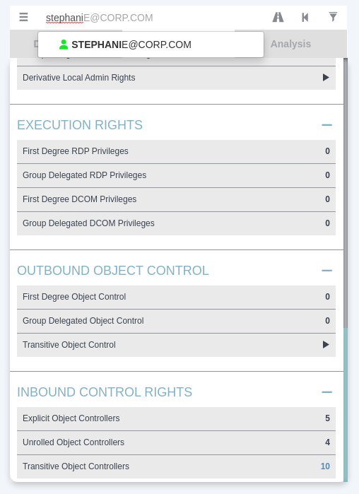<figcaption><p>Searching the Stephanie user</p></figcaption></figure>

Once an object is found the Node Info tab will contain a great deal of information about the particular object:

<figure>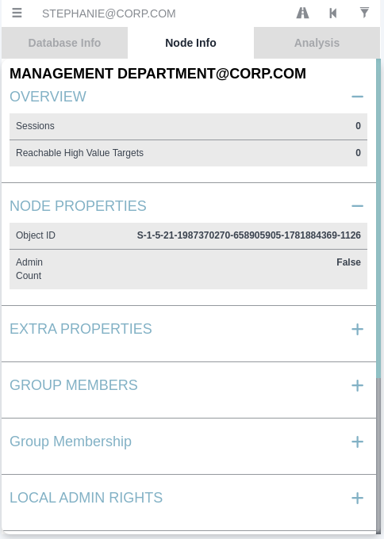<figcaption><p>Node Info tab</p></figcaption></figure>

Each section can be expanded to reveal additional information.

### Shortest Path

One of the strengths of BloodHound is its ability to automatically attempt to find the shortest path possible to reach a goal, whether that goal is to take over a particular computer, user, or group.

#### Shortest Path to Domain Admins

The `Find Shortest Path to Domain Admins` yields a great deal of information. It highlights object relationships to indicate a path an attacker could follow to reach the Domain Admins group:

<figure>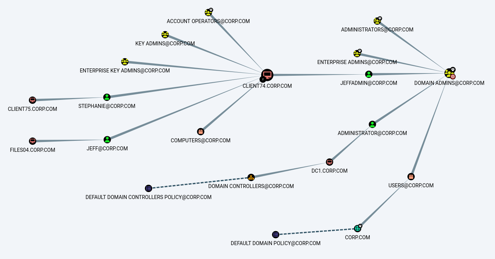<figcaption><p>How to reach Domain Admins</p></figcaption></figure>

This reveals that `client74` could be a pivot point if the attacker can use that access to gain access to the `jeffadmin` account.

#### Shortest Path from Owned Principles

While the [above](automated.md#shortest-path-to-domain-admins) is helpful it requires the user to manually look for items they have access to which can be tedious in bigger datasets. As a way around this problem, BloodHound allows the user to mark an object as Owned which is a way to tag objects the attacker has already compromised.

For example, all of the enumeration shown so far has been done from an account that was assumed to be compromised (`stephanie`). This means the attacker could mark the `stephanie` user account as an owned object:

<figure>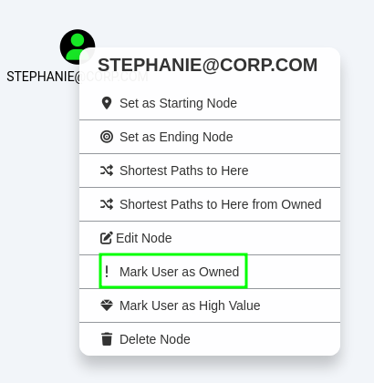<figcaption><p>Marking a User as Owned</p></figcaption></figure>

Once marked, the attacker could then use the `Shortest Paths to Domain Admins from Owned Principals` tool to look for a path that starts with objects the attacker already has access to:

<figure>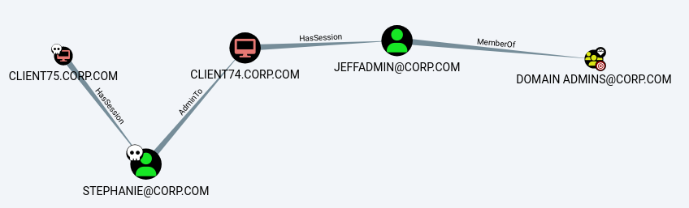<figcaption><p>Path from Owned Principals</p></figcaption></figure>

This shows a slimmed-down output of a path, starting with `stephanie`, that the attacker could follow to Domain Admins.

### Custom Queries

All BloodHound queries, even the predefined ones seen in examples above, are written with the [Cypher Query Language](https://neo4j.com/docs/cypher-manual/current/introduction/). BloodHound also offers the ability to supply custom queries. Some simple ones are enumerated below. For more complex ones see the list [here](https://hausec.com/2019/09/09/bloodhound-cypher-cheatsheet/) or the previously linked documentation for instructions on how to construct them.

#### All Users, Groups, or Computers

To retrieve all computer objects in the domain the query command is:

```
MATCH (c:Computer) RETURN c
```

The query starts with the keyword `MATCH`, which is used to select a set of objects. Then, the variable `c` is set containing all objects in the database with the property `Computer` (the variable name can be set to anything but I find it easier to use `c` for computers, `u` for users, and so on). Next, the `RETURN` keyword is used to build the resulting graph based on the objects in `c`. The `Computer` property could be replaced with `Group`, `User`, or `GPO` to see all groups, users, or group policy objects respectively:

```
MATCH (u:User) RETURN u
```

```
MATCH (g:Group) RETURN g
```

```
MATCH (g:GPO) RETURN g
```

#### User Sessions

The above queries were only filtering on a single property. To determine if a session exists some relationships between objects must be examined. Since Cypher is a [querying language](https://neo4j.com/docs/cypher-manual/current/queries/basic/) it is possible to  build a relationship query with the syntax `(NODES)-[:RELATIONSHIP]->(NODES)`. Therefore to check for any users that have a session on a computer the command would be:

```
MATCH p = (c:Computer)-[:HasSession]->(m:User) RETURN p
```

#### Service Principal Names

In order to check for all users with an associated SPN the query is:

```
MATCH (n:User)WHERE n.hasspn=true RETURN n
```

To check for any object that has an SPN (not just a user) the command is:

```
MATCH (n)WHERE n.hasspn=true RETURN n
```
