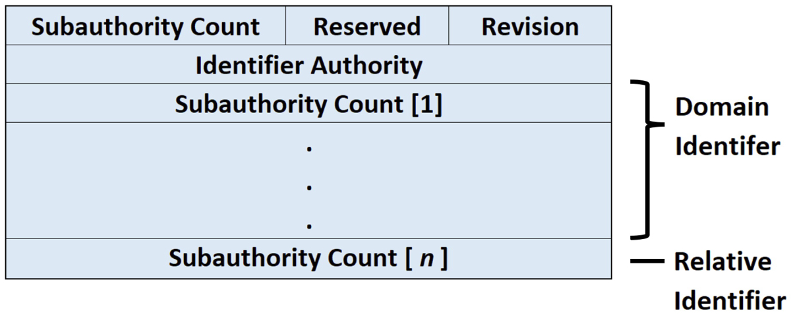
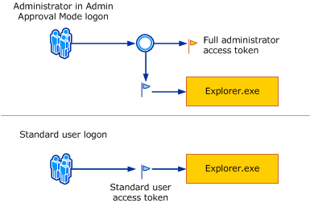

---
layout:
  title:
    visible: true
  description:
    visible: false
  tableOfContents:
    visible: true
  outline:
    visible: true
  pagination:
    visible: true
---

# Privilege Basics

Privileges on the Windows operating system refer to the permissions of a specific account to perform system-related local operations (e.g. modifying the filesystem or adding users).

## Security Identifier (SID)

Windows uses a [SID](https://learn.microsoft.com/en-us/windows-server/identity/ad-ds/manage/understand-security-identifiers) to identify entities. A SID is a unique value assigned to each entity, or **principal**, that can be authenticated by Windows, such as users and groups. The SID for local accounts and groups is generated by the **Local Security Authority** (**LSA**), and for domain users and domain groups, it's generated on a _Domain Controller_ (DC). The SID cannot be changed and is generated when the user or group is created.

### Structure

A security identifier is a data structure in binary format that contains a variable number of values. The first values in the structure contain information about the SID structure. The remaining values are arranged in a hierarchy (similar to a telephone number), and they identify the SID-issuing authority (for example, “NT Authority”), the SID-issuing domain, and a particular security principal or group.

<figure><figcaption><p>Structure of a SID</p></figcaption></figure>

* **Revision:** Indicates the version of the SID structure that's used in a particular SID
* **Identifier Authority:** Identifies the highest level of authority that can issue SIDs for a particular type of security principal
  * For example, the identifier authority value in the SID for the Everyone group is 1 (World Authority). The identifier authority value in the SID for a specific Windows Server account or group is 5 (NT Authority).
* **Subauthorities:** The most important information in a SID, which is contained in a series of one or more subauthority values. All values up to, but not including, the last value in the series collectively identify a domain in an enterprise. This part of the series is called the domain identifier. The last value in the series, which is called the relative identifier (RID), identifies a particular account or group relative to a domain.

The components of a SID are easier to visualize when SIDs are converted from a binary to a string format by using standard notation:

```
S-R-X-Y1-Y2-...-Yn
```

* `S`: Indicates the string is an SID
* `R`: Revision
  * Is always set to 1 as the overall structure of SIDs is still on its initial version
* `X`: Identifier authority. I.e. the authority that issues the SID
* `Y`: Represents a series of subauthority values

#### Identifier Authorities

<table><thead><tr><th width="544">Identifier Authority</th><th width="88">Value</th><th>SID Prefix</th></tr></thead><tbody><tr><td>SECURITY_NULL_SID_AUTHORITY</td><td>0</td><td><code>S-1-0</code></td></tr><tr><td>SECURITY_WORLD_SID_AUTHORITY</td><td>1</td><td><code>S-1-1</code></td></tr><tr><td>SECURITY_LOCAL_SID_AUTHORITY</td><td>2</td><td><code>S-1-2</code></td></tr><tr><td>SECURITY_CREATOR_SID_AUTHORITY</td><td>3</td><td><code>S-1-3</code></td></tr><tr><td>SECURITY_NT_AUTHORITY</td><td>5</td><td><code>S-1-5</code></td></tr><tr><td>SECURITY_AUTHENTICATION_AUTHORITY</td><td>18</td><td><code>S-1-18</code></td></tr></tbody></table>

#### Subauthority Values

The SID's most important information is contained in the series of subauthority values. The first part of the series (`-Y1-Y2-...-Yn-1`) is the **domain identifier**. This element of the SID becomes significant in an enterprise with several domains, because the domain identifier differentiates SIDs that are issued by one domain from SIDs that are issued by all other domains in the enterprise. No two domains in an enterprise share the same domain identifier.

The last item in the series of subauthority values (`-Yn`) is the **relative identifier** (**RID**). It distinguishes one account or group from all other accounts and groups in the domain. No two accounts or groups in any domain share the same relative identifier. The RID usually starts at 1000 for nearly all principals.

### Well-Known SIDs

There are SIDs that have an RID under 1000, and they are called **well-known SIDs**. They can be found on [this list](https://learn.microsoft.com/en-us/windows/win32/secauthz/well-known-sids?source=recommendations) of well-known SIDs. Some of the most common and important are enumerated below:

<table data-full-width="false"><thead><tr><th width="212.33333333333331">SID</th><th width="146">Name</th><th>Description</th></tr></thead><tbody><tr><td><code>S-1-0-0</code></td><td>Null SID</td><td>This is often used when a SID value is not known.</td></tr><tr><td><code>S-1-1-0</code></td><td>World</td><td>A group that includes all users</td></tr><tr><td><code>S-1-5-11</code></td><td>Authenticated Users</td><td><p>A group that includes all users and computers with identities that have been authenticated. </p><p></p><p>This group includes authenticated security principals from any trusted domain, not only the current domain</p></td></tr><tr><td><code>S-1-5-18</code></td><td>System (or LocalSystem)</td><td><p>An identity that's used locally by the operating system and by services that are configured to sign in as LocalSystem. </p><p></p><p>System is a hidden member of Administrators. That is, any process running as System has the SID for the built-in Administrators group in its access token.</p></td></tr><tr><td><code>S-1-5-domain-500</code></td><td>Administrator</td><td><p>A user account for the system administrator. Every computer has a local Administrator account and every domain has a domain Administrator account.</p><p></p><p>The Administrator account is the first account created during operating system installation. The account can't be deleted, disabled, or locked out, but it can be renamed.</p></td></tr><tr><td><code>S-1-5-domain-512</code></td><td>Domain Admins</td><td><p>A global group with members that are authorized to administer the domain.</p><p></p><p>By default, the Domain Admins group is a member of the Administrators group on all computers that have joined the domain, including domain controllers.</p></td></tr><tr><td><code>S-1-5-domain-513</code></td><td>Domain Users</td><td><p>A global group that includes all users in a domain.</p><p></p><p>When you create a new User object in Active Directory, the user is automatically added to this group.</p></td></tr><tr><td><code>S-1-5-domain-515</code></td><td>Domain Computers</td><td>A global group that includes all computers that have joined the domain, excluding domain controllers.</td></tr><tr><td><code>S-1-5-domain-516</code></td><td>Domain Controllers</td><td>A global group that includes all domain controllers in the domain. New domain controllers are added to this group automatically.</td></tr><tr><td><code>S-1-5-domain-519</code></td><td>Enterprise Admins</td><td><p>A group that exists only in the forest root domain.</p><p></p><p>This group is authorized to make changes to the forest infrastructure, such as adding child domains, configuring sites, authorizing DHCP servers, and installing enterprise certification authorities.</p></td></tr><tr><td><code>S-1-5-32-544</code></td><td>Administrators</td><td><p>A built-in group.</p><p></p><p>After the initial installation of the operating system, the only member of the group is the Administrator account.</p></td></tr><tr><td><code>S-1-5-32-545</code></td><td>Users</td><td>A built-in group.</td></tr><tr><td><code>S-1-5-32-546</code></td><td>Guests</td><td><p>A built-in group.</p><p></p><p>By default, the only member is the Guest account. The Guests group allows occasional or one-time users to sign in with limited privileges to a computer's built-in Guest account</p></td></tr><tr><td><code>S-1-5-6</code></td><td>Service</td><td>A group that includes all security principals that have signed in as a service</td></tr></tbody></table>

## Access Tokens

An [access token](https://learn.microsoft.com/en-us/windows/win32/secauthz/access-tokens) is an object that contains information on a process or thread's **security context**. The security context is a set of rules or attributes that are currently in effect. The information in a token includes the identity and privileges of the user account associated with the process or thread.

When a user logs on, the system verifies the user's password by comparing it with information stored in a security database. Assuming the password authenticates, the system produces an access token. Every process executed on behalf of this user has a copy of this access token.

Every process has a [primary token](https://learn.microsoft.com/en-us/windows/desktop/SecGloss/p-gly) that describes the _security context_ of the user account associated with the process. By default, the system uses the primary token when a thread of the process interacts with a securable object. Moreover, a thread can impersonate a client account. Impersonation allows the thread to interact with securable objects using the client's security context. A thread that is impersonating a client has both a primary token and an [impersonation token](https://learn.microsoft.com/en-us/windows/desktop/SecGloss/i-gly).

### Contents

Access tokens contain the following information:

* The [security identifier](https://learn.microsoft.com/en-us/windows/win32/secauthz/security-identifiers) (SID) for the user's account
* SIDs for the groups of which the user is a member
* A [logon SID](https://learn.microsoft.com/en-us/windows/desktop/SecGloss/l-gly) that identifies the current [logon session](https://learn.microsoft.com/en-us/windows/desktop/SecGloss/l-gly)
* A list of the [privileges](https://learn.microsoft.com/en-us/windows/win32/secauthz/privileges) held by either the user or the user's groups
* An owner SID
* The SID for the primary group
* The default [DACL](https://learn.microsoft.com/en-us/windows/win32/secauthz/access-control-lists) that the system uses when the user creates a securable object without specifying a [security descriptor](https://learn.microsoft.com/en-us/windows/desktop/SecGloss/s-gly)
* The source of the access token
* Whether the token is a primary or impersonation token
* An optional list of [restricting SIDs](https://learn.microsoft.com/en-us/windows/win32/secauthz/restricted-tokens)
* Current impersonation levels
* Other statistics

## Mandatory Integrity Control (MIC)

[Mandatory Integrity Control](https://learn.microsoft.com/en-us/windows/win32/secauthz/mandatory-integrity-control) provides a mechanism for controlling access to securable objects. This mechanism is in addition to discretionary access control and evaluates access before access checks against an object's **discretionary access control list** (**DACL**) are evaluated.

The DACL is an access control list that is controlled by the owner of an object and that specifies the access particular users or groups can have to the object.

MIC uses **integrity levels** and **mandatory policy** to evaluate access.&#x20;

### Integrity Levels

Security principals, which are entities recognized by the security system including human users and autonomous processes, and securable objects are assigned integrity levels.

These determine their levels of protection or access. For example, a principal with a low integrity level cannot write to an object with a medium integrity level, even if that object's DACL allows write access to the principal.

Windows defines four integrity levels:

1. Low
2. Medium
3. High
4. System.&#x20;

OffSec states there is a fifth (lowest) level called Untrusted but the four levels are from Microsoft's official documentation.

Standard users receive medium, elevated users receive high. Processes you start and objects you create receive your integrity level (medium or high) or low if the executable file's level is low; system services receive system integrity.

Objects that lack an integrity label are treated as medium by the operating system; this prevents low-integrity code from modifying unlabeled objects. Additionally, Windows ensures that processes running with a low integrity level cannot obtain access to a process which is associated with an app container.

#### Integrity Labels

Integrity labels specify the integrity levels of securable objects and security principals. Integrity labels are represented by **integrity SIDs**. The integrity SID for a securable object is stored in its **system access control list** (**SACL**).&#x20;

The SACL is an ACL that controls the generation of audit messages for attempts to access a securable object. The ability to get or set an object's SACL is controlled by a privilege typically held only by system administrators.

The SACL contains a `SYSTEM_MANDATORY_LABEL_ACE` **access control entry** (**ACE**) that in turn contains the integrity SID. Any object without an integrity SID is treated as if it had medium integrity.

The integrity SID for a security principal is stored in its access token. An access token may contain one or more integrity SIDs.

### Mandatory Policy

The `SYSTEM_MANDATORY_LABEL_ACE` ACE in the SACL of a securable object contains an access mask that specifies the access that principals with integrity levels lower than the object are granted.

The values defined for this access mask are:

* `SYSTEM_MANDATORY_LABEL_NO_WRITE_UP`: A principal with a lower mandatory level than the object cannot write to the object
* `SYSTEM_MANDATORY_LABEL_NO_READ_UP`: A principal with a lower mandatory level than the object cannot read the object
* `SYSTEM_MANDATORY_LABEL_NO_EXECUTE_UP`: A principal with a lower mandatory level than the object cannot execute the object

By default, the system creates every object with an access mask of `SYSTEM_MANDATORY_LABEL_NO_WRITE_UP`.

Every access token also specifies a mandatory policy that is set by the **Local Security Authority** (**LSA**) when the token is created. This policy is specified by a `TOKEN_MANDATORY_POLICY` structure associated with the token.

The LSA is a protected subsystem that authenticates and logs users onto the local system. LSA also maintains information about all aspects of local security on a system, collectively known as the Local Security Policy of the system.

## User Access Control (UAC)

[User Account Control](https://learn.microsoft.com/en-us/windows/security/application-security/application-control/user-account-control/how-it-works) is a Windows security feature that protects the operating system by running most applications and tasks with standard user privileges, even if the user launching them is an Administrator. UAC reduces the risk of malware by limiting the ability of malicious code to execute with administrator privileges.

For this, an administrative user obtains _two access tokens_ after a successful logon. The first token is a **standard user access token** (or **filtered admin token**), which is used to perform all non-privileged operations. The second token is a regular **administrator access token**. It will be used when the user wants to perform a privileged operation.

<figure><figcaption><p>Admin vs. standard user sign in with UAC enabled</p></figcaption></figure>

With UAC, each application that requires the _administrator access token_ must prompt the end user for consent. The only exception is the relationship that exists between parent and child processes. Child processes inherit the user's access token from the parent process. Both the parent and child processes, however, must have the same _integrity level_.&#x20;

This [blog post](https://www.cynet.com/attack-techniques-hands-on/user-account-control-overview-and-exploitation/) explains the mechanisms well.

### Integrity Levels

UAC follows mechanism known as Mandatory Integrity Control (MIC) where every user, processes and resources is provided with Integrity Level (IL) more like an access card with different level of access. Users having higher IL can access resources with same level of IL or lower.

<table><thead><tr><th width="170">Level</th><th>Usage</th></tr></thead><tbody><tr><td>Untrusted</td><td>Processes with anonymous logins</td></tr><tr><td>Low</td><td><p>Mainly for internet interactions, especially in Internet Explorer's Protected Mode, affecting associated files and processes, and certain folders like the <em>Temporary Internet Folder</em>.</p><p></p><p>Low integrity processes face significant restrictions, including no registry write access and limited user profile write access.</p></td></tr><tr><td>Medium</td><td><p>The default level for most activities, assigned to standard users and objects without specific integrity levels.</p><p></p><p>Even members of the Administrators group operate at this level by default.</p></td></tr><tr><td>High</td><td>Reserved for administrators, allowing them to modify objects at lower integrity levels, including those at the high level itself.</td></tr><tr><td>System</td><td>The highest operational level for the Windows kernel and core services, out of reach even for administrators, ensuring protection of vital system functions.</td></tr><tr><td>Installer</td><td>A unique level that stands above all others, enabling objects at this level to uninstall any other object.</td></tr></tbody></table>
