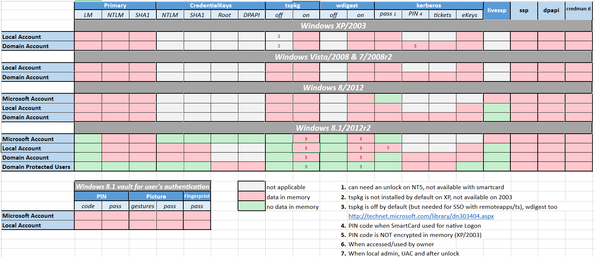

---
layout:
  title:
    visible: true
  description:
    visible: false
  tableOfContents:
    visible: true
  outline:
    visible: true
  pagination:
    visible: true
---

# Mimikatz

[Mimikatz](https://github.com/gentilkiwi/mimikatz) is one of the best tools to gather credential data from Windows systems. It provides the functionality to extract plain-text passwords and password hashes from various sources in Windows and leverage them in further attacks like pass-the-hash.&#x20;

Mimikatz is a Windows x32/x64 program coded in C by Benjamin Delpy in 2007 to learn more about Windows credentials (and as a Proof of Concept). There are two optional components that provide additional features, `mimidrv` (driver to interact with the Windows kernel) and `mimilib` (AppLocker bypass, Auth package/SSP, password filter, and sekurlsa for WinDBG). Mimikatz also includes the `sekurlsa` module, which extracts password hashes from the LSASS process memory.

## LSASS

Since Microsoft's implementation of Kerberos makes use of single sign-on, password hashes must be stored somewhere in order to renew a TGT request. This ensures a user is not prompted each time resource access is requested. In modern versions of Windows, these hashes are stored in the [**Local Security Authority Subsystem Service**](https://en.wikipedia.org/wiki/Local\_Security\_Authority\_Subsystem\_Service) (**LSASS**) memory space.

LSASS is a process in Windows is responsible for enforcing the security policy on the system. It handles user authentication, password changes, and the creation of [access tokens](https://learn.microsoft.com/en-us/windows/win32/secauthz/access-tokens). It also writes to the _Windows Security Log._

Forcible termination of `lsass.exe` will result in the system losing access to any account, including NT AUTHORITY, prompting a restart of the machine.

The credential data stored by LSASS may include Kerberos tickets, NTLM password hashes, LM password hashes (if the password is <15 characters, depending on Windows OS version and patch level), and even clear-text passwords (to support WDigest and SSP authentication among others).&#x20;

While one can prevent a Windows computer from creating the LM hash in the local computer SAM database (and the AD database), this doesn’t prevent the system from generating the LM hash in memory.

### Access Restrictions

LSASS runs as part of the operating system with SYSTEM level privileges. Therefore, Mimikatz requires local administrator or `SYSTEM`, and often debug rights (specifically the [`SeDebugPrivilege`](https://devblogs.microsoft.com/oldnewthing/20080314-00/?p=23113) access right) enabled, in order to perform certain actions and interact with the LSASS process. The `SeDebugPrivilege` access right grants attackers the ability to debug not only processes they own, but also all other users' processes.

#### Privilege Escalation Techniques

More techniques are covered in [Privilege Escalation section](../privilege-escalation/), but an attacker may elevate their privileges to the `SYSTEM` account with tools like [`PsExec`](https://learn.microsoft.com/en-us/sysinternals/downloads/psexec) or the built-in Mimikatz _token elevation function_ to obtain the required privileges. The token elevation function requires the [`SeImpersonatePrivilege`](https://learn.microsoft.com/en-us/troubleshoot/windows-server/windows-security/seimpersonateprivilege-secreateglobalprivilege) access right to work, but all local administrators have it by default.

### Restrictions

Starting with Windows 8.1 and Windows Server 2012 R2, the LM hash and “clear-text” password are no longer in memory. This functionality was also “back-ported” to earlier versions of Windows (Windows 7/8/2008R2/2012) in kb2871997.

Below is a chart ([source](https://adsecurity.org/?page\_id=1821)) indicating what data is in memory on what operating systems. Really the only section still relevant are the bottom which is also applicable to Windows 10/11.

<figure><figcaption><p>Information stored by OS version</p></figcaption></figure>

### LSA Protection

Starting with Windows 8.1 and later, [added protection](https://learn.microsoft.com/en-us/windows-server/security/credentials-protection-and-management/configuring-additional-lsa-protection) for the LSA is provided to prevent reading memory and code injection by non-protected processes. This feature provides added security for the credentials that LSA stores and manages. By setting a registry key, Windows prevents reading memory from this process.

#### Configuration

LSA Protection is controlled by the Registry Key `HKEY_LOCAL_MACHINE\SYSTEM\CurrentControlSet\Control\Lsa`. This key can have two subkeys:

* `RunAsPPL`
* `RunAsPPLBoot`

The following sample REG files show potential configurations. To turn off LSA protection:


```
Windows Registry Editor Version 5.00

[HKEY_LOCAL_MACHINE\SYSTEM\CurrentControlSet\Control\Lsa]
"RunAsPPL"=dword:00000000
"RunAsPPLBoot"=dword:00000000
```


To use LSA protection without UEFI lock:


```
Windows Registry Editor Version 5.00

[HKEY_LOCAL_MACHINE\SYSTEM\CurrentControlSet\Control\Lsa]
"RunAsPPL"=dword:00000002
"RunAsPPLBoot"=dword:00000002
```


To use LSA protection with UEFI lock:


```
Windows Registry Editor Version 5.00

[HKEY_LOCAL_MACHINE\SYSTEM\CurrentControlSet\Control\Lsa]
"RunAsPPL"=dword:00000001
"RunAsPPLBoot"=dword:00000002
```


## Official Links

* [Official GitHub](https://github.com/gentilkiwi/mimikatz) (source code)
* [Releases](https://github.com/gentilkiwi/mimikatz/releases) (includes binaries)
* [GitHub Wiki](https://github.com/gentilkiwi/mimikatz/wiki) (documentation)
* [Writer's Blog](http://blog.gentilkiwi.com/mimikatz) (much of this is in French)

## Usage

All modules and commands are enumerated in [this](https://tools.thehacker.recipes/mimikatz/modules) extremely helpful article. A few of the more commonly used ones are explained below.

### Privilege

Mimikatz offers 2 different built-in privilege escalation commands both of which start with the `privilege::` prefix.

#### Backup

To activate backup rights the Mimikatz command is:

```
privilege::backup
```

#### Debug

To activate debug rights the command is:

```
privilege::debug
```

This assumes the current user has the `SeDebugPrivilege` access right.

### SID and Token Manipulation

#### Add SID

To add an SID to the `sIDHistory` of an object the command is:

```
sid::add /sam:targetUser /sid:newSid
```

* `/sam`: the SAM Account Name of the target
* `/new`: the new SID value
  * Parameter also accepts format such as `Builtin\administrators`.

The command must be executed directly on a domain controller. It has the following command line argument. The [`sid::patch`](https://tools.thehacker.recipes/mimikatz/modules/sid/patch) command must be used prior to this.

* Because `sid::patch` has been known to cause errors on newer DCs this effectively cannot be used on newer systems

#### Token Impersonation

The [command for token impersonation](https://tools.thehacker.recipes/mimikatz/modules/token/elevate) is:

```
token::elevate
```

By default it will impersonate a token from `SYSTEM` and therefore elevate permissions to `NT AUTHORITY\SYSTEM`

The following arguments can be used with the command:

* `/id`: Impersonate the specified token
* `/process`: Impersonate the token of the running process
* `/user`: Impersonate the token of the specified user
* `/admin`: Impersonate a token of builtin local administrators
* `/domainadmin`: Impersonate a token with Domain Admin privileges
* `/enterpriseadmin`: Impersonate a token with Enterprise Admin privileges
* `/localservice`: `NT AUTHORITY\LOCAL SERVICE` token impersonation
* `/networkservice`: `NT AUTHORITY\NETWORK SERVICE` token impersonation

For example to impersonate a domain admin the command would be:

```
token::elevate /domainadmin
```

### LSA Dump

The [`lsadump`](https://tools.thehacker.recipes/mimikatz/modules/lsadump) module contains some commands to dump SAM and LSA secrets

#### DCSync

The [command](https://tools.thehacker.recipes/mimikatz/modules/lsadump/dcsync) to execute a [DCSync](https://tools.thehacker.recipes/mimikatz/modules/lsadump/dcsync) and retrieve domain secrets is:

```
lsa::dcsync
```

It can be used with the following arguments:

* `/all` : It will DCSync the entire active directory database
* `/user`: perform syncing only for the specified user
* `/export` : Save the output
* `/csv` : export to csv
* `/dc` or `/kdc`: Specify the Domain Controller to connect to and gather data
* `/guid` : The GUID of the object to sync credentials. It can be obtained with [`net::trust`](https://tools.thehacker.recipes/mimikatz/modules/net/trust)

The following command line arguments of `lsadump::dcsync` can be used for [ZeroLogon](https://www.thehacker.recipes/ad/movement/netlogon/zerologon) exploitation:

* `/authuser`: the domain controller's machine account
* `/authdomain`: the NetBIOS of the domain
* `/authpassword`: it has to be set to blank `""`
* `/authntlm`: user NTLM authentication

#### LSA

[This command](https://tools.thehacker.recipes/mimikatz/modules/lsadump/lsa) is used to extract hashes from memory by asking the LSA server:

```
lsadump::lsa
```

It can be used with the following command-line arguments:

* `/name` or `/user` : the target user account
* `/id` : the RID (relative identifier) for the target account (500 for Administrator)
* `/patch` : Only dumps the LM and NT password hashes
* `/inject`&#x20;
  * When run on a workstation, it will dump the LM and NT password hashes
  * When run on domain controller is will dump LM, NT, Wdigest, Kerberos keys and password history

There have been observed instances where the `lsadump::lsa` command by itself failed but adding the `/patch` or `/inject` flags caused it to succeed.

### Sekurlsa

The [sekurlsa](https://tools.thehacker.recipes/mimikatz/modules/sekurlsa) module is probably the most well-known and well-loved module of Mimikatz. It retrieves clear text passwords, Kerberos tickets, pin codes, etc (in other words, credentials from several Secure Service Providers) from the LSASS.

#### Logon Passwords

[This](https://tools.thehacker.recipes/mimikatz/modules/sekurlsa/logonpasswords) is the module people usually think of with Mimikatz. It lists all available provider credentials. This is a list of all users that have signed on to the machine since its last reboot. The command is:

```
sekurlsa::logonpasswords
```

* Command requires elevated privileges and must be run after [`privilege::debug`](mimikatz.md#debug)

#### Tickets

The [`tickets`](https://tools.thehacker.recipes/mimikatz/modules/sekurlsa/tickets) command lists Kerberos tickets belonging to all authenticated users on the target server/workstation:

```
sekurlsa::tickets
```

Unlike [`kerberos::list`](https://tools.thehacker.recipes/mimikatz/modules/process/list), sekurlsa uses memory reading and is not subject to key export restrictions. Sekurlsa can also access tickets of others sessions (users). It has the following command line argument:

* `/export`: tickets are exported in `.kirbi` files. The tickets are saved in the current directory
  * They start with user's `LUID` and group number (`0` = TGS, `1` = client ticket(?) and `2` = TGT)

#### Pass the Hash

Mimikatz can be used for pass the hash attacks as demonstrated [here](../active-directory/lateral-movement/overpass-the-hash.md#mimikatz).

### Crypto

The [`crpyto`](https://tools.thehacker.recipes/mimikatz/modules/crypto) module deals with the Microsoft Crypto Magic world.

#### CryptoAPI

[`CryptoAPI`](https://learn.microsoft.com/en-us/windows/win32/seccrypto/cryptoapi-system-architecture) is a Windows API that enables developers to add authentication, encoding, and encryption to Windows-based applications. In normal operation certain items are marked _unexportable_ which means they cannot be extracted via "normal" operation.

The `capi` command patches CryptoAPI layer for easy export. It modifies a `CryptoAPI` function in the `mimikatz` process in order to make unexportable keys exportable (no specific right other than access to the private key is needed).

```
crypto::capi
```

It can be used with [`crypto::certificates`](mimikatz.md#certificates) and [`crypto::keys`](mimikatz.md#keys). This is only useful when the keys provider is one of:

* Microsoft Base Cryptographic Provider v1.0
* Microsoft Enhanced Cryptographic Provider v1.0
* Microsoft Enhanced RSA and AES Cryptographic Provider
* Microsoft RSA SChannel Cryptographic Provider
* Microsoft Strong Cryptographic Provider

#### CryptoAPI Next Generation

CryptoAPI Next Generation (CNG) is the second generation of the `CryptoAPI`. CNG allows users to replace existing algorithm providers with their own providers and add new algorithms as they become available. CNG also allows the same APIs to be used from user and kernel mode applications.

The CNG key isolation (`KeyIso`) service is hosted in the `LSA` process. The service provides key process isolation to private keys and associated cryptographic operations as required by the Common Criteria. The service stores and uses long-lived keys in a secure process complying with Common Criteria requirements.

The Mimikatz cng command can be used to patch the CNG service for easy export:

```
crypto::cng
```

This patch modifies `KeyIso` service, in `LSASS` process, in order to make unexportable keys, exportable. This is only useful when the keys provider is `Microsoft Software Key Storage Provider`.

The command can be used with [`crypto::certificates`](mimikatz.md#certificates) and [`crypto::keys`](mimikatz.md#keys).

#### Certificates

The [`certificates`](https://tools.thehacker.recipes/mimikatz/modules/crypto/certificates) command lists or exports certificates:

```
crypto::certificates
```

It has the following command line arguments:

* `/systemstore`: the system store that must be used (default: `CERT_SYSTEM_STORE_CURRENT_USER`)
* `/store`: the store that must be used to list/export certificates (default: `My`) - full list with `crypto::stores`
* `/export`: export all certificates to files (public parts in `DER`, private parts in `PFX` files - password protected with: `mimikatz`)
* `/silent`: if user interaction is required, then abort
* `/nokey`: do not try to interact with the private key

It must be run after the [`crypto::capi`](mimikatz.md#cryptoapi) or [`crypto::cng`](mimikatz.md#cryptoapi-next-generation) command.

#### Keys

The [`keys`](https://tools.thehacker.recipes/mimikatz/modules/crypto/keys) command lists or exports key containers

```
crypto::keys
```

The command may have the following command line arguments:

* `/provider`: the legacy `CryptoAPI` provider (default: `MS_ENHANCED_PROV`)
* `/providertype`: the legacy `CryptoAPI` provider type (default: `PROV_RSA_FULL`)
* `/cngprovider`: the `CNG` provider (default: `Microsoft Software Key Storage Provider`)
* `/export`: export all keys to `PVK` files
* `/silent`: if user interaction is required, then abort

It must be run after the [`crypto::capi`](mimikatz.md#cryptoapi) or [`crypto::cng`](mimikatz.md#cryptoapi-next-generation) command.

If needed, one can convert `PVK` files with:

```bash
openssl rsa -inform pvk -in key.pvk -outform pem -out key.pem
```

### Kerberos

#### Pass the Ticket

Mimikatz can be used for PtT attacks as demonstrated [here](../active-directory/lateral-movement/pass-the-ticket.md).

#### Golden Ticket

Mimikatz can be used for Golden Ticket attacks with the [`kerberos::golden`](https://tools.thehacker.recipes/mimikatz/modules/kerberos/golden) command:

```
kerberos::golden
```

It can be run with a multitude of command-line arguments:

* `/domain`: the active directory domain (the user's domain to impersonate)
* `/sid`: the SID of the active directory domain the user's hash is hold
* `/sids`: the extra SID of the domain to target during the SIDHistory spoofing
* `/user`: username to impersonate, keep in mind that Administrator is not the only name for this well-known account
* `/ticket`: save the ticket to a `.kirbi` file
* `/groups`: id of groups the user belongs (first is primary group, comma separator) - default is: `513,512,520,518,519` for the well-known Administrators groups
* `/id`: The user RID. The default value is 500 (local administrator)
* `/target` - the server/computer name where the service is hosted (ex: `share.server.local`, `sql.server.local:1433`)
* `/service` - The service name for the silver ticket (ex: `cifs`, `rpcss`, `http`, `mssql`)
* `/ptt`: inject the generated golden ticket into memory
* `/startoffset`: The start offset when the ticket is available. Default is 0
* `/endin`: The ticket's minutes lifetime. The default value is 10 years. The default active directory kerberos policy is 10 hours
* `/renewmax`: The maximum ticket's minutes lifetime renewal. The default value is 10 years. The default active directory kerberos policy is 7 days
* `/krbtgt`: specify the krbtgt NTLM key
* `/des`: the DES key to be used
* `/rc4`: the RC4 key to be used
* `/aes128`: The AES128 key to be used. More opsec safe
* `/aes256`: the AES256 key to be used. More opsec safe
* `/claims`: [add additional values to a user’s kerberos ticket and then make access decisions based on those values at the client level](https://syfuhs.net/2017/07/29/active-directory-claims-and-kerberos-net/)
* `/rodc`: for generating a golden ticket with the krbtgt hash of a Read Only Domain Controller

It is used in an example in [another section](../active-directory/persistence/golden-ticket.md#mimikatz).

#### Purge

[This command](https://tools.thehacker.recipes/mimikatz/modules/kerberos/purge) purges all kerberos tickets similar to [`klist purge`](https://docs.microsoft.com/en-us/windows-server/administration/windows-commands/klist).

```
kerberos::purge
```

It is used in an example in [another section](../active-directory/persistence/golden-ticket.md#mimikatz).
